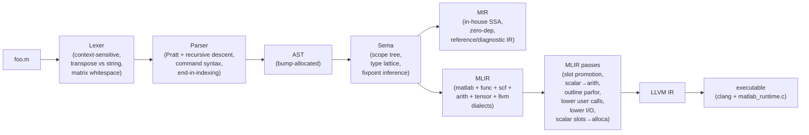
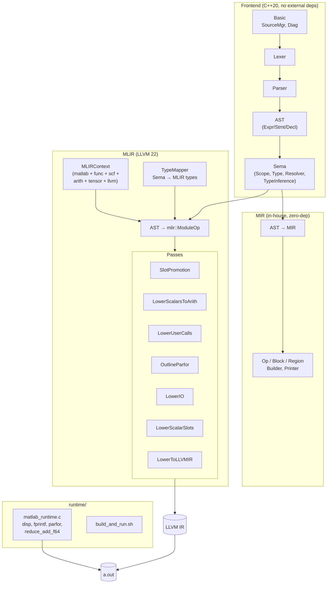
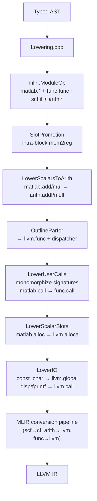

# matlab_llvm

A compiler from a practical subset of MATLAB to native executables, built
end-to-end: lexer → parser → AST → semantic analysis → in-house SSA IR →
MLIR (real `func`/`scf`/`arith`/`llvm` dialects + a small `matlab` dialect) →
LLVM IR → clang → a.out.

Programs like this compile and run:

```matlab
x = 0;
parfor i = 1:10
    x = x + i;
end
disp(x);     % 55 — parallel sum reduction, mutex-guarded atomic add
```

```matlab
disp(fact(5));        % 120 — recursion via per-call-site signature monomorphization
function y = fact(n)
    if n <= 1
        y = 1;
    else
        y = n * fact(n - 1);
    end
end
```

No MathWorks source, no Octave dependency. Just C++20, MLIR (22.1 from
Homebrew), and a ~170-line C runtime shim that wraps `libc`, `pthreads`,
and a global mutex for stdout + reductions.

## Pipeline



The MIR branch is kept as a reference/diagnostic IR — all production
codegen flows through the MLIR branch.

## Building

Prerequisites:

- LLVM 22.x + MLIR (tested with Homebrew `llvm@22.1.3` at
  `/opt/homebrew/opt/llvm` on macOS arm64).
- CMake ≥ 3.20, Ninja, a C++20 compiler (Apple clang works).

```bash
cmake -S . -B build -G Ninja
cmake --build build
ctest --test-dir build --output-on-failure
```

Frontend-only build (skips MLIR, builds the lexer/parser/AST/Sema/MIR
layers only):

```bash
cmake -S . -B build -G Ninja -DMATLAB_LLVM_WITH_MLIR=OFF
```

## Usage

One CLI, many stages:

| Flag | Produces |
|---|---|
| `-dump-tokens` | Flat token stream |
| `-dump-ast` | Pretty-printed AST |
| `-emit-sema` | AST annotated with resolved bindings and inferred types |
| `-emit-mir` | In-house SSA IR (MLIR-shaped, no external deps) |
| `-emit-mlir` | Real MLIR module (unregistered `matlab.*` + registered dialects) |
| `-emit-mlir -opt` | Same, after slot-promotion + scalar-to-arith |
| `-emit-llvm` | LLVM IR text |

To compile and run a program:

```bash
runtime/build_and_run.sh path/to/foo.m   # produces ./foo
./foo
```

Or manually:

```bash
build/matlabc -emit-llvm foo.m > foo.ll
clang foo.ll runtime/matlab_runtime.c -o foo
```

## Architecture



## Parfor execution model

Every `parfor` becomes a thread fan-out. `LowerParfor` outlines the body
into a private `llvm.func`; the runtime dispatches one pthread per
iteration and joins them at the end.

```mermaid
sequenceDiagram
    autonumber
    participant Main as main()
    participant RT as matlab_parfor_dispatch
    participant W1 as body worker #1
    participant W2 as body worker #2
    participant Wn as body worker #N
    Note over Main: parfor i = 1:N<br/>body(i, state) = ...
    Main->>RT: dispatch(1, 1, N, &body, &state)
    par
        RT->>W1: pthread_create(body, i=1)
        RT->>W2: pthread_create(body, i=2)
        RT->>Wn: pthread_create(body, i=N)
    end
    W1-->>RT: pthread_exit
    W2-->>RT: pthread_exit
    Wn-->>RT: pthread_exit
    RT->>Main: return
    Note over Main: all reductions complete;<br/>disp(x) now sees final value
```

**Reductions** use a mutex-protected atomic-add entry
(`matlab_reduce_add_f64`). Each reduction variable's pointer is stored
in a stack-allocated state array; every worker receives the pointer and
contributes via the atomic entry. That's why `x = x + i` across 10
threads deterministically prints 55.

## What works today

### Language features

| Feature | Frontend | Sema | Codegen | Runtime |
|---|:-:|:-:|:-:|:-:|
| Numeric literals (int, float, hex, binary, imaginary) | ✅ | ✅ | ✅ (f64) | ✅ |
| String/char literals (`"..."` and `'...'`) | ✅ | ✅ | ✅ (char only) | ✅ |
| Variables, assignment | ✅ | ✅ | ✅ | ✅ |
| Arithmetic / comparison / logical operators | ✅ | ✅ | ✅ (scalar) | ✅ |
| Element-wise operators (`.*` `./` `.^` etc) | ✅ | ✅ | ⚠️ typed only | — |
| Matrix literal construction `[1 2; 3 4]` | ✅ | ✅ | ✅ (literal disp) | ✅ |
| Ranges `a:b`, `a:s:b` | ✅ | ✅ (folded lengths) | ✅ | ✅ |
| Transpose `'`, `.'` | ✅ | ✅ (shape flip) | ⚠️ not lowered | — |
| Indexing `A(i,j)`, `A(:,2)`, `A(1:2, 2:3)` | ✅ | ✅ (ranked shapes) | ⚠️ not lowered | — |
| Indexed store `A(i,j) = v` | ✅ | ✅ | ⚠️ not lowered | — |
| `if / elseif / else` | ✅ | ✅ | ✅ (`scf.if` chain) | ✅ |
| `for i = 1:n` | ✅ | ✅ | ✅ (`matlab.for`) | ✅ |
| `while` | ✅ | ✅ | ✅ (`matlab.while`) | ✅ |
| `switch / case / otherwise` | ✅ | ✅ | ✅ (lowers to if-chain) | ✅ |
| `break`, `continue`, `return` | ✅ | ✅ | ✅ | ✅ |
| `function y = f(x)` definitions (incl. multi-return) | ✅ | ✅ | ✅ | ✅ |
| User-defined function calls — scalar | ✅ | ✅ | ✅ (monomorphized) | ✅ |
| User-defined function calls — chained / recursive | ✅ | ✅ | ✅ | ✅ |
| **`parfor i = 1:N`** (one pthread per iteration) | ✅ | ✅ | ✅ (outlined body) | ✅ |
| **`parfor` with `x = x + rhs` reductions** | ✅ | ✅ | ✅ (atomic add) | ✅ |
| Anonymous functions `@(x) x^2` | ✅ | ✅ | ⚠️ created but not called | — |
| Function handles `@name` | ✅ | ✅ | ⚠️ created but not called | — |
| `global`, `persistent` | ✅ (parsed) | ⚠️ | ❌ | — |
| `try / catch` | ✅ | ✅ | ⚠️ catch dropped | — |
| `classdef` (OOP) | ❌ | ❌ | ❌ | — |
| Cells `{...}`, structs `s.x` | ✅ (parsed) | ⚠️ partial | ❌ | — |
| Command syntax (`disp hello` → `disp('hello')`) | ✅ | ✅ | ✅ | — |

Legend: ✅ works · ⚠️ partial · ❌ not implemented · — not applicable.

### Runtime I/O

| Call | Works? | Notes |
|---|:-:|---|
| `disp('string literal')` | ✅ | |
| `disp(scalar)` | ✅ | Formats with `%g` |
| `disp(row_vector)` | ✅ | Literal or literal-through-concat |
| `disp(matrix)` | ✅ | Literal matrices of any size (1×1 up) |
| `disp(A')`, `disp(A(i,:))`, `disp(A+B)` | ❌ | Need a tensor descriptor ABI |
| `fprintf('fmt\n')` | ✅ | Escape sequences expanded at runtime |
| `fprintf('fmt %f\n', x)` | ✅ | Single f64 arg |
| `fprintf(...)` with multiple args | ❌ | Variadic ABI not wired |
| `input(prompt)` | ⚠️ | Parsed and resolved, not linked to a runtime entry |

## MATLAB Primer coverage

The MATLAB Primer (R2026a edition, from the PDF) lays out MATLAB in five
chapters. Here's how this compiler maps to it.

### Chapter 1 — Quick Start

| Primer section | Status |
|---|:-:|
| Desktop Basics (REPL, editor, help) | ❌ — batch-compiler only, no REPL |
| Matrices and Arrays (construction) | ✅ literal 2-D, ⚠️ higher-dim |
| Array Indexing (`A(i,j)`, `A(:,2)`, `A(end)`) | ✅ parses and infers shape; ⚠️ runtime indexing not wired |
| Workspace Variables | ✅ scalar/array slot model |
| Text and Characters (strings vs chars) | ⚠️ parses both, runtime only handles `'…'` |
| Calling Functions (builtins like `sin`, `zeros`) | ✅ Sema registry of ~60 builtins, runtime subset wired |
| 2-D / 3-D Plots | ❌ not in scope |
| Programming and Scripts (scripts vs functions) | ✅ |
| Help and Documentation | ❌ |

### Chapter 2 — Language Fundamentals

| Primer section | Status |
|---|:-:|
| Magic Squares / `magic`, `sum`, `transpose`, `diag` | ⚠️ `sum`/`diag` infer type only; no runtime |
| Removing rows/columns (`A(2,:) = []`) | ❌ |
| Reshaping / rearranging (`reshape`, `repmat`) | ⚠️ Sema-typed, no runtime |
| Array vs matrix operations (`.*` vs `*`) | ✅ distinguished in IR, scalar lowering only |
| Find array elements | ❌ |
| Multidimensional arrays (>2 dims) | ⚠️ Sema models `NDArray` rank but lowering assumes ≤2D |
| Text / character arrays | ✅ char array; ⚠️ string-type (double-quoted) partial |
| Tables | ❌ |
| Cell arrays | ⚠️ parsed, typed as `cell`; no runtime |
| Structs (`s.x`, `s.(name)`) | ⚠️ parsed; field access lowers to placeholder |
| Floating-point / integer types | ✅ lattice supports all, runtime uses double |

### Chapter 3 — Mathematics

| Primer section | Status |
|---|:-:|
| Matrix environment, slicing | ✅ parsing + shape inference; ❌ runtime |
| Powers and exponentials | ⚠️ scalar only; matrix power `^` not lowered |
| Solving linear systems `A\b`, `A/b` | ⚠️ Sema types it; no BLAS/LAPACK wiring |
| Eigenvalues, singular values | ❌ |
| Random number arrays (`rand`, `randn`) | ⚠️ Sema types; no runtime |
| Function handles (create, pass) | ✅ (creation) / ⚠️ (call-through still placeholder) |

### Chapter 4 — Graphics

❌ entirely out of scope.

### Chapter 5 — Programming

| Primer section | Status |
|---|:-:|
| `if / elseif / else` | ✅ |
| `switch / case / otherwise` | ✅ |
| `for / while / continue / break` | ✅ |
| `return` | ✅ |
| Vectorization | ⚠️ preserved in IR, not exploited by codegen |
| Preallocation (`zeros(n,n)`) | ⚠️ Sema types it; runtime gives empty disp |
| Scripts | ✅ lowered to `@main` |
| Functions (named) | ✅ |
| Local / nested / private / anonymous functions | ✅ named + nested parsed; anonymous: created, ❌ called |
| Global variables | ⚠️ parsed, not materialized |
| Command vs function syntax | ✅ disambiguated at parse time |

**Net coverage (rough):** Quick Start & Programming are solid; Language
Fundamentals covers arithmetic/control-flow/basic arrays; Mathematics
and Graphics chapters are largely out of scope (no BLAS runtime, no
plotting).

## Compiler stages — what each one does

### 1. Lexer (`lib/Lex/`)

Context-sensitive: `'` is transpose if it follows an identifier,
`)`/`]`/`}`, literal, or `end`; otherwise it starts a char-array
literal. Handles `...` continuation, `%{ … %}` block comments,
hex/binary/imaginary suffixes.

### 2. Parser (`lib/Parse/`)

Hand-written recursive-descent + Pratt expression parser. Handles the
usual MATLAB gotchas:

- Whitespace inside `[…]` (`[1 -2]` is two elements, `[1-2]` is one).
- `end` as an expression only inside indexing contexts.
- Command syntax: if `disp` isn't bound in scope, `disp hello world` is
  `disp('hello', 'world')`.
- Multi-assignment on the LHS: `[u, s, v] = svd(A)`.

### 3. AST + Sema (`lib/AST/`, `lib/Sema/`)

- AST allocated via a bump allocator.
- **Scope tree** with `Binding` (Var/Param/Output/Global/Persistent/
  Function/Builtin/Import).
- **Type lattice**: `Dtype × Shape` with `broadcastNumeric`, `join` for
  control-flow merges, and rank-aware shape inference (ranges fold to
  concrete lengths; slicing composes).
- **Fixpoint type inference** (loops iterate to convergence).
- **Resolver** disambiguates every `CallOrIndex` in the parser AST into
  a real `Call` (function dispatch) or `Index` (array subscript).

### 4. MIR (`lib/MIR/`) — reference IR

An in-house MLIR-shaped SSA IR: `Value`, `Op`, `Block`, `Region`,
`MIRContext`, Builder, MLIR-style textual printer. Used as a zero-dep
diagnostic IR (`-emit-mir`). Production codegen goes through real MLIR.

### 5. MLIR (`lib/MLIR/`) — production IR



Noteworthy passes:

- **`OutlineParfor`** (`LowerParfor.cpp`) — redirects the loop-var slot
  to the block argument, detects `x = x + rhs` reduction chains,
  outlines the body into a private `llvm.func`, packs reduction
  pointers into a state struct, emits a call to
  `matlab_parfor_dispatch`.
- **`LowerUserCalls`** (`LowerUserCalls.cpp`) — iterates to fixpoint:
  collects call-site arg types, refines `func.func` signatures,
  forward-propagates concrete types through unregistered `matlab.*`
  ops, infers return types from `func.return`, re-emits stale
  `func.call`s. Handles chained and recursive calls.
- **`LowerIO`** (`LowerIO.cpp`) — `matlab.const_char` → global string,
  `disp`/`fprintf` → `llvm.call` to the runtime, `disp(tensor<MxNxf64>)`
  via a literal-matrix-walk + stack alloca of doubles.
- **`LowerScalarSlots`** (`LowerScalarSlots.cpp`) — post-refinement
  pass that converts surviving scalar `matlab.alloc` into `llvm.alloca`
  with matching `llvm.load`/`llvm.store`.

### 6. Runtime (`runtime/matlab_runtime.c`)

~170 lines of C. Entries wired today:

- `matlab_disp_str`, `matlab_disp_f64`, `matlab_disp_vec_f64`,
  `matlab_disp_mat_f64`
- `matlab_fprintf_str`, `matlab_fprintf_f64` (with escape-sequence
  expansion for `\n\t\r\\\'\"\0`)
- `matlab_parfor_dispatch` (pthread fan-out + join)
- `matlab_reduce_add_f64` (mutex-guarded atomic add)

Mutex-serialized across all I/O so parfor output doesn't interleave
mid-line.

## Testing

Two CTest suites, ~100 goldens total:

| Suite | Driver flag | Tests | What it checks |
|---|---|:-:|---|
| `Lexer` | `-dump-tokens` | 4 | Transpose/string, numbers, strings, comments |
| `Parser` | `-dump-ast` | 8 | Whitespace matrices, `end` indexing, command syntax, multi-assign, etc. |
| `Sema` | `-emit-sema` | 8 | Resolution, Call/Index disambiguation, shape inference |
| `MIR` | `-emit-mir` | 9 | In-house IR structure + types |
| `MLIR` | `-emit-mlir` | 8 | Real MLIR with tensor types flowing through |
| `Opt` | `-emit-mlir -opt` | 5 | Slot promotion + constant folding through `arith` |
| `Programs` | `-emit-mlir -opt` | 31 | Medium programs (matrix ops, loops, functions) |
| `Errors` | `-dump-ast` | 4 | Parser/Sema diagnostics |
| `Run` | `-emit-llvm` + link + exec | 25 | End-to-end stdout goldens (supports `.sorted` for parfor) |

```bash
ctest --test-dir build
# or just:
test/run_tests.sh build/matlabc
test/Run/run_tests.sh build/matlabc
```

Set `UPDATE=1` on `run_tests.sh` to regenerate `.expected` / `.stdout`
files.

## Repo layout

```
include/matlab/
  Basic/           SourceManager, diagnostics, file IDs
  Lex/             Lexer, Token, TokenKinds.def
  AST/             Expr/Stmt/Decl hierarchy, ASTContext (bump alloc), dumper
  Parse/           Parser interface
  Sema/            Scope, Binding, Type lattice, Resolver, TypeInference
  MIR/             In-house SSA IR (Op, Value, Block, Region, Builder, Printer)
  MLIR/
    Context.h      MLIRContext bootstrap with our dialects
    TypeMapper.h   Sema Type → mlir::Type
    Lowering.h     AST → mlir::ModuleOp
    Dialect/       MatlabDialect
    Passes/        Slot promotion, scalar-to-arith, parfor, user calls,
                   scalar slots, lower to LLVM IR
lib/               implementations mirror include/
tools/matlabc/     driver (main.cpp, all CLI flags wired here)
runtime/           C runtime + build_and_run.sh
test/              goldens + run scripts
```

## Roadmap, ordered by what unblocks the most programs

1. **Array runtime descriptor ABI** — `{ptr, rank, dims[]}` — unblocks
   `disp(A')`, `disp(A+B)`, `disp(A(i,:))`, and essentially every
   program that computes then prints.
2. **Subscript lowering** — `matlab.subscript` → `tensor.extract_slice`
   or a runtime helper; enables runtime indexing and indexed store.
3. **Matrix ops via BLAS** — `matlab.matmul` → `linalg.matmul` → cblas;
   `transpose` → `linalg.transpose`.
4. **Anonymous function calls** — the handle is created today; wire
   `matlab.call_indirect` to an LLVM function pointer call.
5. **String concatenation, `input` at runtime**, multi-arg `fprintf`.
6. **`classdef`**, cells, structs with a proper boxed-value layout.
7. **Multi-callsite polymorphism** — today a function called from two
   sites with different concrete types stays `none`. Template-style
   specialization per call signature would unblock this.
8. **REPL / Live Scripts** — out of scope for now.
9. **Plotting** — out of scope; would need a plotting backend (SDL2,
   gnuplot pipe, etc).

## Non-goals (for now)

- Full MathWorks bug-for-bug compatibility. We follow the Primer's
  documented behavior, not undocumented quirks.
- Simulink, toolboxes (Image Processing, Signal Processing, etc).
- Interpreted/live-script execution.
- JIT REPL (would need ORCv2 integration).
