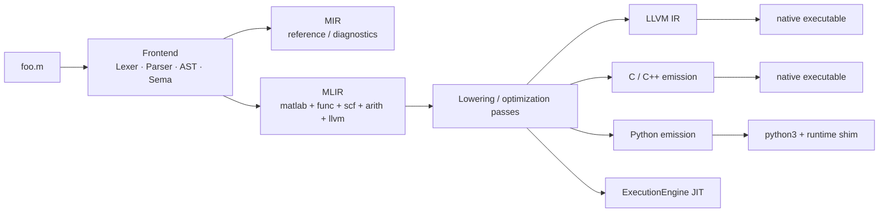

# matlab_llvm

`matlab_llvm` is a MATLAB compiler and tooling stack for a practical,
tested subset of the language. It ships a full frontend, multiple code
generation paths, a JIT-backed REPL, a formatter, and a Language Server,
all built on the same parser and semantic analysis.

The core pipeline is:

`MATLAB source -> Lexer -> Parser -> AST -> Sema -> MIR -> MLIR -> LLVM / C / C++ / Python`

The project is self-contained by design:

- no MathWorks source
- no Octave dependency
- no BLAS/LAPACK dependency for the compiled backends
- C++20 frontend and MLIR-based lowering
- in-tree C and Python runtimes

## Code Generation

The project also allows emission from the MLIR:
- C/C++
- Python
- SystemVerilog (Future)

## What It Covers

The implemented subset is centered on numeric programs, linear algebra,
control flow, functions, basic OOP, and editor tooling.

| Area | Highlights |
|---|---|
| Core language | scripts, functions, recursion, multi-return, `if` / `switch` / `for` / `while` / `try` / `catch`, `break`, `continue`, `return` |
| Numeric runtime | dense matrices, slicing, broadcasting, reductions, `eig`, `svd` (values), `qr`, `chol`, `fft`, `ifft`, `fft2`, `ifft2` |
| MATLAB data types | strings, chars, structs, 1-D cell arrays, function handles, anonymous functions with captures |
| State | `global`, `persistent`, REPL workspace variables, `who` / `whos` / `clear` |
| Parallelism | `parfor` with reduction support |
| OOP | `classdef`, inheritance, static methods, operator overloading, `Dependent` properties, enumerations |
| Tooling | formatter, REPL, DAP server, LSP server |
| Outputs | LLVM IR, C, C++, experimental Python, native executables via helper scripts |

Current corpus size in-tree:

- `16` runnable programs in [`examples/`](examples/)
- `125` execution tests in `test/Run/`

For the authoritative compatibility inventory, see
[`docs/feature_status.md`](docs/feature_status.md).

## Quick Start

Prerequisites:

- LLVM 22.x and MLIR
- CMake 3.20+
- Ninja
- a C++20 compiler
- Python 3 with NumPy if you want `-emit-python`

Build and test:

```bash
cmake -S . -B build -G Ninja
cmake --build build
ctest --test-dir build --output-on-failure
```

Or via [`just`](https://github.com/casey/just):

```bash
just build
just test
just repl
just examples
```

Frontend-only build, without MLIR/LLVM:

```bash
cmake -S . -B build -G Ninja -DMATLAB_LLVM_WITH_MLIR=OFF
cmake --build build
```

## Common Workflows

Inspect each compiler stage:

```bash
build/matlabc -dump-tokens foo.m
build/matlabc -dump-ast foo.m
build/matlabc -emit-sema foo.m
build/matlabc -emit-mir foo.m
build/matlabc -emit-mlir foo.m
build/matlabc -emit-llvm foo.m
```

Compile through the different backends:

```bash
# LLVM path
runtime/build_and_run.sh foo.m

# C path
build/matlabc -emit-c foo.m > foo.c
cc foo.c runtime/matlab_runtime.c -o foo -lm -lpthread

# C++ path
build/matlabc -emit-cpp foo.m > foo.cpp
c++ -x c++ foo.cpp -x c runtime/matlab_runtime.c -o foo -lm -lpthread

# Python path (experimental)
build/matlabc -emit-python foo.m > foo.py
PYTHONPATH=runtime python3 foo.py
```

The Python emitter aims to read as the natural translation of the
source. MATLAB `for i = 1:N` becomes `for i in range(1, N+1):`; matrix
arithmetic uses inline numpy operators (`A @ B`, `A.T`,
`np.linalg.inv(A)`); MATLAB `classdef` becomes a real Python `class`
with `__init__`, `@property`, `@staticmethod`, and dunder operator
overloads; `disp` of a string literal collapses to bare `print(...)`;
and the `matlab_runtime` import only appears when the body actually
references the shim. See [`docs/emit_python.md`](docs/emit_python.md)
for the full op-to-Python mapping.

Use the development shortcuts in [`justfile`](justfile):

```bash
just compile examples/hello.m
just compile-c examples/hello.m
just compile-cpp examples/hello.m
just compile-python examples/hello.m
just format examples/factorial.m
just mlir examples/matrix_mult.m
just llvm examples/matrix_mult.m
```

## Tools

`matlabc` is the main driver:

| Mode | Purpose |
|---|---|
| `-dump-tokens` | token stream |
| `-dump-ast` | parsed AST |
| `-emit-sema` | AST with bindings and inferred types |
| `-emit-mir` | internal SSA-style MIR |
| `-emit-mlir` | MLIR module |
| `-emit-llvm` | LLVM IR |
| `-emit-c` | self-contained C source |
| `-emit-cpp` | self-contained C++ source |
| `-emit-python` | self-contained Python source using `runtime/matlab_runtime.py` |
| `-format` | canonical source formatting |
| `-repl` | JIT-backed interactive interpreter |
| `-dap` | Debug Adapter Protocol server over stdio |

Useful modifiers:

| Flag | Effect |
|---|---|
| `-opt` / `-O` | run optimization passes before emission |
| `-no-line` | omit `#line` markers in generated C / C++ / Python |
| `-doxygen` | preserve function-leading comments as Doxygen blocks in `-emit-c` / `-emit-cpp` |
| `-cpp-auto` | prefer `auto` in generated C++ locals |

The repo also builds `matlab-lsp`, a lightweight Language Server that
reuses the same frontend.

## Main Features

Examples of shipped functionality:

```matlab
% Parallel reduction
x = 0;
parfor i = 1:10
    x = x + i;
end
disp(x);   % 55
```

```matlab
% Linear algebra
A = [4 3; 6 3];
b = [7; 9];
disp(A \ b);
disp(det(A));
disp(inv(A));
```

```matlab
% Handles and anonymous functions
k = 5;
f = @(x) x + k;
g = @sq;
disp(f(3));
disp(g(6));
function y = sq(x), y = x * x; end
```

```matlab
% Basic OOP
classdef Vec2
    properties
        x
        y
    end
    methods
        function obj = Vec2(xv, yv), obj.x = xv; obj.y = yv; end
        function r = plus(a, b), r = Vec2(a.x + b.x, a.y + b.y); end
    end
end
```

```matlab
% Complex arithmetic and FFT
x = [1 2 3 4];
y = fft(x);
disp(real(y));
disp(imag(y));
```

## Architecture



Notes:

- The frontend can build without MLIR.
- MIR is maintained as a readable internal IR and diagnostic target.
- Production lowering goes through MLIR.
- The compiled backends share the same semantics-oriented runtime model.
- `parfor` lowers to pthread-backed execution in the compiled runtime.

## Documentation Map

Start here for the high-level index:

- [`docs/README.md`](docs/README.md)

Core docs:

- [`docs/feature_status.md`](docs/feature_status.md): feature inventory and known gaps
- [`docs/repl.md`](docs/repl.md): REPL behavior and limits
- [`docs/lsp.md`](docs/lsp.md): editor integration and LSP surface
- [`docs/debug.md`](docs/debug.md): DAP mode and built-in debugging aids
- [`docs/emit_c_cpp.md`](docs/emit_c_cpp.md): C and C++ backends
- [`docs/emit_python.md`](docs/emit_python.md): Python backend status and behavior
- [`docs/complex.md`](docs/complex.md): complex numbers and FFT
- [`docs/emit_systemc.md`](docs/emit_systemc.md): future SystemC backend

Program examples:

- [`examples/README.md`](examples/README.md)

## Repository Layout

| Path | Role |
|---|---|
| `include/matlab/` | public headers for frontend, MIR, MLIR, and tooling |
| `lib/` | implementation of lexer, parser, Sema, MIR, MLIR lowering, and emitters |
| `tools/matlabc/` | CLI driver, REPL, DAP entry point |
| `tools/matlab-lsp/` | Language Server |
| `runtime/` | C runtime shim and Python runtime shim |
| `examples/` | runnable sample programs |
| `test/` | parser, sema, MIR, MLIR, emission, and execution tests |

## Status

This is not a full MATLAB implementation. The target is the practical
subset needed for numeric programs and compiler experimentation, not
toolboxes, graphics, GUIs, or `.mat` compatibility.

The Python backend is implemented and tested, but it is still the least
mature code generation path. The C, C++, LLVM, REPL, and editor tooling
docs should be treated as the primary supported surface today.
