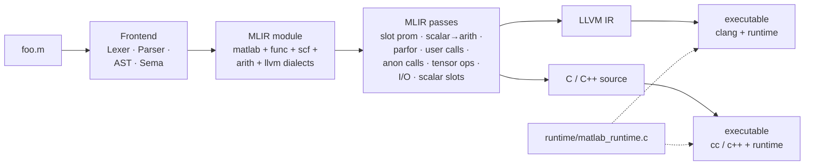

# matlab_llvm

A compiler from a practical subset of MATLAB to native executables,
with four execution paths — **LLVM IR**, **portable C**, **portable
C++**, and an in-process **JIT REPL** — all producing identical
behavior. Built end-to-end: lexer → parser → AST → semantic analysis
→ in-house SSA IR → MLIR (`matlab` + `func` + `scf` + `arith` + `llvm`
dialects) → codegen. Plus a MATLAB-aware **formatter** (`matlabc
-format`) and a **Language Server** (`matlab-lsp`) built on the same
front-end.

No MathWorks source, no Octave dependency, no numerics library
dependency. Just C++20, MLIR 22.x, and a ~3100-line C runtime shim
(libc + pthreads + heap-allocated `matlab_mat` / `matlab_mat3` /
`matlab_struct` / `matlab_cell` / `matlab_obj` / `matlab_string`
descriptors, plus matmul / inverse / solve / LU / QR / Cholesky /
SVD / eig / sort / FFT-free math implemented inline) that compiles
stand-alone.

## Runs today

```matlab
x = 0;
parfor i = 1:10
    x = x + i;
end
disp(x);        % 55 — parallel sum reduction, mutex-guarded atomic add
```

```matlab
% Linear algebra in pure C — no BLAS, no LAPACK.
A = [4 3; 6 3];  b = [7; 9];
disp(A \ b);                         % [1; 1]  — LU with partial pivoting
disp(det(A));    disp(inv(A));       % -6, Gauss-Jordan via LU
[V, D] = eig([2 -1 0; -1 2 -1; 0 -1 2]);
disp(V * D * V');                    % reconstructs A (Jacobi, symmetric)
```

```matlab
% Anonymous functions, user-function handles, builtin handles.
k = 5;
f = @(x) x + k;     % scalar by-value capture at @-time
g = @sq;            % user-function handle
h = @sin;           % builtin handle
disp(f(3));  disp(g(6));  disp(h(0));     % 8, 36, 0
function y = sq(x), y = x * x; end
```

```matlab
% OOP with inheritance, operator overloading, Dependent properties.
classdef Vec2
    properties
        x
        y
    end
    methods
        function obj = Vec2(xv, yv), obj.x = xv; obj.y = yv; end
        function r = plus(a, b),    r = Vec2(a.x + b.x, a.y + b.y); end
        function r = mtimes(a, k),  r = Vec2(a.x * k, a.y * k); end
    end
end
a = Vec2(1, 2);  b = Vec2(3, 4);
disp((a + b).x);        % 4   — operator+ dispatches to Vec2__plus
disp((a * 3).y);        % 6   — scalar scaling via Vec2__mtimes
```

```
$ matlabc -repl                     # JIT REPL with persistent workspace
matlabc REPL (experimental). Ctrl-D or `exit` to quit.
>> A = [1 2; 3 4]
A =
         1         2
         3         4
>> A'             % implicit display: transpose shows without disp()
ans =
         1         3
         2         4
>> whos           % workspace introspection
  Name             Size             Class
  A                2x2              double
  ans              2x2              double
```

More in [`examples/`](examples/) — every file there compiles and runs
under the current compiler end-to-end.

## Building

Prerequisites: LLVM 22.x + MLIR (tested with Homebrew `llvm@22.1.3` on
macOS arm64), CMake ≥ 3.20, Ninja, C++20 compiler.

```bash
cmake -S . -B build -G Ninja
cmake --build build
ctest --test-dir build --output-on-failure
```

Or via [just](https://github.com/casey/just) (recipes in `justfile`):

```bash
just build                 # configure + ninja
just test                  # all ctest suites
just compile FILE OUT      # .m → native executable (LLVM path)
just compile-c FILE        # .m → native executable (C path)
just examples              # build and run every examples/*.m
just repl                  # launch the JIT-backed REPL
just format FILE           # pretty-print a .m file to stdout
just --list                # full recipe list
```

Frontend-only build (no MLIR — just Lexer/Parser/AST/Sema/MIR):

```bash
cmake -S . -B build -G Ninja -DMATLAB_LLVM_WITH_MLIR=OFF
```

## Architecture



The frontend has no external dependencies. The in-house MIR
(`lib/MIR/`) is kept as a reference/diagnostic IR (`-emit-mir`) —
production codegen flows through MLIR. The runtime is single-file C,
library-agnostic by design: every matrix op has an in-tree
implementation so the whole stack stays transpilable. The tradeoff is
performance (naive O(N³) matmul vs. OpenBLAS), not correctness.

`parfor` compiles to a `pthread`-per-iteration fan-out with a
mutex-guarded atomic-add entry for reductions, so `x = x + i` across
10 threads deterministically prints 55.

Design docs:
- [`docs/feature_status.md`](docs/feature_status.md) — complete feature inventory and gap analysis for full MATLAB compatibility.
- [`docs/emit_c_cpp.md`](docs/emit_c_cpp.md) — the C / C++ backend: op-to-C mapping, runtime ABI bridge, design alternatives considered.
- [`docs/repl.md`](docs/repl.md) — shipped JIT REPL built on MLIR `ExecutionEngine`, with state persistence via a runtime workspace.
- [`docs/lsp.md`](docs/lsp.md) — shipped Language Server (`matlab-lsp`): diagnostics, goto-definition, document outline, plus editor-setup snippets.
- [`docs/debug.md`](docs/debug.md) — DAP server (`matlabc -dap`) for editor-integrated breakpoints and stepping, plus the lightweight aids (`dbg(x)`, `who` / `whos` / `clear`).
- [`docs/complex.md`](docs/complex.md) — complex-number runtime and pure-C Cooley-Tukey FFT (radix-2 + Bluestein), no external deps.
- [`docs/emit_python.md`](docs/emit_python.md) — planned Python backend.
- [`docs/emit_systemc.md`](docs/emit_systemc.md) — planned SystemC (synthesizable) backend.

## CLI

One driver, many stages:

| Flag | Produces |
|---|---|
| `-dump-tokens` | Flat token stream |
| `-dump-ast` | Pretty-printed AST |
| `-emit-sema` | AST annotated with resolved bindings and inferred types |
| `-emit-mir` | In-house SSA IR (MLIR-shaped, no external deps) |
| `-emit-mlir` | Real MLIR module |
| `-emit-mlir -opt` | After slot promotion + scalar-to-arith |
| `-emit-llvm` | LLVM IR text |
| `-emit-c` | Self-contained C source (links with `runtime/matlab_runtime.c`) |
| `-emit-cpp` | Self-contained C++ source (same runtime via `extern "C"`) |
| `-format`    | Canonically-formatted source — idempotent; drops comments |
| `-repl`      | JIT-backed interactive prompt with persistent workspace |
| `-dap`       | Debug Adapter Protocol server over stdio: breakpoints, step, variable inspection. See [`docs/debug.md`](docs/debug.md). |

Plus a separate binary:

| Binary        | Role |
|---|---|
| `matlab-lsp`  | Language Server (JSON-RPC over stdio): diagnostics, goto-definition, document outline — wires into any LSP-capable editor. See [`docs/lsp.md`](docs/lsp.md). |

Build and run, via any of the three backends:

```bash
# LLVM path (one-shot helper)
runtime/build_and_run.sh path/to/foo.m           # → ./foo

# Or manually via LLVM IR
build/matlabc -emit-llvm foo.m > foo.ll
clang foo.ll runtime/matlab_runtime.c -o foo

# Or via the C path (no LLVM needed at compile time)
build/matlabc -emit-c foo.m > foo.c
cc foo.c runtime/matlab_runtime.c -o foo -lm -lpthread

# Or via the C++ path
build/matlabc -emit-cpp foo.m > foo.cpp
c++ -x c++ foo.cpp -x c runtime/matlab_runtime.c -o foo -lm -lpthread
```

All three backends produce stdout that matches byte-for-byte on the
98-program test corpus.

## Features

See [`docs/feature_status.md`](docs/feature_status.md) for the
authoritative inventory. Short version:

**Supported:** numeric scalars and 2-D dense matrices (f64); 3-D
arrays via `zeros(m,n,p)` / `ones(m,n,p)` with scalar `A(i,j,k)`
read/write; integer cast builtins (`int8` / `int16` / `int32` /
`int64` / `uint8` / `uint16` / `uint32` / `uint64` / `single` /
`double` / `logical`) with MATLAB-style truncate + saturate
semantics; all standard arithmetic / comparison / logical /
element-wise operators; control flow (`if` / `elseif` / `else` /
`for` / `while` / `switch` / `try` / `break` / `continue` /
`return`); `parfor` with atomic-add reductions; user-defined
functions with multi-return and recursion; polymorphic call
monomorphization (per-callsite `nargin` / `nargout`); `varargin` with
call-site cell packing; anonymous functions with captures; function
handles (`@sin`, `@myFunc`, `@(x) x+k`); structs (nested fields,
dynamic `s.(name)`, `isstruct` / `isfield` / `rmfield`); 1-D cell
arrays; real string type (`"..."`, `+`, `disp`, `strlen`,
`isstring`); `global` / `persistent`; error flag + `catch ME;
ME.message`; implicit display; command syntax; `classdef` with
inheritance, static methods, operator overloading (`plus`, `minus`,
`mtimes`, `eq`, etc.), `Dependent` properties with `get.Prop` /
`set.Prop` methods, property attribute syntax (parsed; only
`Dependent` changes behavior), `enumeration` blocks.

Runtime built-ins include:

- **Linear algebra**: `*`, `\`, `/`, `inv`, `det`, `transpose`,
  `trace`, `norm`, `kron`; symmetric `eig` (Jacobi), `lu` (partial
  pivoting), `qr` (Gram-Schmidt), `chol`, `pinv` (via normal
  equations), `svd` singular values.
- **Constructors & shape**: `zeros`, `ones`, `eye`, `magic`, `rand`,
  `randn`, `linspace`, `diag`, `reshape`, `repmat`, `horzcat`,
  `vertcat`, `permute`, `squeeze`, `flip` / `fliplr` / `flipud`,
  `rot90`, `size`, `length`, `numel`, `ndims`.
- **Reductions** (single-arg and dim-aware): `sum`, `prod`, `mean`,
  `min`, `max`, `cumsum`, `cumprod`.
- **Element-wise math**: `abs`, `sqrt`, `exp`, `log`, `sin`, `cos`,
  `tan`, `asin`, `acos`, `atan`, `atan2`, `sinh`, `cosh`, `tanh`,
  `log2`, `log10`, `sign`, `floor`, `ceil`, `round`, `fix`, `mod`,
  `rem`.
- **Sort / search / sets**: `sort`, `sortrows`, `unique`, `find`,
  `ismember`, `setdiff`, `intersect`, `union`, `isempty`,
  `isequal`, `sub2ind`, `ind2sub`, `assert`.
- **Strings**: `sprintf`, `num2str`, `str2double`, `strcat`,
  `strtrim`, `strrep`, `upper`, `lower`, `startsWith`, `endsWith`,
  `contains`, `strlen`, `isstring`.
- **I/O**: `disp`, `fprintf` up to 4 args, `input`, `error`,
  `warning`; file I/O `fopen`, `fclose`, `fprintf(fid, ...)`,
  `fgetl`, `feof`, `fread`, `fwrite`, `save` / `load` (custom
  binary format — not MATLAB `.mat`).
- **Debug**: `dbg(x)` / `dbg(x, 'label')` — source-located print
  to stderr; `who` / `whos` / `clear` workspace introspection (in
  the REPL).

**Not yet:** value-class copy semantics (every object is
handle-shaped), events / listeners, property validators
(`{mustBeNumeric}` parses but isn't enforced), struct arrays, 2-D
cells, `varargout`, complex linalg (`inv` / `svd` / `eig` on
complex matrices — scalar / matrix arithmetic and FFT shipped, see
[`docs/complex.md`](docs/complex.md)), 3-D vector slicing (only
scalar `A(i,j,k)` today), 4-D+ arrays, sparse matrices,
non-symmetric `eig`, full `[U, S, V] = svd(A)`,
`regexp` / `regexprep`, MATLAB `.mat` file format,
DAP user-function frames in stack trace and watch expressions (MVP
breakpoint/step server shipped — see [`docs/debug.md`](docs/debug.md)),
LSP completion / hover / rename (see [`docs/lsp.md`](docs/lsp.md)).

**Not planned:** plotting, Simulink, toolboxes, GPU arrays, live
scripts (`.mlx`), MathWorks bit-exact numerics.

## Testing

Seven CTest suites. The end-to-end `Run` lane compiles 118 `.m`
programs through all three compiled backends (LLVM, C, C++, plus
`-Wall -Wextra -Werror` strict lanes for the C/C++ paths) and diffs
stdout against `.stdout` goldens:

```bash
ctest --test-dir build
```

To regenerate goldens after an intentional change:

```bash
UPDATE=1 test/run_tests.sh build/matlabc
```

## Repo layout

```
include/matlab/
  Basic/  Lex/  Parse/  AST/  Sema/  MIR/  MLIR/
lib/                           implementations mirror include/
tools/matlabc/                 CLI driver: emit modes, -format, -repl, -dap
tools/matlab-lsp/              Language Server (stdio JSON-RPC)
runtime/                       matlab_runtime.c + build_and_run.sh
test/                          goldens + run scripts (per-suite subdirs)
examples/                      end-to-end example programs
docs/                          design docs (see Architecture section)
justfile                       task runner
```
