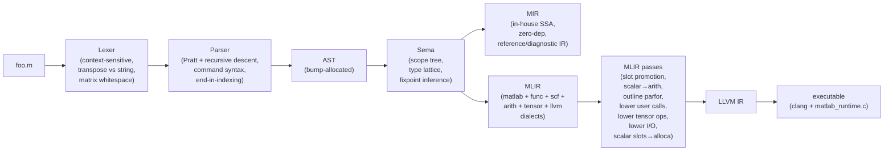
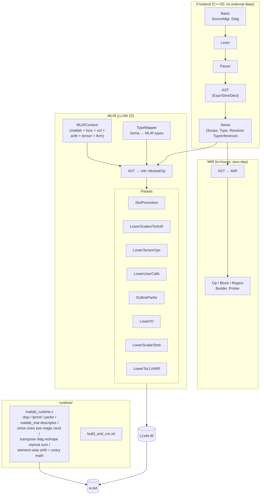
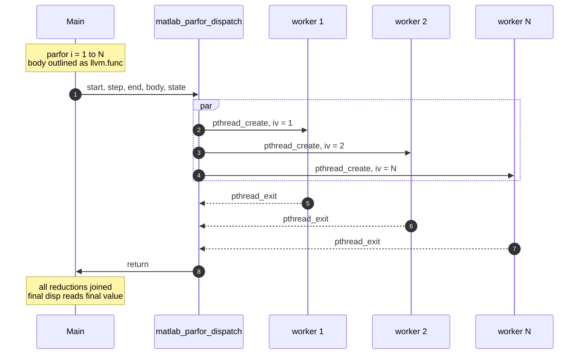
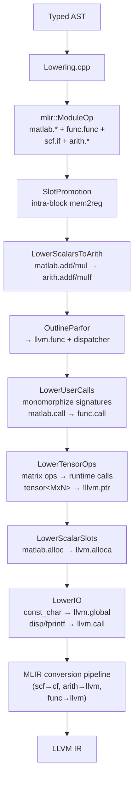

# matlab_llvm

A compiler from a practical subset of MATLAB to native executables, built
end-to-end: lexer → parser → AST → semantic analysis → in-house SSA IR →
MLIR (real `func`/`scf`/`arith`/`llvm` dialects + a small `matlab` dialect) →
LLVM IR → clang → a.out.

Programs like this compile and run:

```matlab
x = 0;
parfor i = 1:10
    x = x + i;
end
disp(x);     % 55 — parallel sum reduction, mutex-guarded atomic add
```

```matlab
disp(fact(5));        % 120 — recursion via per-call-site signature monomorphization
function y = fact(n)
    if n <= 1
        y = 1;
    else
        y = n * fact(n - 1);
    end
end
```

```matlab
A = magic(5);
disp(A);              % full 5×5 magic square
disp(sum(A));         % 325 = 1 + 2 + ... + 25
disp(A');             % transpose (routed to matlab_transpose)
B = (A + 10) .* 2;    % element-wise broadcast: (A + 10) .* 2
disp(B);
```

```matlab
% Linear algebra, pure C — no BLAS, no LAPACK.
A = [4 3; 6 3];
b = [7; 9];
x = A \ b;            % LU with partial pivoting → x = [1; 1]
disp(x);
disp(A * x);          % = b, roundtrip
disp(det(A));         % -6
disp(inv(A));         % Gauss-Jordan via LU
```

```matlab
% Decompositions, pure C — one-sided Jacobi SVD and symmetric Jacobi eig.
disp(svd([1 2; 3 4]));            % [5.4650; 0.3660]
A = [2 -1 0; -1 2 -1; 0 -1 2];
disp(eig(A));                     % [0.5858; 2; 3.4142]  (2 ± √2 and 2)
```

No MathWorks source, no Octave dependency, no numerics library
dependency. Just C++20, MLIR (22.1 from Homebrew), and a ~700-line C
runtime shim that wraps libc, pthreads, a heap-allocated `matlab_mat`
descriptor, and a global mutex for stdout and reductions. The entire
runtime — including matmul, inverse, solve, determinant — is
transpilable as a single self-contained file.

## Pipeline



The MIR branch is kept as a reference/diagnostic IR — all production
codegen flows through the MLIR branch.

## Building

Prerequisites:

- LLVM 22.x + MLIR (tested with Homebrew `llvm@22.1.3` at
  `/opt/homebrew/opt/llvm` on macOS arm64).
- CMake ≥ 3.20, Ninja, a C++20 compiler (Apple clang works).

```bash
cmake -S . -B build -G Ninja
cmake --build build
ctest --test-dir build --output-on-failure
```

Frontend-only build (skips MLIR, builds the lexer/parser/AST/Sema/MIR
layers only):

```bash
cmake -S . -B build -G Ninja -DMATLAB_LLVM_WITH_MLIR=OFF
```

## Usage

One CLI, many stages:

| Flag | Produces |
|---|---|
| `-dump-tokens` | Flat token stream |
| `-dump-ast` | Pretty-printed AST |
| `-emit-sema` | AST annotated with resolved bindings and inferred types |
| `-emit-mir` | In-house SSA IR (MLIR-shaped, no external deps) |
| `-emit-mlir` | Real MLIR module (unregistered `matlab.*` + registered dialects) |
| `-emit-mlir -opt` | Same, after slot-promotion + scalar-to-arith |
| `-emit-llvm` | LLVM IR text |

To compile and run a program:

```bash
runtime/build_and_run.sh path/to/foo.m   # produces ./foo
./foo
```

Or manually:

```bash
build/matlabc -emit-llvm foo.m > foo.ll
clang foo.ll runtime/matlab_runtime.c -o foo
```

## Architecture



## Parfor execution model

Every `parfor` becomes a thread fan-out. `LowerParfor` outlines the body
into a private `llvm.func`; the runtime dispatches one pthread per
iteration and joins them at the end.



**Reductions** use a mutex-protected atomic-add entry
(`matlab_reduce_add_f64`). Each reduction variable's pointer is stored
in a stack-allocated state array; every worker receives the pointer and
contributes via the atomic entry. That's why `x = x + i` across 10
threads deterministically prints 55.

## What works today

### Language features

| Feature | Frontend | Sema | Codegen | Runtime |
|---|:-:|:-:|:-:|:-:|
| Numeric literals (int, float, hex, binary, imaginary) | ✅ | ✅ | ✅ (f64) | ✅ |
| String/char literals (`"..."` and `'...'`) | ✅ | ✅ | ✅ (char only) | ✅ |
| Variables, assignment | ✅ | ✅ | ✅ | ✅ |
| Arithmetic / comparison / logical operators | ✅ | ✅ | ✅ (scalar) | ✅ |
| Element-wise operators (`.*` `./` `.^` etc) | ✅ | ✅ | ✅ (mm/ms/sm) | ✅ |
| Matrix literal construction `[1 2; 3 4]` | ✅ | ✅ | ✅ (any size) | ✅ |
| Ranges `a:b`, `a:s:b` | ✅ | ✅ (folded lengths) | ✅ | ✅ (matrix `ptr`) |
| Transpose `'`, `.'` | ✅ | ✅ (shape flip) | ✅ | ✅ |
| Scalar indexing `A(i)`, `A(i,j)` | ✅ | ✅ | ✅ | ✅ |
| Range/colon subscripts `A(:,2)`, `A(1:2, 2:3)` | ✅ | ✅ (ranked shapes) | ⚠️ not lowered | — |
| Indexed store `A(i,j) = v` | ✅ | ✅ | ⚠️ not lowered | — |
| Matrix constructors (`zeros`, `ones`, `eye`, `magic`, `rand`, `randn`) | ✅ | ✅ | ✅ | ✅ |
| Shape ops (`transpose`, `diag`, `reshape`, `repmat`) | ✅ | ✅ | ✅ | ✅ |
| Reductions (`sum` over whole matrix) | ✅ | ✅ | ✅ | ✅ |
| Element-wise math (`exp`, `log`, `sin`, `cos`, `tan`, `sqrt`, `abs`) | ✅ | ✅ | ✅ | ✅ |
| Matrix multiplication `A * B` (non-scalar operands) | ✅ | ✅ | ✅ (pure-C O(N³)) | ✅ |
| Matrix inverse `inv(A)` | ✅ | ✅ | ✅ (LU with partial pivoting) | ✅ |
| Linear solve `A\b`, `A/b` | ✅ | ✅ | ✅ (LU solve, pure C) | ✅ |
| Determinant `det(A)` | ✅ | ✅ | ✅ (LU byproduct) | ✅ |
| Singular values `svd(A)` | ✅ | ✅ | ✅ (one-sided Jacobi, pure C) | ✅ |
| Eigenvalues `eig(A)` | ✅ | ✅ | ✅ (Jacobi; symmetric only — see docs) | ✅ |
| `if / elseif / else` | ✅ | ✅ | ✅ (`scf.if` chain) | ✅ |
| `for i = 1:n` | ✅ | ✅ | ✅ (`matlab.for`) | ✅ |
| `while` | ✅ | ✅ | ✅ (`matlab.while`) | ✅ |
| `switch / case / otherwise` | ✅ | ✅ | ✅ (lowers to if-chain) | ✅ |
| `break`, `continue`, `return` | ✅ | ✅ | ✅ | ✅ |
| `function y = f(x)` definitions (incl. multi-return) | ✅ | ✅ | ✅ | ✅ |
| User-defined function calls — scalar | ✅ | ✅ | ✅ (monomorphized) | ✅ |
| User-defined function calls — chained / recursive | ✅ | ✅ | ✅ | ✅ |
| **`parfor i = 1:N`** (one pthread per iteration) | ✅ | ✅ | ✅ (outlined body) | ✅ |
| **`parfor` with `x = x + rhs` reductions** | ✅ | ✅ | ✅ (atomic add) | ✅ |
| Anonymous functions `@(x) x^2` | ✅ | ✅ | ⚠️ created but not called | — |
| Function handles `@name` | ✅ | ✅ | ⚠️ created but not called | — |
| `global`, `persistent` | ✅ (parsed) | ⚠️ | ❌ | — |
| `try / catch` | ✅ | ✅ | ⚠️ catch dropped | — |
| `classdef` (OOP) | ❌ | ❌ | ❌ | — |
| Cells `{...}`, structs `s.x` | ✅ (parsed) | ⚠️ partial | ❌ | — |
| Command syntax (`disp hello` → `disp('hello')`) | ✅ | ✅ | ✅ | — |

Legend: ✅ works · ⚠️ partial · ❌ not implemented · — not applicable.

### Runtime I/O

| Call | Works? | Notes |
|---|:-:|---|
| `disp('string literal')` | ✅ | |
| `disp(scalar)` | ✅ | Formats with `%g` |
| `disp(row_vector)` | ✅ | |
| `disp(matrix)` | ✅ | Works on any computed matrix (`disp(A')`, `disp(A+B)`, `disp(magic(5))`, etc.) |
| `disp(A(i,j))` scalar subscript | ✅ | 1-based, OOB returns 0 |
| `disp(A(:,2))`, `disp(A(1:2,1:2))` sliced views | ❌ | Still need runtime slicing |
| `fprintf('fmt\n')` | ✅ | Escape sequences expanded at runtime |
| `fprintf('fmt %f\n', x)` | ✅ | Single f64 arg |
| `fprintf(...)` with multiple args | ❌ | Variadic ABI not wired |
| `input(prompt)` | ⚠️ | Parsed and resolved, not linked to a runtime entry |

## MATLAB Primer coverage

The MATLAB Primer (R2026a edition, from the PDF) lays out MATLAB in five
chapters. Here's how this compiler maps to it.

### Chapter 1 — Quick Start

| Primer section | Status |
|---|:-:|
| Desktop Basics (REPL, editor, help) | ❌ — batch-compiler only, no REPL |
| Matrices and Arrays (construction) | ✅ literal 2-D + `zeros/ones/eye/magic/rand/randn`; ⚠️ higher-dim |
| Array Indexing (`A(i,j)`, `A(:,2)`, `A(end)`) | ✅ scalar indexing executes; ⚠️ colon/range slices typed but not yet lowered to runtime |
| Workspace Variables | ✅ scalar/array slot model |
| Text and Characters (strings vs chars) | ⚠️ parses both, runtime only handles `'…'` |
| Calling Functions (builtins like `sin`, `zeros`) | ✅ Sema registry of ~60 builtins, runtime subset wired |
| 2-D / 3-D Plots | ❌ not in scope |
| Programming and Scripts (scripts vs functions) | ✅ |
| Help and Documentation | ❌ |

### Chapter 2 — Language Fundamentals

| Primer section | Status |
|---|:-:|
| Magic Squares / `magic`, `sum`, `transpose`, `diag` | ✅ all four execute end-to-end; `magic` uses Siamese for odd n, simple fill for even |
| Removing rows/columns (`A(2,:) = []`) | ❌ |
| Reshaping / rearranging (`reshape`, `repmat`) | ✅ execute end-to-end |
| Array vs matrix operations (`.*` vs `*`) | ✅ both paths execute: scalar×matrix → element-wise; matrix×matrix → pure-C O(N³) matmul |
| Find array elements | ❌ |
| Multidimensional arrays (>2 dims) | ⚠️ Sema models `NDArray` rank but lowering assumes ≤2D |
| Text / character arrays | ✅ char array; ⚠️ string-type (double-quoted) partial |
| Tables | ❌ |
| Cell arrays | ⚠️ parsed, typed as `cell`; no runtime |
| Structs (`s.x`, `s.(name)`) | ⚠️ parsed; field access lowers to placeholder |
| Floating-point / integer types | ✅ lattice supports all, runtime uses double |

### Chapter 3 — Mathematics

| Primer section | Status |
|---|:-:|
| Matrix environment, construction | ✅ literals, `zeros`, `ones`, `eye`, `magic`, `diag`, `reshape`, `repmat` all execute |
| Slicing | ⚠️ scalar subscripts execute; colon/range slices typed but not yet wired |
| Powers and exponentials (`.^`, `exp`, `log`) | ✅ element-wise; ❌ matrix power `A^n` |
| Solving linear systems `A\b`, `A/b`, `inv(A)`, `det(A)` | ✅ pure-C LU with partial pivoting, no BLAS/LAPACK dep |
| Singular values `svd(A)` | ✅ one-sided Jacobi SVD, pure C, ~100 LoC |
| Eigenvalues `eig(A)` | ✅ Jacobi rotations for symmetric matrices; non-symmetric inputs are symmetrized as `(A + Aᵀ)/2` (correct for symmetric, approximate otherwise). General-case QR iteration still open |
| Random number arrays (`rand`, `randn`) | ✅ runtime uses xorshift64 + Box-Muller; seed via `matlab_rng_state` |
| Function handles (create, pass) | ✅ (creation) / ⚠️ (call-through still placeholder) |
| Vectorization (whole-matrix ops replacing loops) | ✅ element-wise add/sub/emul/ediv/epow all dispatch to runtime |

### Chapter 4 — Graphics

❌ entirely out of scope.

### Chapter 5 — Programming

| Primer section | Status |
|---|:-:|
| `if / elseif / else` | ✅ |
| `switch / case / otherwise` | ✅ |
| `for / while / continue / break` | ✅ |
| `return` | ✅ |
| Vectorization | ✅ whole-matrix ops execute; codegen still doesn't auto-vectorize loops |
| Preallocation (`zeros(n,n)`) | ✅ runtime allocates and zeros |
| Scripts | ✅ lowered to `@main` |
| Functions (named) | ✅ |
| Local / nested / private / anonymous functions | ✅ named + nested parsed; anonymous: created, ❌ called |
| Global variables | ⚠️ parsed, not materialized |
| Command vs function syntax | ✅ disambiguated at parse time |

**Net coverage (rough):** Quick Start & Programming are solid; Language
Fundamentals covers arithmetic/control-flow/basic arrays; Mathematics
and Graphics chapters are largely out of scope (no BLAS runtime, no
plotting).

## Compiler stages — what each one does

### 1. Lexer (`lib/Lex/`)

Context-sensitive: `'` is transpose if it follows an identifier,
`)`/`]`/`}`, literal, or `end`; otherwise it starts a char-array
literal. Handles `...` continuation, `%{ … %}` block comments,
hex/binary/imaginary suffixes.

### 2. Parser (`lib/Parse/`)

Hand-written recursive-descent + Pratt expression parser. Handles the
usual MATLAB gotchas:

- Whitespace inside `[…]` (`[1 -2]` is two elements, `[1-2]` is one).
- `end` as an expression only inside indexing contexts.
- Command syntax: if `disp` isn't bound in scope, `disp hello world` is
  `disp('hello', 'world')`.
- Multi-assignment on the LHS: `[u, s, v] = svd(A)`.

### 3. AST + Sema (`lib/AST/`, `lib/Sema/`)

- AST allocated via a bump allocator.
- **Scope tree** with `Binding` (Var/Param/Output/Global/Persistent/
  Function/Builtin/Import).
- **Type lattice**: `Dtype × Shape` with `broadcastNumeric`, `join` for
  control-flow merges, and rank-aware shape inference (ranges fold to
  concrete lengths; slicing composes).
- **Fixpoint type inference** (loops iterate to convergence).
- **Resolver** disambiguates every `CallOrIndex` in the parser AST into
  a real `Call` (function dispatch) or `Index` (array subscript).

### 4. MIR (`lib/MIR/`) — reference IR

An in-house MLIR-shaped SSA IR: `Value`, `Op`, `Block`, `Region`,
`MIRContext`, Builder, MLIR-style textual printer. Used as a zero-dep
diagnostic IR (`-emit-mir`). Production codegen goes through real MLIR.

### 5. MLIR (`lib/MLIR/`) — production IR



Noteworthy passes:

- **`OutlineParfor`** (`LowerParfor.cpp`) — redirects the loop-var slot
  to the block argument, detects `x = x + rhs` reduction chains,
  outlines the body into a private `llvm.func`, packs reduction
  pointers into a state struct, emits a call to
  `matlab_parfor_dispatch`.
- **`LowerUserCalls`** (`LowerUserCalls.cpp`) — iterates to fixpoint:
  collects call-site arg types, refines `func.func` signatures,
  forward-propagates concrete types through unregistered `matlab.*`
  ops, infers return types from `func.return`, re-emits stale
  `func.call`s. Handles chained and recursive calls.
- **`LowerTensorOps`** (`LowerTensorOps.cpp`) — every tensor-typed
  `matlab.*` op becomes an `llvm.call` against the matrix runtime.
  Literal `[...]` matrices materialize as a stack array of doubles
  handed to `matlab_mat_from_buf`; matrix slots become `llvm.alloca`
  of `!llvm.ptr`; `disp(matrix)` routes to `matlab_disp_mat`.
- **`LowerIO`** (`LowerIO.cpp`) — `matlab.const_char` → global string,
  `disp`/`fprintf` → `llvm.call` to the runtime.
- **`LowerScalarSlots`** (`LowerScalarSlots.cpp`) — post-refinement
  pass that converts surviving scalar `matlab.alloc` into `llvm.alloca`
  with matching `llvm.load`/`llvm.store`.

### 6. Runtime (`runtime/matlab_runtime.c`)

**Design note: library-agnostic, single-file C.** The runtime has no
external dependencies beyond libc and pthreads — no BLAS, no LAPACK,
no FFTW. This is deliberate: the IR + runtime are intended to be
transpilable to other languages, so every op needs a self-contained
implementation that doesn't pull in a platform-specific numerics
vendor. The tradeoff is performance (a naive O(N³) matmul is ~10–100×
slower than OpenBLAS for large matrices), not correctness.

~700 lines of C. Entries wired today:

**I/O**

- `matlab_disp_str`, `matlab_disp_f64`, `matlab_disp_vec_f64`,
  `matlab_disp_mat_f64`, `matlab_disp_mat` (descriptor variant)
- `matlab_fprintf_str`, `matlab_fprintf_f64` (escape-sequence expansion
  for `\n\t\r\\\'\"\0`)

**Matrix descriptor + math** (`matlab_mat = { data, rows, cols }`, heap-
allocated, passed around as `!llvm.ptr`; program lifetimes are short, so
we leak).

- Constructors: `matlab_zeros`, `matlab_ones`, `matlab_eye`,
  `matlab_magic` (Siamese for odd `n`, simple fill for even),
  `matlab_rand` (xorshift64), `matlab_randn` (Box-Muller),
  `matlab_range` (for `a:b` / `a:step:b`), `matlab_mat_from_buf` (for
  literal `[...]`).
- Shape: `matlab_transpose`, `matlab_diag`, `matlab_reshape`,
  `matlab_repmat`.
- Reduction: `matlab_sum` (total over all elements).
- Element-wise binary: `matlab_{add,sub,emul,ediv,epow}_{mm,ms,sm}`
  (matrix×matrix, matrix×scalar, scalar×matrix).
- Element-wise unary: `matlab_{neg,exp,log,sin,cos,tan,sqrt,abs}_m`
  plus scalar `_s` variants.
- Linear algebra (pure C, no BLAS): `matlab_matmul_mm` (triple-loop
  O(N³)), `matlab_inv` (Gauss-Jordan via LU), `matlab_mldivide_mm`
  (`A\B` via LU with partial pivoting), `matlab_mrdivide_mm`
  (`A/B = (Bᵀ\Aᵀ)ᵀ`), `matlab_det` (LU byproduct). Shared
  `lu_decompose` + `lu_solve_column` helpers handle the factorization
  and forward/back substitution.
- Decompositions (pure C): `matlab_svd` (one-sided Jacobi, any m×n
  matrix, returns descending singular values), `matlab_eig` (Jacobi
  for symmetric matrices, ascending eigenvalues; non-symmetric inputs
  are symmetrized to `(A + Aᵀ)/2` — correct for symmetric, garbage for
  matrices with complex eigenvalues).
- Scalar indexing: `matlab_subscript1_s`, `matlab_subscript2_s`
  (1-based, out-of-range returns 0).

**Concurrency**

- `matlab_parfor_dispatch` (pthread fan-out + join)
- `matlab_reduce_add_f64` (mutex-guarded atomic add)
- Global I/O mutex so parfor output doesn't interleave mid-line.

## Testing

Two CTest suites, ~115 goldens total:

| Suite | Driver flag | Tests | What it checks |
|---|---|:-:|---|
| `Lexer` | `-dump-tokens` | 4 | Transpose/string, numbers, strings, comments |
| `Parser` | `-dump-ast` | 8 | Whitespace matrices, `end` indexing, command syntax, multi-assign, etc. |
| `Sema` | `-emit-sema` | 8 | Resolution, Call/Index disambiguation, shape inference |
| `MIR` | `-emit-mir` | 9 | In-house IR structure + types |
| `MLIR` | `-emit-mlir` | 8 | Real MLIR with tensor types flowing through |
| `Opt` | `-emit-mlir -opt` | 5 | Slot promotion + constant folding through `arith` |
| `Programs` | `-emit-mlir -opt` | 31 | Medium programs (matrix ops, loops, functions) |
| `Errors` | `-dump-ast` | 4 | Parser/Sema diagnostics |
| `Run` | `-emit-llvm` + link + exec | 54 | End-to-end stdout goldens (I/O, parfor, matrix math, linear algebra, SVD/eig, user calls) |

```bash
ctest --test-dir build
# or just:
test/run_tests.sh build/matlabc
test/Run/run_tests.sh build/matlabc
```

Set `UPDATE=1` on `run_tests.sh` to regenerate `.expected` / `.stdout`
files.

## Repo layout

```
include/matlab/
  Basic/           SourceManager, diagnostics, file IDs
  Lex/             Lexer, Token, TokenKinds.def
  AST/             Expr/Stmt/Decl hierarchy, ASTContext (bump alloc), dumper
  Parse/           Parser interface
  Sema/            Scope, Binding, Type lattice, Resolver, TypeInference
  MIR/             In-house SSA IR (Op, Value, Block, Region, Builder, Printer)
  MLIR/
    Context.h      MLIRContext bootstrap with our dialects
    TypeMapper.h   Sema Type → mlir::Type
    Lowering.h     AST → mlir::ModuleOp
    Dialect/       MatlabDialect
    Passes/        Slot promotion, scalar-to-arith, parfor, user calls,
                   scalar slots, lower to LLVM IR
lib/               implementations mirror include/
tools/matlabc/     driver (main.cpp, all CLI flags wired here)
runtime/           C runtime + build_and_run.sh
test/              goldens + run scripts
```

## Roadmap, ordered by what unblocks the most programs

1. **Sliced subscript runtime** — `A(:,2)`, `A(1:2, 2:3)`, `A(end,:)`.
   Types already propagate as ranked tensors; need the runtime
   `matlab_slice` entry and IR lowering.
2. **Indexed store** — `A(i,j) = v`, `A(:, 2) = w`. Placeholder today.
3. **General-case `eig`** — today we do Jacobi for symmetric matrices
   (and symmetrize non-symmetric inputs, which is approximate).
   QR iteration with Wilkinson shifts would handle asymmetric matrices
   with real spectra; complex-eigenvalue support would need 2×2 block
   handling. Still pure C.
   `pinv`, `rank`, `null` are natural byproducts of extending SVD
   to a full `[U, S, V]` return.
4. **Column reductions** — real MATLAB `sum(A)` returns a row vector;
   ours returns the flat scalar. Once the row-vector variant is wired,
   row/col-wise `min`/`max`/`mean`/`prod` follow the same pattern.
5. **Anonymous function calls** — the handle is created today; wire
   `matlab.call_indirect` to an LLVM function pointer call.
6. **Multi-arg `fprintf`, `input` at runtime**, string concatenation.
7. **`classdef`**, cells, structs with a proper boxed-value layout.
8. **Multi-callsite polymorphism** — today a function called from two
   sites with different concrete types stays `none`. Template-style
   specialization per call signature would unblock this.
9. **Optional `-DMATLAB_USE_BLAS`** — link CBLAS as an opt-in fast
   path for matmul / LU. The default pure-C path stays intact so the
   runtime remains single-file and transpilable.
10. **REPL / Live Scripts** — out of scope for now.
11. **Plotting** — out of scope; would need a plotting backend.

## Non-goals (for now)

- Full MathWorks bug-for-bug compatibility. We follow the Primer's
  documented behavior, not undocumented quirks.
- Simulink, toolboxes (Image Processing, Signal Processing, etc).
- Interpreted/live-script execution.
- JIT REPL (would need ORCv2 integration).
