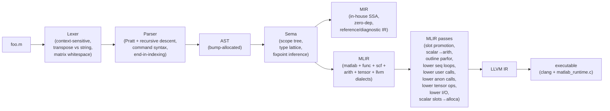
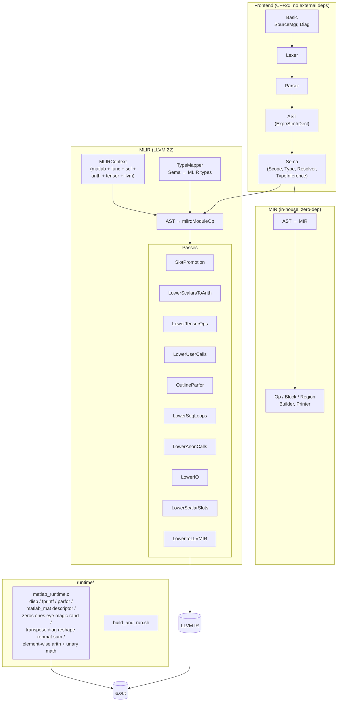
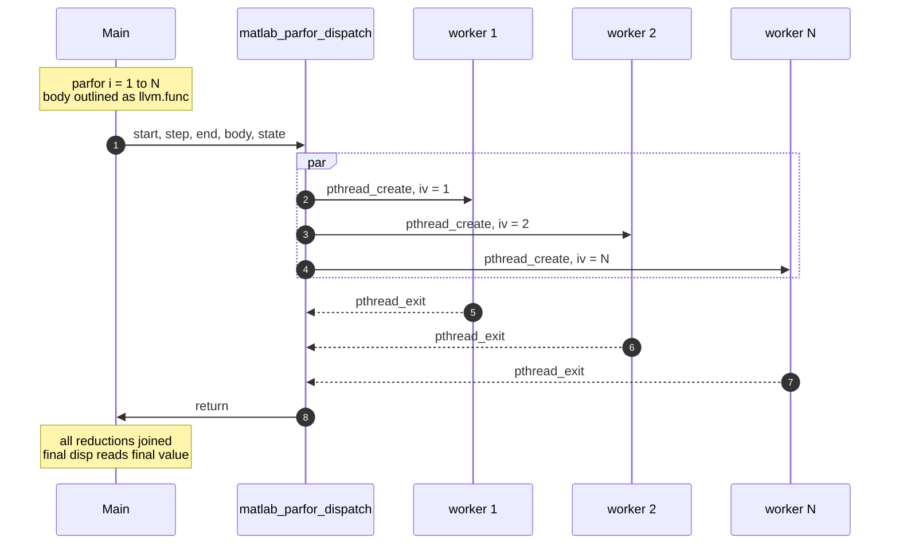
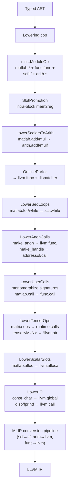

# matlab_llvm

A compiler from a practical subset of MATLAB to native executables, built
end-to-end: lexer → parser → AST → semantic analysis → in-house SSA IR →
MLIR (real `func`/`scf`/`arith`/`llvm` dialects + a small `matlab` dialect) →
LLVM IR → clang → a.out.

Programs like this compile and run:

```matlab
x = 0;
parfor i = 1:10
    x = x + i;
end
disp(x);     % 55 — parallel sum reduction, mutex-guarded atomic add
```

```matlab
disp(fact(5));        % 120 — recursion via per-call-site signature monomorphization
function y = fact(n)
    if n <= 1
        y = 1;
    else
        y = n * fact(n - 1);
    end
end
```

```matlab
A = magic(5);
disp(A);              % full 5×5 magic square
disp(sum(A));         % 325 = 1 + 2 + ... + 25
disp(A');             % transpose (routed to matlab_transpose)
B = (A + 10) .* 2;    % element-wise broadcast: (A + 10) .* 2
disp(B);
```

```matlab
% Linear algebra, pure C — no BLAS, no LAPACK.
A = [4 3; 6 3];
b = [7; 9];
x = A \ b;            % LU with partial pivoting → x = [1; 1]
disp(x);
disp(A * x);          % = b, roundtrip
disp(det(A));         % -6
disp(inv(A));         % Gauss-Jordan via LU
```

```matlab
% Decompositions, pure C — one-sided Jacobi SVD and symmetric Jacobi eig.
disp(svd([1 2; 3 4]));            % [5.4650; 0.3660]
A = [2 -1 0; -1 2 -1; 0 -1 2];
disp(eig(A));                     % [0.5858; 2; 3.4142]  (2 ± √2 and 2)
[V, D] = eig(A);                  % two-return form dispatches via nargout
disp(V * D * V');                 % ≈ A (reconstruction)
```

```matlab
% Classic for-loop accumulator — sequential for/while lower to scf.while.
s = 0;
for k = 2:2:10
    s = s + k;
end
disp(s);                          % 30

% Recursive fib with two self-calls in one expression.
disp(fib(12));                    % 144
function y = fib(n)
    if n < 2, y = n; else, y = fib(n-1) + fib(n-2); end
end
```

```matlab
% Function handles for builtins, user functions, and anon with captures.
k = 5;
f = @(x) x + k;                   % scalar by-value capture at @-time
g = @sq;                          % user-function handle
h = @sin;                         % runtime scalar-math handle
disp(f(3));  disp(g(6));  disp(h(0));   % 8, 36, 0
function y = sq(x), y = x * x; end
```

No MathWorks source, no Octave dependency, no numerics library
dependency. Just C++20, MLIR (22.1 from Homebrew), and a ~1400-line C
runtime shim that wraps libc, pthreads, a heap-allocated `matlab_mat`
descriptor, and a global mutex for stdout and reductions. The entire
runtime — including matmul, inverse, solve, determinant, SVD, eig — is
transpilable as a single self-contained file.

## Pipeline



The MIR branch is kept as a reference/diagnostic IR — all production
codegen flows through the MLIR branch.

## Building

Prerequisites:

- LLVM 22.x + MLIR (tested with Homebrew `llvm@22.1.3` at
  `/opt/homebrew/opt/llvm` on macOS arm64).
- CMake ≥ 3.20, Ninja, a C++20 compiler (Apple clang works).

```bash
cmake -S . -B build -G Ninja
cmake --build build
ctest --test-dir build --output-on-failure
```

Or via [just](https://github.com/casey/just) (recipes in `justfile`):

```bash
just build               # configure + ninja
just test                # run all ctest suites
just compile FILE OUT    # produce a native executable from FILE.m
just examples            # build and run every examples/*.m
just mlir FILE           # dump the MLIR module for inspection
just --list              # full recipe list
```

Frontend-only build (skips MLIR, builds the lexer/parser/AST/Sema/MIR
layers only):

```bash
cmake -S . -B build -G Ninja -DMATLAB_LLVM_WITH_MLIR=OFF
```

## Usage

One CLI, many stages:

| Flag | Produces |
|---|---|
| `-dump-tokens` | Flat token stream |
| `-dump-ast` | Pretty-printed AST |
| `-emit-sema` | AST annotated with resolved bindings and inferred types |
| `-emit-mir` | In-house SSA IR (MLIR-shaped, no external deps) |
| `-emit-mlir` | Real MLIR module (unregistered `matlab.*` + registered dialects) |
| `-emit-mlir -opt` | Same, after slot-promotion + scalar-to-arith |
| `-emit-llvm` | LLVM IR text |

To compile and run a program:

```bash
runtime/build_and_run.sh path/to/foo.m   # produces ./foo
./foo
```

Or manually:

```bash
build/matlabc -emit-llvm foo.m > foo.ll
clang foo.ll runtime/matlab_runtime.c -o foo
```

A gallery of small programs that exercise different corners of the
language lives in [`examples/`](examples/). Every file there is expected
to compile end-to-end and run under the current compiler:

```bash
just examples              # builds and runs all of examples/*.m
just compile examples/matrix_mult.m /tmp/matmul && /tmp/matmul
```

## Architecture



## Parfor execution model

Every `parfor` becomes a thread fan-out. `LowerParfor` outlines the body
into a private `llvm.func`; the runtime dispatches one pthread per
iteration and joins them at the end.



**Reductions** use a mutex-protected atomic-add entry
(`matlab_reduce_add_f64`). Each reduction variable's pointer is stored
in a stack-allocated state array; every worker receives the pointer and
contributes via the atomic entry. That's why `x = x + i` across 10
threads deterministically prints 55.

## What works today

### Language features

| Feature | Frontend | Sema | Codegen | Runtime |
|---|:-:|:-:|:-:|:-:|
| Numeric literals (int, float, hex, binary, imaginary) | ✅ | ✅ | ✅ (f64) | ✅ |
| String/char literals (`"..."` and `'...'`) | ✅ | ✅ | ✅ (char only) | ✅ |
| Variables, assignment | ✅ | ✅ | ✅ | ✅ |
| Arithmetic / comparison / logical operators | ✅ | ✅ | ✅ (scalar) | ✅ |
| Element-wise operators (`.*` `./` `.^` etc) | ✅ | ✅ | ✅ (mm/ms/sm) | ✅ |
| Matrix literal construction `[1 2; 3 4]` | ✅ | ✅ | ✅ (any size) | ✅ |
| Ranges `a:b`, `a:s:b` | ✅ | ✅ (folded lengths) | ✅ | ✅ (matrix `ptr`) |
| Transpose `'`, `.'` | ✅ | ✅ (shape flip) | ✅ | ✅ |
| Scalar indexing `A(i)`, `A(i,j)` | ✅ | ✅ | ✅ | ✅ |
| Range/colon subscripts `A(:,2)`, `A(1:2, 2:3)`, `A(end,:)` | ✅ | ✅ (ranked shapes) | ✅ | ✅ |
| Indexed store `A(i,j) = v`, `A(:,j) = w`, `A(1:2, 2:3) = M` | ✅ | ✅ | ✅ | ✅ |
| Matrix constructors (`zeros`, `ones`, `eye`, `magic`, `rand`, `randn`) | ✅ | ✅ | ✅ | ✅ |
| Shape ops (`transpose`, `diag`, `reshape`, `repmat`) | ✅ | ✅ | ✅ | ✅ |
| Column reductions (`sum`, `prod`, `mean`, `min`, `max`) | ✅ | ✅ | ✅ | ✅ |
| Shape queries (`size`, `length`, `numel`, `ndims`) | ✅ | ✅ | ✅ | ✅ |
| Predicates (`isempty`, `isequal`) | ✅ | ✅ | ✅ | ✅ |
| `find` (non-zero indices) | ✅ | ✅ | ✅ | ✅ |
| Matrix power `A^n` (integer exponent, via repeated matmul) | ✅ | ✅ | ✅ | ✅ |
| Element-wise math (`exp`, `log`, `sin`, `cos`, `tan`, `sqrt`, `abs`) | ✅ | ✅ | ✅ | ✅ |
| Matrix multiplication `A * B` (non-scalar operands) | ✅ | ✅ | ✅ (pure-C O(N³)) | ✅ |
| Matrix inverse `inv(A)` | ✅ | ✅ | ✅ (LU with partial pivoting) | ✅ |
| Linear solve `A\b`, `A/b` | ✅ | ✅ | ✅ (LU solve, pure C) | ✅ |
| Determinant `det(A)` | ✅ | ✅ | ✅ (LU byproduct) | ✅ |
| Singular values `svd(A)` | ✅ | ✅ | ✅ (one-sided Jacobi, pure C) | ✅ |
| Eigenvalues `eig(A)` / `[V,D] = eig(A)` | ✅ | ✅ | ✅ (Jacobi; symmetric only) — two-return form dispatches via `nargout` | ✅ |
| `if / elseif / else` | ✅ | ✅ | ✅ (`scf.if` chain) | ✅ |
| `for i = 1:n` (sequential) | ✅ | ✅ | ✅ `matlab.for` → `scf.while` over f64 counter; supports step + negative step | — |
| `while` (sequential) | ✅ | ✅ | ✅ `matlab.while` → `scf.while` | — |
| `break` / `continue` | ✅ | ✅ | ✅ did_break/did_continue i1 flags + scf.if tail wrap inside loops | — |
| `switch / case / otherwise` | ✅ | ✅ | ✅ (lowers to if-chain) | ✅ |
| `return` | ✅ | ✅ | ✅ | ✅ |
| `function y = f(x)` definitions (incl. multi-return) | ✅ | ✅ | ✅ | ✅ |
| User-defined function calls — scalar | ✅ | ✅ | ✅ (monomorphized) | ✅ |
| User-defined function calls — chained / recursive (single + multi self-call) | ✅ | ✅ | ✅ `fib(n-1)+fib(n-2)` closes under self-recursion speculation | ✅ |
| Multi-callsite polymorphism (`sq(5)` + `sq([1 2 3])`) | ✅ | ✅ | ✅ per-signature clones (`sq`, `sq__s0`, …) specialised after LowerTensorOps | ✅ |
| `[V, D] = eig(A)` multi-return via `nargout` | ✅ | ✅ | ✅ routed to `matlab_eig_V`/`matlab_eig_D` | ✅ |
| Implicit display (`x = 1` with no `;`) | ✅ | ✅ | ✅ emits `disp("x =")` + `disp(value)` | ✅ |
| `nargin` / `nargout` introspection | ✅ | ✅ | ✅ compile-time constants from the enclosing function's declared arities | — |
| **`parfor i = 1:N`** (one pthread per iteration) | ✅ | ✅ | ✅ (outlined body) | ✅ |
| **`parfor` with `x = x + rhs` reductions** | ✅ | ✅ | ✅ (atomic add) | ✅ |
| Anonymous functions `@(x) x^2` | ✅ | ✅ | ✅ outlined to `llvm.func` | ✅ |
| Anon captures `k = 5; @(x) x + k` | ✅ | ✅ | ✅ by-value at @-time, scalar + matrix captures (scalar params only) | ✅ |
| Calls through handles `f(x)` | ✅ | ✅ | ✅ `matlab.call_indirect` → LLVM function pointer | ✅ |
| Function handles `@name` | ✅ | ✅ | ✅ scalar math entries (`@sin`/`@cos`/…) + user functions (`@mySq`) via compile-time folding | ✅ |
| Logical indexing `A(A > 0)` | ✅ | ✅ | ✅ (masked slice) | ✅ |
| Empty matrix `A = []` / deallocate | ✅ | ✅ | ✅ (`matlab_empty_mat`) | ✅ |
| Matrix comparisons `A > B`, `A == s` etc. | ✅ | ✅ | ✅ (returns 0/1 matrix) | ✅ |
| `global`, `persistent` | ✅ | ✅ | ✅ scalar (f64) via runtime-backed slot table; globals shared by name, persistents namespaced per function | ✅ |
| `try / catch` | ✅ | ✅ | ✅ runs try body; catch body runs when `error()` set the runtime error flag (no stack unwinding) | ✅ |
| Structs `s.x = v`, `s.x` read, `s.a.b` nested, `s.(name)` dynamic | ✅ | ✅ | ✅ runtime-backed `matlab_struct` with f64/matrix/nested-struct field kinds | ✅ |
| `isstruct(x)` / `isfield(s, 'x')` | ✅ | ✅ | ✅ `isstruct` compile-time fold; `isfield` routes to `matlab_struct_has_field` | ✅ |
| `classdef` (OOP) | ❌ | ❌ | ❌ | — |
| Cells `{a, b, c}`, `C{i}` read, `C{i} = v` write | ✅ | ✅ | ✅ 1-D matlab_cell with f64/matrix slot kinds (transparent 1×1 box), auto-grow on out-of-range write | ✅ |
| Command syntax (`disp hello` → `disp('hello')`) | ✅ | ✅ | ✅ | — |

Legend: ✅ works · ⚠️ partial · ❌ not implemented · — not applicable.

### Runtime I/O

| Call | Works? | Notes |
|---|:-:|---|
| `disp('string literal')` | ✅ | |
| `disp(scalar)` | ✅ | Formats with `%g` |
| `disp(row_vector)` | ✅ | |
| `disp(matrix)` | ✅ | Works on any computed matrix (`disp(A')`, `disp(A+B)`, `disp(magic(5))`, etc.) |
| `disp(A(i,j))` scalar subscript | ✅ | 1-based, OOB returns 0 |
| `disp(A(:,2))`, `disp(A(1:2,1:2))` sliced views | ✅ | `matlab_slice1`/`matlab_slice2` in the runtime |
| `fprintf('fmt\n')` | ✅ | Escape sequences expanded at runtime |
| `fprintf('fmt %f\n', x)` | ✅ | Single f64 arg |
| `fprintf('fmt %g %g\n', a, b)` and up to 4 f64 args | ✅ | Per-arity runtime entries (matlab_fprintf_f64_{2,3,4}) |
| `input(prompt)` | ✅ | Numeric variant: prompt + scanf of a double |

## MATLAB Primer coverage

The MATLAB Primer (R2026a edition, from the PDF) lays out MATLAB in five
chapters. Here's how this compiler maps to it.

### Chapter 1 — Quick Start

| Primer section | Status |
|---|:-:|
| Desktop Basics (REPL, editor, help) | ❌ — batch-compiler only, no REPL |
| Matrices and Arrays (construction) | ✅ literal 2-D + `zeros/ones/eye/magic/rand/randn`; ⚠️ higher-dim |
| Array Indexing (`A(i,j)`, `A(:,2)`, `A(end)`) | ✅ scalar and colon/range/`end` slicing all execute end-to-end |
| Workspace Variables | ✅ scalar/array slot model |
| Text and Characters (strings vs chars) | ⚠️ parses both, runtime only handles `'…'` |
| Calling Functions (builtins like `sin`, `zeros`) | ✅ Sema registry of ~60 builtins, runtime subset wired |
| 2-D / 3-D Plots | ❌ not in scope |
| Programming and Scripts (scripts vs functions) | ✅ |
| Help and Documentation | ❌ |

### Chapter 2 — Language Fundamentals

| Primer section | Status |
|---|:-:|
| Magic Squares / `magic`, `sum`, `transpose`, `diag` | ✅ all four execute end-to-end; `magic` uses Siamese for odd n, simple fill for even |
| Removing rows/columns (`A(2,:) = []`) | ⚠️ runtime entries ready (`matlab_erase_rows`/`_cols`); frontend doesn't yet lower empty-RHS stores |
| Reshaping / rearranging (`reshape`, `repmat`) | ✅ execute end-to-end |
| Array vs matrix operations (`.*` vs `*`) | ✅ both paths execute: scalar×matrix → element-wise; matrix×matrix → pure-C O(N³) matmul |
| Find array elements (`find`) | ✅ |
| Multidimensional arrays (>2 dims) | ⚠️ Sema models `NDArray` rank but lowering assumes ≤2D |
| Text / character arrays | ✅ char array; ⚠️ string-type (double-quoted) partial |
| Tables | ❌ |
| Cell arrays | ✅ 1-D `{a, b, c}` literals, `C{i}` read, `C{i} = v` write (auto-grow) via runtime-backed `matlab_cell`; 2-D cells and `cellfun` still pending |
| Structs (`s.x`, `s.(name)`) | ✅ runtime-backed `matlab_struct` — scalar and matrix fields, updates, dynamic read with literal field name; nested / struct-array pending |
| Floating-point / integer types | ✅ lattice supports all, runtime uses double |

### Chapter 3 — Mathematics

| Primer section | Status |
|---|:-:|
| Matrix environment, construction | ✅ literals, `zeros`, `ones`, `eye`, `magic`, `diag`, `reshape`, `repmat` all execute |
| Slicing | ✅ `A(:,j)`, `A(i,:)`, `A(1:2, 2:3)`, `A(end,:)`, `A(end-1, end-1)` all execute |
| Powers and exponentials (`.^`, `exp`, `log`, `A^n`) | ✅ element-wise plus integer matrix power via repeated matmul |
| Solving linear systems `A\b`, `A/b`, `inv(A)`, `det(A)` | ✅ pure-C LU with partial pivoting, no BLAS/LAPACK dep |
| Singular values `svd(A)` | ✅ one-sided Jacobi SVD, pure C, ~100 LoC |
| Eigenvalues `eig(A)` / `[V, D] = eig(A)` | ✅ Jacobi rotations for symmetric matrices (both single-return and two-return via `nargout`); non-symmetric inputs are symmetrized as `(A + Aᵀ)/2` (correct for symmetric, approximate otherwise). General-case QR iteration still open |
| Random number arrays (`rand`, `randn`) | ✅ runtime uses xorshift64 + Box-Muller; seed via `matlab_rng_state` |
| Function handles (create, pass, call) | ✅ `@(x) ...` with scalar captures, `@sin`-style builtin handles, and `@myFunc` user-function handles all execute |
| Vectorization (whole-matrix ops replacing loops) | ✅ element-wise add/sub/emul/ediv/epow all dispatch to runtime |

### Chapter 4 — Graphics

❌ entirely out of scope.

### Chapter 5 — Programming

| Primer section | Status |
|---|:-:|
| `if / elseif / else` | ✅ |
| `switch / case / otherwise` | ✅ |
| `for / while / continue / break` | ✅ sequential `for`/`while` lower to `scf.while` (supports step + negative step); `break` / `continue` via did_break / did_continue i1 flags + scf.if tail-wrapping; `parfor` runs on pthreads |
| `return` | ✅ |
| Vectorization | ✅ whole-matrix ops execute; codegen still doesn't auto-vectorize loops |
| Preallocation (`zeros(n,n)`) | ✅ runtime allocates and zeros |
| Scripts | ✅ lowered to `@main` |
| Functions (named) | ✅ |
| Local / nested / private / anonymous functions | ✅ named + nested parsed; anonymous created + called (scalar captures supported); `@myFunc` handles to user functions fold to direct calls |
| Global variables | ✅ materialised as a runtime-backed scalar slot table; `persistent` also works (per-function namespace) |
| Command vs function syntax | ✅ disambiguated at parse time |

**Net coverage (rough):** Quick Start & Programming are solid; Language
Fundamentals covers arithmetic/control-flow/basic arrays; Mathematics
and Graphics chapters are largely out of scope (no BLAS runtime, no
plotting).

## Compiler stages — what each one does

### 1. Lexer (`lib/Lex/`)

Context-sensitive: `'` is transpose if it follows an identifier,
`)`/`]`/`}`, literal, or `end`; otherwise it starts a char-array
literal. Handles `...` continuation, `%{ … %}` block comments,
hex/binary/imaginary suffixes.

### 2. Parser (`lib/Parse/`)

Hand-written recursive-descent + Pratt expression parser. Handles the
usual MATLAB gotchas:

- Whitespace inside `[…]` (`[1 -2]` is two elements, `[1-2]` is one).
- `end` as an expression only inside indexing contexts.
- Command syntax: if `disp` isn't bound in scope, `disp hello world` is
  `disp('hello', 'world')`.
- Multi-assignment on the LHS: `[u, s, v] = svd(A)`.

### 3. AST + Sema (`lib/AST/`, `lib/Sema/`)

- AST allocated via a bump allocator.
- **Scope tree** with `Binding` (Var/Param/Output/Global/Persistent/
  Function/Builtin/Import).
- **Type lattice**: `Dtype × Shape` with `broadcastNumeric`, `join` for
  control-flow merges, and rank-aware shape inference (ranges fold to
  concrete lengths; slicing composes).
- **Fixpoint type inference** (loops iterate to convergence).
- **Resolver** disambiguates every `CallOrIndex` in the parser AST into
  a real `Call` (function dispatch) or `Index` (array subscript).

### 4. MIR (`lib/MIR/`) — reference IR

An in-house MLIR-shaped SSA IR: `Value`, `Op`, `Block`, `Region`,
`MIRContext`, Builder, MLIR-style textual printer. Used as a zero-dep
diagnostic IR (`-emit-mir`). Production codegen goes through real MLIR.

### 5. MLIR (`lib/MLIR/`) — production IR



Noteworthy passes:

- **`OutlineParfor`** (`LowerParfor.cpp`) — redirects the loop-var slot
  to the block argument, detects `x = x + rhs` reduction chains,
  outlines the body into a private `llvm.func`, packs reduction
  pointers into a state struct, emits a call to
  `matlab_parfor_dispatch`.
- **`LowerSeqLoops`** (`LowerSeqLoops.cpp`) — sequential `matlab.for`
  (over a `matlab.range`) becomes an `scf.while` carrying one f64
  induction value, with a cond region that picks `OLE` for positive
  step and `OGE` for negative step; `matlab.while` maps directly to
  `scf.while`. Runs after `OutlineParfor` (so `matlab.parfor` is
  already consumed) and before `LowerTensorOps` (which would erase
  the `matlab.range` producer).
- **`LowerUserCalls`** (`LowerUserCalls.cpp`) — iterates to fixpoint:
  collects call-site arg types, refines `func.func` signatures,
  forward-propagates concrete types through unregistered `matlab.*`
  ops, infers return types from `func.return`, re-emits stale
  `func.call`s. Handles chained and recursive calls.
- **`LowerAnonCalls`** (`LowerAnonCalls.cpp`) — outlines each
  `matlab.make_anon` region into a private `llvm.func @__anon_N`
  taking `(captures..., params...)` as f64 arguments, replaces the
  op with `llvm.mlir.addressof @__anon_N`, and rewrites matching
  `matlab.call_indirect` sites into `llvm.call`-through-pointer.
  Pre-steps handle two handle flavours: `matlab.make_handle {callee="sin"}`
  resolves to `addressof @matlab_sin_s` for the scalar math runtime
  entries (`sin`, `cos`, `tan`, `exp`, `log`, `sqrt`, `abs`); a
  user-function handle (`f = @mySq; f(3)`) is folded by tracing the
  `call_indirect` operand through one level of `matlab.load`/
  `matlab.store` back to the originating `make_handle`, then
  replacing the indirect call with a direct `matlab.call @mySq` so
  `LowerUserCalls` picks up the signature refinement.
- **`LowerTensorOps`** (`LowerTensorOps.cpp`) — every tensor-typed
  `matlab.*` op becomes an `llvm.call` against the matrix runtime.
  Literal `[...]` matrices materialize as a stack array of doubles
  handed to `matlab_mat_from_buf`; matrix slots become `llvm.alloca`
  of `!llvm.ptr`; `disp(matrix)` routes to `matlab_disp_mat`.
- **`LowerIO`** (`LowerIO.cpp`) — `matlab.const_char` → global string,
  `disp`/`fprintf` → `llvm.call` to the runtime.
- **`LowerScalarSlots`** (`LowerScalarSlots.cpp`) — post-refinement
  pass that converts surviving scalar `matlab.alloc` into `llvm.alloca`
  with matching `llvm.load`/`llvm.store`.

### 6. Runtime (`runtime/matlab_runtime.c`)

**Design note: library-agnostic, single-file C.** The runtime has no
external dependencies beyond libc and pthreads — no BLAS, no LAPACK,
no FFTW. This is deliberate: the IR + runtime are intended to be
transpilable to other languages, so every op needs a self-contained
implementation that doesn't pull in a platform-specific numerics
vendor. The tradeoff is performance (a naive O(N³) matmul is ~10–100×
slower than OpenBLAS for large matrices), not correctness.

~1400 lines of C. Entries wired today:

**I/O**

- `matlab_disp_str`, `matlab_disp_f64`, `matlab_disp_vec_f64`,
  `matlab_disp_mat_f64`, `matlab_disp_mat` (descriptor variant)
- `matlab_fprintf_str`, `matlab_fprintf_f64` (escape-sequence expansion
  for `\n\t\r\\\'\"\0`)

**Matrix descriptor + math** (`matlab_mat = { data, rows, cols }`, heap-
allocated, passed around as `!llvm.ptr`; program lifetimes are short, so
we leak).

- Constructors: `matlab_zeros`, `matlab_ones`, `matlab_eye`,
  `matlab_magic` (Siamese for odd `n`, simple fill for even),
  `matlab_rand` (xorshift64), `matlab_randn` (Box-Muller),
  `matlab_range` (for `a:b` / `a:step:b`), `matlab_mat_from_buf` (for
  literal `[...]`).
- Shape: `matlab_transpose`, `matlab_diag`, `matlab_reshape`,
  `matlab_repmat`.
- Reduction: `matlab_sum` (total over all elements).
- Element-wise binary: `matlab_{add,sub,emul,ediv,epow}_{mm,ms,sm}`
  (matrix×matrix, matrix×scalar, scalar×matrix).
- Element-wise unary: `matlab_{neg,exp,log,sin,cos,tan,sqrt,abs}_m`
  plus scalar `_s` variants.
- Linear algebra (pure C, no BLAS): `matlab_matmul_mm` (triple-loop
  O(N³)), `matlab_inv` (Gauss-Jordan via LU), `matlab_mldivide_mm`
  (`A\B` via LU with partial pivoting), `matlab_mrdivide_mm`
  (`A/B = (Bᵀ\Aᵀ)ᵀ`), `matlab_det` (LU byproduct). Shared
  `lu_decompose` + `lu_solve_column` helpers handle the factorization
  and forward/back substitution.
- Decompositions (pure C): `matlab_svd` (one-sided Jacobi, any m×n
  matrix, returns descending singular values), `matlab_eig` (Jacobi
  for symmetric matrices, ascending eigenvalues; non-symmetric inputs
  are symmetrized to `(A + Aᵀ)/2` — correct for symmetric, garbage for
  matrices with complex eigenvalues). `matlab_eig_V` / `matlab_eig_D`
  share a `jacobi_sym` helper so `[V, D] = eig(A)` works end-to-end —
  V holds eigenvectors as columns ordered by ascending eigenvalue,
  D is a diagonal matrix of the same eigenvalues.
- Slicing: `matlab_slice1` (1-D index, including logical masks and
  colon), `matlab_slice2` (2-D row × col index).
- Scalar indexing: `matlab_subscript1_s`, `matlab_subscript2_s`
  (1-based, out-of-range returns 0).
- Scope storage: `matlab_global_get_f64` / `matlab_global_set_f64`
  backed by a fixed-size scalar slot table (`matlab_global_table[128]`).
  The frontend hands out stable slot IDs per name, so different
  functions declaring the same `global x` share storage; `persistent`
  names are namespaced per declaring function.
- Structs: `matlab_struct_new` / `matlab_struct_set_f64` /
  `matlab_struct_set_mat` / `matlab_struct_get_f64` /
  `matlab_struct_get_mat` / `matlab_struct_has_field` /
  `matlab_struct_get_child_struct`. Parallel name/kind/value tables
  with linear-scan lookup; scalar, matrix, and nested-struct fields
  can mix inside the same descriptor with transparent 1×1 boxing
  when a scalar is read as matrix or vice-versa.
- Cells: `matlab_cell_new` / `matlab_cell_set_f64` /
  `matlab_cell_set_mat` / `matlab_cell_get_f64` /
  `matlab_cell_get_mat` / `matlab_cell_numel` / `matlab_iscell`.
  1-D only for v1; each slot carries a kind tag (0 = f64, 1 =
  matlab_mat*) so `{1, [10 20], 'x'}`-style heterogeneous literals
  work.
- Error flag: `matlab_set_error` / `matlab_check_error` /
  `matlab_clear_error`, a process-wide i32 that the try/catch lowering
  checks after the try body. `error(...)` sets the flag; the catch
  body clears it and runs.

**Concurrency**

- `matlab_parfor_dispatch` (pthread fan-out + join)
- `matlab_reduce_add_f64` (mutex-guarded atomic add)
- Global I/O mutex so parfor output doesn't interleave mid-line.

## Testing

Two CTest suites, ~165 goldens total:

| Suite | Driver flag | Tests | What it checks |
|---|---|:-:|---|
| `Lexer` | `-dump-tokens` | 4 | Transpose/string, numbers, strings, comments |
| `Parser` | `-dump-ast` | 8 | Whitespace matrices, `end` indexing, command syntax, multi-assign, etc. |
| `Sema` | `-emit-sema` | 8 | Resolution, Call/Index disambiguation, shape inference |
| `MIR` | `-emit-mir` | 9 | In-house IR structure + types |
| `MLIR` | `-emit-mlir` | 8 | Real MLIR with tensor types flowing through |
| `Opt` | `-emit-mlir -opt` | 5 | Slot promotion + constant folding through `arith` |
| `Programs` | `-emit-mlir -opt` | 31 | Medium programs (matrix ops, loops, functions) |
| `Errors` | `-dump-ast` | 4 | Parser/Sema diagnostics |
| `Run` | `-emit-llvm` + link + exec | 95 | End-to-end stdout goldens — I/O, parfor, sequential for/while, `break`/`continue`, matrix math, linear algebra, SVD/eig (incl. `[V,D]`), reductions, slicing, indexed store, logical indexing, anon calls + scalar & matrix captures, `@name` + `@myFunc` handles, multi-self-recursion, polymorphic user calls, implicit display, `clear`, `global`/`persistent`, `nargin`/`nargout`, structs (incl. nested `s.a.b` + `isstruct`/`isfield`) + `s.(name)`, 1-D cells (literals + read + write), `try`/`catch` via error flag |

```bash
ctest --test-dir build
# or just:
test/run_tests.sh build/matlabc
test/Run/run_tests.sh build/matlabc
```

Set `UPDATE=1` on `run_tests.sh` to regenerate `.expected` / `.stdout`
files.

## Repo layout

```
include/matlab/
  Basic/           SourceManager, diagnostics, file IDs
  Lex/             Lexer, Token, TokenKinds.def
  AST/             Expr/Stmt/Decl hierarchy, ASTContext (bump alloc), dumper
  Parse/           Parser interface
  Sema/            Scope, Binding, Type lattice, Resolver, TypeInference
  MIR/             In-house SSA IR (Op, Value, Block, Region, Builder, Printer)
  MLIR/
    Context.h      MLIRContext bootstrap with our dialects
    TypeMapper.h   Sema Type → mlir::Type
    Lowering.h     AST → mlir::ModuleOp
    Dialect/       MatlabDialect
    Passes/        Slot promotion, scalar-to-arith, parfor, user calls,
                   scalar slots, lower to LLVM IR
lib/               implementations mirror include/
tools/matlabc/     driver (main.cpp, all CLI flags wired here)
runtime/           C runtime + build_and_run.sh
test/              goldens + run scripts
examples/          gallery of small end-to-end programs (see examples/README.md)
justfile           task runner: build / test / compile / mlir / examples / ...
```

## What's missing

A grouped view of the gaps between this compiler and MATLAB, roughly
ordered by "blocks how many real programs". Items inside each group
are individually roadmap-sized — pick one to unlock a whole class of
programs.

### Heterogeneous data — the biggest user-facing gap

1. **Struct arrays + `fieldnames` / `rmfield`** — scalar `s.x`,
   nested `s.a.b`, field update, literal-name `s.(name)`, matrix
   fields, and `isstruct` / `isfield` all execute today. Missing:
   struct arrays (`s(1).x`, `s(2).x`), `fieldnames(s)` (returns a
   cell of char arrays, blocked on cells), `rmfield(s, 'x')`, and
   runtime-varying `s.(expr)` where `expr` isn't a literal.
2. **2-D cells + cell concat + cellfun** — 1-D `C = {a, b, c}`
   literals, `C{i}` reads, and `C{i} = v` writes all execute today
   via `matlab_cell`. Pending: `{…; …}` 2-D cells, `[C1, C2]`
   concatenation, `cellfun`, and `numel(C)` / `iscell` specialised
   for cells (today those route to matrix paths — an extra runtime
   dispatch layer would fix it).
3. **`varargin` / `varargout`** — cells exist, but the call-site
   packing (bundle remaining args into a cell) and the function-side
   unpacking haven't been wired yet.
4. **Real `string` type** vs char array — `"…"` parses but runtime
   treats it the same as `'…'`. Needs a distinct descriptor plus
   `strsplit` / `+` concatenation entry points so `"a" + "b"` returns
   a string instead of a numeric sum of character codes.

### Type-system depth

6. **Integer types** (`int32`, `uint8`, `int64`, …) end-to-end —
   Sema has them in the lattice but the runtime is f64-only. Needs
   typed `matlab_mat` variants + op dispatch per dtype.
7. **Complex numbers** — imaginary literals parse but the runtime is
   real-only. `sqrt(-1)` returns NaN today. Needs a complex descriptor
   plus complex versions of every arithmetic / linear-algebra entry.
8. **N-dim arrays (>2D)** — Sema models rank but the tensor-ops
   runtime assumes `rows × cols`. Needs a stride-aware descriptor
   plus N-dim indexing in the runtime.
9. **Matrix-typed anon params** — scalar and matrix captures work,
   but anon params are still hard-coded f64. `@(x) A * x` with a
   vector `x` needs call-site-driven param-type inference (inspect the
   call_indirect operand types, retype the outlined function's entry
   block, rerun LowerTensorOps on its body).
10. **Per-call-site `nargin` / `nargout`** — today both are compile-
    time constants derived from the function's declared arities.
    Call-site introspection (different arities across call sites)
    would need LHS-threaded monomorphisation similar to the existing
    per-signature clones.

### Error handling

11. **Full try / catch with stack unwinding** — today the try body
    runs, then the catch body runs iff the process-global
    `matlab_error_flag` is set (by an explicit `error(...)` call).
    That handles the common idiom but misses: runtime faults
    (OOB access, divide-by-zero), per-statement unwinding (error
    mid-try jumps straight to catch), and binding the exception to
    `catch ME` with `ME.message` / `ME.identifier`. A proper
    implementation needs either setjmp/longjmp shared with the
    runtime or LLVM invoke/landingpad, plus an `matlab_err` struct.

### Linear-algebra extensions

12. **General-case `eig`** — today we do Jacobi for symmetric matrices
    (and symmetrize non-symmetric inputs, which is approximate).
    QR iteration with Wilkinson shifts would handle asymmetric matrices
    with real spectra; complex-eigenvalue support would need 2×2 block
    handling. Still pure C.
13. **Full `[U, S, V] = svd(A)` + friends** — SVD returns only
    singular values today. Extending to a full decomposition unlocks
    `pinv`, `rank`, `null`, `orth` as natural byproducts.
14. **Row / column deletion** `A(2, :) = []` — runtime entries
    (`matlab_erase_rows`, `matlab_erase_cols`) are ready; needs the
    frontend to detect the `= []` pattern and route to them.

### OOP & file-level features

15. **`classdef`** — classes, methods, inheritance, properties,
    `handle` vs value semantics. Largest single language feature
    still missing; needs dispatch tables, vtables, property slots.
16. **Package folders / `addpath`** — multi-file projects today
    must be single-file. Needs a module system + path resolution.

### Runtime / performance

17. **Optional `-DMATLAB_USE_BLAS`** — link CBLAS as an opt-in fast
    path for matmul / LU. The default pure-C path stays intact so the
    runtime remains single-file and transpilable.
18. **Copy-on-write matrix descriptor** — we currently allocate and
    leak every intermediate. Programs with long lifetimes will OOM.
19. **Sparse matrices** — `sparse(i, j, v, m, n)` plus sparse BLAS.
20. **Compile-time / runtime `eval`** — not planned.

### Standard library — the long tail

21. **Signal processing**: `fft`, `ifft`, `conv`, `filter`, `xcorr`,
    `fftshift`.
22. **Sorting / searching**: `sort`, `sortrows`, `unique`, `cumsum`,
    `cumprod`, `histc`, `accumarray`.
23. **Interpolation / grids**: `linspace`, `logspace`, `meshgrid`,
    `ndgrid`, `interp1`, `interp2`, `spline`.
24. **Random**: `randi`, `randperm`, proper `rng(seed)` API.
25. **String manipulation**: `sprintf`, `strcat`, `strsplit`, `regexp`,
    `num2str`, `str2double`.
26. **File I/O**: `fopen` / `fread` / `fwrite` / `fclose`, `load` /
    `save` for `.mat`, `csvread` / `csvwrite`.
27. **Date/time**: `tic` / `toc`, `datetime`, `datestr`, `clock`.
28. **Predicates**: `isnumeric`, `ischar`, `isa`, `class`.

### Tooling / ecosystem

29. **Debugger (DAP)**: no `dbstop`, `keyboard`, breakpoints.
30. **LSP**: no go-to-definition, hover types, completions.
31. **Testing framework**: `matlab.unittest.TestCase`.
32. **Mex-style C interop**: call C from MATLAB or expose matlab_llvm
    functions as a C library.

### Out of scope

- **Plotting** (`plot`, `surf`, `imshow`, `figure`, `hold on`, ...)
  — would need a display backend; MATLAB's plotting stack is enormous.
- **REPL / Live Scripts** (`.mlx`) — would need ORCv2 JIT integration.
- **Simulink** and all domain toolboxes.
- **App Designer / UIs**.
- **GPU arrays** (`gpuArray`).
- **Parallel Server / cluster execution**.
- **Bit-compatible floating-point** with MathWorks' exact orderings.

## Non-goals (for now)

- Full MathWorks bug-for-bug compatibility. We follow the Primer's
  documented behavior, not undocumented quirks.
- Simulink, toolboxes (Image Processing, Signal Processing, etc).
- Interpreted/live-script execution.
- JIT REPL (would need ORCv2 integration).
