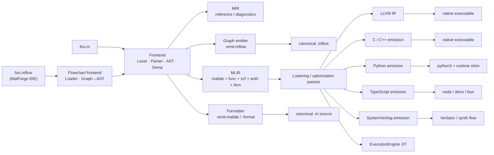

# matlab_llvm

`matlab_llvm` is a MATLAB compiler and tooling stack for a practical,
tested subset of the language. It ships a full frontend, multiple code
generation paths, a JIT-backed REPL, a formatter, and a Language Server,
all built on the same parser and semantic analysis.

The core pipeline is:

```
MATLAB source (.m)        ─► Lexer ─► Parser ────────┐
                                                     ├─► AST ─► Sema ─► MIR ─► MLIR ─► LLVM / C / C++ / Python / TypeScript / SystemVerilog
Flowchart graph (.mflow)  ─► Loader ─► Graph→AST ────┘             │
                                                                   ├─► .m source via formatter (`-emit-matlab`)
                                                                   └─► .mflow via AST→Graph emitter (`-emit-mflow`)
```

Both frontends produce the same `TranslationUnit`, and the AST has
two reverse-direction emitters: `-emit-matlab` (any input → canonical
`.m`) and `-emit-mflow` (any input → IDE-format `.mflow` diagram).

The project is self-contained by design:

- no MathWorks source
- no Octave dependency
- no BLAS/LAPACK dependency for the compiled backends
- C++20 frontend and MLIR-based lowering
- in-tree C and Python runtimes

## Code Generation

The project also allows emission from the MLIR:
- C/C++
- Python
- TypeScript
- SystemVerilog (ASIC, synthesizable; vendor-neutral RTL — Verilator lint-clean)

Plus a frontend-side round-trip: any `.m` or `.mflow` input can emit
canonical MATLAB source via `-emit-matlab` (pretty-prints from the AST,
with classdef-attribute aware formatting and idempotent re-parse).

## What It Covers

The implemented subset is centered on numeric programs, linear algebra,
control flow, functions, basic OOP, and editor tooling.

| Area | Highlights |
|---|---|
| Core language | scripts, functions, recursion, multi-return, `if` / `switch` / `for` / `while` / `try` / `catch`, `break`, `continue`, `return` |
| Numeric runtime | dense matrices, slicing, broadcasting, reductions, `eig`, `svd` (values), `qr`, `chol`, `fft`, `ifft`, `fft2`, `ifft2` |
| Signal Processing Toolbox (subset) | **Tier-1 IIR/FIR design loop (LP + HP/BP/BS) + Tier-2 bulk + Tier-3 (§4.1, §4.2, §4.3, §4.4) closed.** Tier-1: 17 windows; polynomial helpers (`roots`/`poly`/`polyder`/`polyint`/`residue`); IIR design (`butter`/`cheby1`/`cheby2` LP+HP+BP+BS via `'high'`/`'stop'` + 2-elem-Wn dispatch, `besself` analog Bessel, `buttord`/`cheb1ord`/`cheb2ord`); standalone `bilinear`/`freqs`; form conversions (`tf2zp`/`zp2tf`/`tf2sos`/`sos2tf`); FIR (`fir1`/`sgolay`/`sgolayfilt`); filter impl (`filter`/`filtfilt` with steady-state ICs/`sosfilt`); response (`freqz`/`impz`/`stepz`/`grpdelay`). Tier-2: transforms (`dct`/`idct`/`fwht`/`hilbert`/`goertzel`); spectral (`periodogram`/`pwelch`/`cpsd`/`mscohere`/`tfestimate`); LP + parametric PSD (`levinson`/`lpc`/`aryule`/`arburg`/`pyulear`/`pburg`); time-frequency (`spectrogram`). Tier-3: real multirate (`upfirdn`/`decimate`/`interp`/`resample`), waveform generators (`chirp`/`sawtooth`/`square`/`gauspuls`/`rectpuls`/`tripuls`/`sinc`), alignment (`xcov`/`finddelay`/`dtw`), pulse measurements (`findpeaks`, `rms`/`peak2peak`/`peak2rms`/`rssq`, `medfilt1`/`hampel`/`envelope`, `midcross`/`risetime`/`falltime`/`dutycycle`, `statelevels`/`slewrate`/`pulseperiod`/`pulsewidth`/`overshoot`/`undershoot`/`settlingtime`). See [`docs/signal_toolbox_roadmap.md`](docs/signal_toolbox_roadmap.md). |
| Communications Toolbox — Tier-4 equalisation / sync / RF impairments (function-form) | **§6 of the comm toolbox roadmap closed** for the SO-free subset. Adaptive equalisers (`lms`, `rls`, `cma`, `dfe`); carrier / symbol / frame sync (`costasPll` for M-PSK with 2nd-order PLL, `symbolSyncMM` Mueller-Müller TED, `preambleDetect` cross-correlation peak); the four canonical RF impairments (`phaseFreqOffset` complex frequency / phase rotation, `iqimbal` amplitude + phase mis-mate, `memorylessNl(x, model_code, p1..p4)` with cubic-clipper / Saleh / Rapp / Ghorbani models, `phaseNoise` random-walk SSB density); soft-decision Viterbi (`vitdecSoft(llr, trellis, tblen, opmode)` — max-log-MAP path-metric branch). End-to-end soft-vs-hard Viterbi BER curve (`examples/comm/ber_soft_vs_hard.m`) shows ~3 dB soft-decision gain on (171,133)₈ K=7 over BPSK + AWGN (hard 0.120 / soft 0.0051 at 5 dB Eb/N0). System-Object variants (`comm.LinearEqualizer`, `comm.CarrierSynchronizer`, `comm.SymbolSynchronizer`, `comm.PreambleDetector`, `comm.PhaseNoise`, `comm.MemorylessNonlinearity`) stay gated on the SO lowering fix. See [`docs/comm_toolbox_roadmap.md`](docs/comm_toolbox_roadmap.md) §6. |
| Communications Toolbox — Tier-3 channel coding (function-form) | **§5 of the comm toolbox roadmap closed** for the SO-free subset. Function-form CRC (`crcGenerate` / `crcCheck` / `crcStrip` — sidesteps the System-Object surface); convolutional codes (`poly2trellis` builds the trellis struct, `convenc` runs the state-machine encoder, `vitdec` is hard-decision Viterbi with traceback over the trellis at user-supplied `tblen` / `opmode` / `dectype` tags, `oct2dec` bridge for octal generators); Hamming binary codes (`hammgenParity`, `hammingEncode`, `hammingDecode` — single-error correction); block interleavers (`intrlv` / `deintrlv`). End-to-end coded-vs-uncoded BER curve (`examples/comm/ber_coded_vs_uncoded.m`) shows (171,133)₈ K=7 convolutional beating uncoded BPSK by ~2× at Eb/N0 = 7 dB. Carve-outs: BCH / RS + `gf(2^m)` (needs a new typed descriptor — ~2 wk follow-on); CRC System-Object form (`comm.CRCGenerator` / `comm.CRCDetector`) and LDPC / Turbo / Polar (multi-week iterative decoders) stay deferred. See [`docs/comm_toolbox_roadmap.md`](docs/comm_toolbox_roadmap.md) §5. |
| Communications Toolbox — Tier-2 digital modulation MVP (function-form) | **§4 of the comm toolbox roadmap closed.** First user-visible Comm slice: source → modulate → AWGN → demodulate → BER, with a closed-form theory overlay. PAM (`pammod` / `pamdemod`), PSK (`pskmod` / `pskdemod` with configurable initial phase), square + rectangular cross-QAM (`qammod` / `qamdemod` for M ∈ {4, 8, 16, 32, 64, 256, …}), bit-output and max-log LLR demod (`qamdemodBit` / `qamdemodLlr`), generic user-alphabet (`genqammod` / `genqamdemod`), pulse shaping (`rcosdesign` RRC + full-RC, `gaussdesign` GMSK/GFSK), closed-form BER (`berawgn` for PAM/PSK/QAM/DPSK/FSK-coh/FSK-nc), `scatterplot`, `qfunc`, `erfc`. Mapping codes: order 0 natural / 1 Gray; output 0 hard / 1 bit / 2 LLR; mod 0 PAM / 1 PSK / 2 QAM / 3 DPSK / 4 FSK-coh / 5 FSK-nc; shape 0 RRC / 1 full RC. End-to-end 16-QAM Monte-Carlo (`examples/comm/ber_qam_montecarlo.m`) tracks `berawgn` theory within ~10% relative from 4 dB Eb/N0 onward at 20 k symbols/point. FSK function-form is the only deferral. See [`docs/comm_toolbox_roadmap.md`](docs/comm_toolbox_roadmap.md) §4. |
| Communications Toolbox — Tier-1 base layer (function-form) | **§2 of the comm toolbox roadmap closed.** Bit / symbol sources (`randi` scalar / matrix, `randsrc`, `randsrcWeighted`, `randerr`), RNG seed control (`rng(seed)`, `rngDefault()`, `rngShuffle()`, `rngGet()` / `rngSet()` save-restore — shared PRNG state with `rand` / `randn`), MSB-first ↔ LSB-first bit/int conversion (`int2bit` / `bit2int`, legacy `de2bi` / `bi2de`), additive white Gaussian noise channel `awgn(x, snr_dB)` / `awgn(x, snr, sigpower_dBW)` polymorphic on real / complex input via the descriptor-magic dispatch, BER / SER measurement (`biterr`, `biterrCount`, `biterrK(x, y, k)` for k-bit symbols, `symerr`, `symerrCount`). End-to-end BPSK Monte-Carlo loop (`examples/comm/ber_awgn_uncoded.m`) tracks Q(√SNR_lin) within ~5% from 4 dB onward at 50 k bits per SNR point. See [`docs/comm_toolbox_roadmap.md`](docs/comm_toolbox_roadmap.md) §2. |
| Communications / RF / Antenna — Propagation Models (function-form) | **PROP-Tier-1a + 2a + 2b + 3 of the comm toolbox roadmap §3 closed.** Closed-form ITU-R / NIST path loss (`fspl`, `pathlossRain`, `pathlossGas`, `pathlossFog`, `pathlossCloseIn`); cellular empirical models (`pathlossHata`, `pathlossCost231`, `pathlossEgli`, `pathlossEcc33`, `pathlossSui`, `pathlossEricsson9999`); Fresnel-zone math (`fresnelZoneRadius`, `fresnelClearance`); single-edge + multi-edge knife-edge diffraction (`diffractionKnifeEdge`, `diffractionBullington`, `diffractionDeygout`); geographic helpers (`haversine`, `bearing`, `vincenty`, `greatCircleDestLat`, `greatCircleDestLon`); Longley-Rice / ITM (`itmPathloss(profile, freq, ht, hr, pol, climate, Ns, σ, εr, d_total, q_t, q_l, q_s)` — engineering port with reliability quantile correction); terrain + LOS + link budget + single-TX coverage (`terrainProfile`, `losObstruction`, `losClear`, `linkBudget` → struct, `coverageGrid` → matrix); directional antennas + mount + multi-site coverage (`sectorPattern`, `cosinePattern`, `gaussianPattern`, `isotropicPattern`, `applyMountAz`/`applyMountEl`/`applyMountOrientation`, `coverageGridMulti` with best-server / sum-power / SINR aggregation). End-to-end demos under `examples/rf/`: `coverage_barbados.m` (PtP + ITM + coverage map on a synthetic Mount-Hillaby DEM with two 22 dBi cosine dishes), `pathloss_models.m`, `fresnel_diffraction.m`, `antenna_patterns.m`, `longley_rice_link.m`, `geo_helpers.m`, `coverage_three_sector.m`. See [`docs/comm_toolbox_roadmap.md`](docs/comm_toolbox_roadmap.md). The classdef wrappers (`propagationModel` / `txsite` / `rxsite` / `pathloss` / `coverage`) are gated on the System-Object lowering fix per the CST roadmap §12. |
| Control System Toolbox (subset) | **Tier-1 numeric stack + Tier-2 SISO design loop + Tier-3 state-space design + Tier-4 model reduction + Tier-2/3.6 interconnection + §3.1 model objects (tf / ss / zpk / pid / frd classdefs) + model-object short-form surface all closed.** Numerics: `expm`, `logm`, `hess` (1- + 2-return), `schur` (1- + 2-return), non-symmetric `eig` (1- + 2-return, real-eig path), generalised `eig(A, B)` (via QZ + 2×2-block quadratic), `lyap`/`dlyap`/`lyapchol`/`sylvester`, `qz` (4-return), `care`/`dare`/`icare`/`idare` (1- + 3-return `[X, K, L]` + 5-arg cross-term). Design: `lqr`/`dlqr` (1- + 3-return `[K, S, e]` + 5-arg cross-term), `lqry(sys, Q, R)` output-weighted, SISO `place` + `acker` alias (Ackermann), `kalman_L`/`kalmd_L` + 2-return `[L, P] = kalman/kalmd`. Discretization: `c2d` (ZOH), `c2d_tustin` + `d2c_tustin` (matrix-arg, 2-return), **`c2d(sys, Ts)`** model-object form returning a fresh ss. Analysis: `bode_ss` (SISO) / `bode_tf` + 2-return `[mag, phase]`, `step_ss`, `impulse_ss`, `initial_ss`, `lsim_ss`, `gain_margin`/`phase_margin`/`allmargin_ss`, `bandwidth_ss`, `getPeakGain_ss` (rough H∞), `freqresp_ss`/`freqresp_tf` (complex H(jω)), `nyquist_ss`/`nyquist_tf` (`[re, im]` columns), `gram_c`/`gram_o`, `ctrb`/`obsv`, `isstable`/`isstable_d`, `damp`, `hsvd`, `norm_h2`/`norm_h2_d`, `dcgain_ss`, `pole`, `stepinfo`, `logspace`. Reduction: `balreal_T`, `balred` (1- and 3-return `[Ar, Br, Cr]`), `sminreal_{A,B,C}` (structural minimality via boolean-graph reach/observability), `modred_{A,B,C}` (modal residualisation, Truncate / MatchDC), `minreal(num, den, tol)` tf-form pole-zero cancellation. Time-delay: `pade(τ, n)` Padé approximation of `e^{-τs}`, `thiran(D, n)` fractional-delay all-pass FIR. Interconnection (matrix-arg, strictly proper): `feedback_ss`, `series_ss`, `parallel_ss`, `append_ss` — all 3-return splitters. **Model-object short forms** (Sema's `pinnedOfRhs` propagates the class pin through class-returning builtin names): `pole(sys)`, `step(sys)`, `impulse(sys)`, `initial(sys, x0)`, `lsim(sys, u, dt)`, `bode(sys, w)`, `freqresp(sys, w)`, `nyquist(sys, w)`, `allmargin(sys, w)`, `dcgain(sys)`, `bandwidth(sys)`, `damp(sys)`, `isstable(sys)`, `ctrb(sys)`, `obsv(sys)`, `gram(sys, 'c'\|'o')`, `norm(sys)` / `norm(sys, 2)`, `hsvd(sys)`, `balreal_T(sys)`, `lqry(sys, Q, R)`. Class-returning short forms: `c2d(sys, Ts)`, `feedback(sys1, sys2)`, `series(sys1, sys2)`, `parallel(sys1, sys2)`, `append(sys1, sys2)`, `blkdiag(sys1, sys2)`, `sminreal(sys)`, `modred(sys, elim, method)`. Plus `tf('s')` / `tf('z')` char-literal sugar and `disp(tf)` formatted s-domain rendering. See [`docs/control_toolbox_roadmap.md`](docs/control_toolbox_roadmap.md). |
| MATLAB data types | strings, chars, structs, **struct arrays** (`s(i).x`), 1-D and 2-D cell arrays + bracket-concat, function handles, anonymous functions with captures, **dictionaries** (`containers.Map` / `dictionary`), **datetime** / **duration**, **categorical**, **table**, **symbolic** (`sym` / `syms` via SymPP) |
| Symbolic Math Toolbox | `syms`, `sym`, `str2sym`, `diff`, `int`, `simplify`, `expand`, `factor`, `subs`, `solve`, `vpa`, `taylor`, `limit`, `dsolve`, `pdsolve`, `pdsolve_heat`, `pdsolve_wave`, `laplace`, `ilaplace`, `fourier`, `ifourier`, `ztrans`, `iztrans`, `assume`, `assumeAlso`, `clearAssumptions`, `double`, `latex`, `pretty`, `ccode` — opt-in via `-DMATLAB_LLVM_WITH_SYM=ON`, backed by [SymPP](https://github.com/leonardoaraujosantos/SymPP) |
| ODE / IVP solvers | `ode45` (Dormand–Prince 5(4)) and `ode23` (Bogacki–Shampine 3(2)) non-stiff, plus `ode23s` (Rosenbrock 2(3) **stiff solver** — handles Robertson-style kinetics where `ode45` diverges). All three for **scalar and vector `y`**, with adaptive FSAL + cubic-Hermite dense output, full `odeset` surface (`RelTol`, `AbsTol`, `MaxStep`, `InitialStep`, `Refine`, `Stats`), 2- and 3-return forms, forward/backward integration, user-time-grid `tspan = [t0 t1 … tN]`. **Event detection** via the dedicated `[t, y, te, ye, ie] = ode_events(@f, tspan, y0, @evt)` builtin — bracket-then-bisect over each accepted step on a user `value` function with `isterminal` halt and `direction` filter. See [`docs/ode.md`](docs/ode.md). |
| Numerical PDE | `pdepe(m, @pdefun, @icfun, @bcfun, xmesh, tspan)` — MATLAB-compatible 1-D parabolic-elliptic solver via method-of-lines on top of `ode23s`. Cartesian / cylindrical / spherical (`m = 0, 1, 2`); Dirichlet, Neumann, Robin BCs; non-uniform mesh; scalar PDE. Heat equation `u_t = u_xx` on a 21-point mesh recovers `exp(-π²t)·sin(πx)` to ~1e-3; cylindrical Laplacian on an annulus recovers the log-profile steady state to ~2e-5. See [`docs/ode.md`](docs/ode.md). |
| Numeric typed lanes | `int32` / `uint8` matrix descriptors with saturating arithmetic, comparisons, casts, REPL+DAP display; narrower / wider int lanes still f64-shadowed |
| State | `global`, `persistent`, REPL workspace variables, `who` / `whos` / `clear` |
| Parallelism | `parfor` with reduction support |
| OOP | `classdef`, inheritance, static methods, operator overloading, `Dependent` properties, enumerations, **value-class copy-on-assign** for non-handle classes |
| Multi-return | full `[a, b] = f(x)` plus `varargout` (pure and mixed `function [first, varargout] = f(...)`) |
| Tooling | formatter, REPL, DAP server, LSP server, `.mflow` flowchart frontend (graph → AST → every backend) |
| Outputs | LLVM IR, C, C++, experimental Python, native executables via helper scripts. Symbolic programs route through `-emit-cpp` / `-emit-llvm`; `-emit-python`, `-emit-typescript`, and `-emit-systemverilog` diagnose unsupported sym usage at emit time. |

Current corpus size in-tree:

- `29` runnable programs in [`examples/`](examples/)
- `39` synthesizable HDL example modules in [`examples/hdl/`](examples/hdl/) (plus driver scripts)
- `10` flowchart programs in [`examples/mflow/`](examples/mflow/)
- `248` execution tests in `test/Run/` plus `4` opt-in symbolic tests in `test/RunSym/`
- `77` SystemVerilog golden fixtures (Verilator lint-clean) in `test/EmitSV/`
- `7` fi-spec port-declaration regression tests in `test/EmitSVPorts/`
- `2` boolean-port lint-hint tests in `test/EmitSVHint/`
- `10` synthesizability-gate diagnostic tests in `test/EmitSVFail/`
- `40` flowchart fixtures across 6 lanes in `test/Flowchart/` (loader / emit-matlab / cross-backend / lsp / dap / emit-mflow)

For the authoritative compatibility inventory, see
[`docs/feature_status.md`](docs/feature_status.md).

## Quick Start

Prerequisites:

- LLVM 22.x and MLIR
- CMake 3.20+
- Ninja
- a C++20 compiler
- Python 3 with NumPy if you want `-emit-python`

Build and test:

```bash
cmake -S . -B build -G Ninja
cmake --build build
ctest --test-dir build --output-on-failure
```

Or via [`just`](https://github.com/casey/just):

```bash
just build
just test
just repl
just examples
```

Frontend-only build, without MLIR/LLVM:

```bash
cmake -S . -B build -G Ninja -DMATLAB_LLVM_WITH_MLIR=OFF
cmake --build build
```

## Common Workflows

Inspect each compiler stage:

```bash
build/matlabc -dump-tokens foo.m
build/matlabc -dump-ast foo.m
build/matlabc -emit-sema foo.m
build/matlabc -emit-mir foo.m
build/matlabc -emit-mlir foo.m
build/matlabc -emit-llvm foo.m

# Flowchart frontend: same pipeline from a different source shape.
build/matlabc -dump-flow   foo.mflow      # parsed FlowDoc / validation
build/matlabc -emit-matlab foo.mflow      # round-trip to canonical .m
build/matlabc -emit-c      foo.mflow      # any -emit-* works here too
```

Compile through the different backends:

```bash
# LLVM path
runtime/build_and_run.sh foo.m

# C path
build/matlabc -emit-c foo.m > foo.c
cc foo.c runtime/matlab_runtime.c -o foo -lm -lpthread

# C++ path
build/matlabc -emit-cpp foo.m > foo.cpp
c++ -x c++ foo.cpp -x c runtime/matlab_runtime.c -o foo -lm -lpthread

# Python path (experimental)
build/matlabc -emit-python foo.m > foo.py
PYTHONPATH=runtime python3 foo.py
```

The Python emitter aims to read as the natural translation of the
source. MATLAB `for i = 1:N` becomes `for i in range(1, N+1):`; matrix
arithmetic uses inline numpy operators (`A @ B`, `A.T`,
`np.linalg.inv(A)`); MATLAB `classdef` becomes a real Python `class`
with `__init__`, `@property`, `@staticmethod`, and dunder operator
overloads; `disp` of a string literal collapses to bare `print(...)`;
and the `matlab_runtime` import only appears when the body actually
references the shim. See [`docs/emit_python.md`](docs/emit_python.md)
for the full op-to-Python mapping.

Use the development shortcuts in [`justfile`](justfile):

```bash
just compile examples/hello.m
just compile-c examples/hello.m
just compile-cpp examples/hello.m
just compile-python examples/hello.m
just format examples/factorial.m
just mlir examples/matrix_mult.m
just llvm examples/matrix_mult.m
```

## Tools

`matlabc` is the main driver:

| Mode | Purpose |
|---|---|
| `-dump-tokens` | token stream |
| `-dump-ast` | parsed AST |
| `-emit-sema` | AST with bindings and inferred types |
| `-emit-mir` | internal SSA-style MIR |
| `-emit-mlir` | MLIR module |
| `-emit-llvm` | LLVM IR |
| `-emit-c` | self-contained C source |
| `-emit-cpp` | self-contained C++ source |
| `-emit-python` | self-contained Python source using `runtime/matlab_runtime.py` |
| `-emit-typescript` | self-contained TypeScript source using `runtime/matlab_runtime.ts` |
| `-emit-systemverilog` | synthesizable SystemVerilog (ASIC, vendor-neutral RTL) |
| `-check-synthesizable` | gate-only mode for `-emit-systemverilog` (no output, only diagnostics) |
| `-emit-hardware-report` | per-module synthesis budget summary (registers / FSMs / pipeline) |
| `-emit-fixed-point-report` | per-`fi` summary of WL/FL/saturate sites |
| `-emit-matlab` (alias `-emit-m`) | canonical MATLAB source from any input — `.m` formats in place; `.mflow` round-trips through the flowchart frontend |
| `-emit-mflow` (alias `-emit-flow`) | reverse direction: emit a `.mflow` JSON diagram from any input. IDE-canonical formatting; idempotent on repeat emission |
| `-dump-flow` | parsed `FlowDoc` for a `.mflow` input (loader + validation only; no AST build) |
| `-format` | canonical source formatting (synonym of `-emit-matlab` for `.m` inputs) |
| `-repl` | JIT-backed interactive interpreter |
| `-dap` | Debug Adapter Protocol server over stdio |

Useful modifiers:

| Flag | Effect |
|---|---|
| `-opt` / `-O` | run optimization passes before emission |
| `-line` | emit `#line` markers in generated C / C++ (off by default — opt in when you need `lldb` / `gdb` to step into the original `.m`) |
| `-no-line` | redundant for C / C++ (matches the default); accepted for backwards compat |
| `-doxygen` | preserve function-leading comments as Doxygen blocks in `-emit-c` / `-emit-cpp` |
| `-cpp-auto` | prefer `auto` in generated C++ locals |
| `-g` / `--debug-hooks` | inject `matlab_dbg_hook(file_id, line)` at every statement (the same instrumentation `-dap` runs against; visible in `-emit-mlir` / `-emit-c` / `-emit-cpp` output) |
| `--block-path DIR` | search path for `.mflow` `custom` block `library_id` resolution; repeatable. Pairs with the `MATFORGE_BLOCK_PATH` env var (colon-separated). |

The repo also builds `matlab-lsp`, a lightweight Language Server that
reuses the same frontend. It accepts both `.m` and `.mflow` URIs —
`.mflow` files surface loader / builder diagnostics inline on the
offending block.

## Debugging

`matlabc -dap` starts a Debug Adapter Protocol server on stdio so any
DAP-aware editor (VS Code via a generic DAP extension, `nvim-dap`,
JetBrains, Emacs `dap-mode`, …) can drive a live debugging session
against your `.m` script. What works today:

| Capability | Notes |
|---|---|
| Plain line breakpoints | `setBreakpoints`; verified against the loaded source |
| Conditional breakpoints | `condition` evaluated against the workspace via the REPL JIT — pause iff non-zero |
| Log points | `logMessage` with `{name}` placeholders, emitted as DAP `output` events; never pauses |
| Step into / over / out | Full step into user-function bodies — frame stack pushed on entry, popped on return; pauses surface as DAP `reason="step"` |
| Continue / pause / stop on entry | All standard resume actions plus `stopOnEntry` on launch |
| Multi-frame stack trace | `stackTrace` walks back through nested calls (e.g. recursive `fact(5)` shows 5 `fact` frames + `<script>`) |
| Per-frame variable inspection | `scopes(frameId)` + `variables(ref)` render Locals for any frame — function bodies show their own locals (`a`, `b`, `total`), the script frame merges `matlab_ws` + loop-induction vars |
| `evaluate` against any frame | `evaluate(expr, frameId=…)` bridges the chosen frame's mini-ws into the REPL JIT and reverses afterward — watch / hover / debug-console expressions resolve function-frame locals |
| `setVariable` (any RHS) | Watch-box mutation routes through the REPL JIT — scalars, matrix literals, strings, struct accessors all work |
| `error()` backtrace | When `-dap` is on, `error()` prints `error: <msg>` plus one `at <fn> (<file>:<line>)` frame per call site to stderr |
| Multi-file breakpoints | Function-only / classdef-only sibling `.m` files in the entry-point's directory get auto-loaded; bps on their lines resolve and fire correctly |
| Hook line normalization | Stepping never lands on a blank or comment-only row — the lowering anchors each statement's hook to its first executable line |
| `lldb` / `gdb` stepping into `.m` | `matlabc -emit-llvm -g foo.m` attaches DWARF line tables (`!DICompileUnit` / `!DISubprogram` / `!DILocation`) so clang-compiled binaries map back to `.m` source — line breakpoints set by file:line resolve correctly |

Minimal nvim-dap config:

```lua
require('dap').adapters.matlab = {
  type = 'executable',
  command = '/path/to/matlab_llvm/build/matlabc',
  args = { '-dap' },
}
require('dap').configurations.matlab = {{
  type = 'matlab', request = 'launch',
  name = 'Run current .m', program = '${file}', stopOnEntry = false,
}}
```

For the full protocol surface, threading model, and the limits of the
current condition / log-point evaluator (script-level workspace only —
locals inside user functions aren't reachable yet), see
[`docs/debug.md`](docs/debug.md). Lower-level aids — `dbg(x)` source-
located prints, `who` / `whos` / `clear` in the REPL, `#line`-annotated
C/C++ output for stepping in `lldb`/`gdb` — live there too.

The debugging surface is regression-tested by two ctest suites,
`debug-hook-tests` (per-statement hook injection in the lowering) and
`debug-dap-tests` (end-to-end DAP scenarios driven by a small Python
client over `matlabc -dap`'s stdio). Run with
`ctest --test-dir build -R "debug-"`.

## Main Features

Examples of shipped functionality:

```matlab
% Parallel reduction
x = 0;
parfor i = 1:10
    x = x + i;
end
disp(x);   % 55
```

```matlab
% Linear algebra
A = [4 3; 6 3];
b = [7; 9];
disp(A \ b);
disp(det(A));
disp(inv(A));
```

```matlab
% Handles and anonymous functions
k = 5;
f = @(x) x + k;
g = @sq;
disp(f(3));
disp(g(6));
function y = sq(x), y = x * x; end
```

```matlab
% Basic OOP
classdef Vec2
    properties
        x
        y
    end
    methods
        function obj = Vec2(xv, yv), obj.x = xv; obj.y = yv; end
        function r = plus(a, b), r = Vec2(a.x + b.x, a.y + b.y); end
    end
end
```

```matlab
% Complex arithmetic and FFT
x = [1 2 3 4];
y = fft(x);
disp(real(y));
disp(imag(y));
```

```matlab
% Fixed-Point Designer (`fi`) — emits idiomatic int + shift code in C
gain = fi(1.5, 1, 16, 8);    % Q8.8 signed
x    = fi(0.75, 1, 16, 8);
y    = fi(0, 1, 16, 8);
y(:) = x * gain;             % real-world 1.125
disp(y);
```

## Architecture


```mermaid
flowchart LR
  src1["foo.m"] --> FE["Frontend<br/>Lexer · Parser · AST · Sema"]
  src2["foo.mflow<br/>(MatForge IDE)"] --> FC["Flowchart frontend<br/>Loader · Graph→AST"]
  FC --> FE
  FE --> MIR["MIR<br/>reference / diagnostics"]
  FE --> MLIR["MLIR<br/>matlab + func + scf + arith + llvm"]
  FE --> FMT["Formatter<br/>-emit-matlab / -format"]
  FE --> MFL["Graph emitter<br/>-emit-mflow"]
  MFL --> MOUT2["canonical .mflow"]
  MLIR --> Passes["Lowering / optimization passes"]
  Passes --> LLVM["LLVM IR"]
  Passes --> C["C / C++ emission"]
  Passes --> PY["Python emission"]
  Passes --> TS["TypeScript emission"]
  Passes --> SV["SystemVerilog emission"]
  Passes --> JIT["ExecutionEngine JIT"]
  LLVM --> EXE1["native executable"]
  C --> EXE2["native executable"]
  PY --> EXE3["python3 + runtime shim"]
  TS --> EXE4["node / deno / bun"]
  SV --> EXE5["Verilator / synth flow"]
  FMT --> MOUT["canonical .m source"]
```

Notes:

- The frontend can build without MLIR.
- MIR is maintained as a readable internal IR and diagnostic target.
- Production lowering goes through MLIR.
- The compiled backends share the same semantics-oriented runtime model.
- `parfor` lowers to pthread-backed execution in the compiled runtime.

## Documentation Map

Start here for the high-level index:

- [`docs/README.md`](docs/README.md)

Core docs:

- [`docs/roadmap.md`](docs/roadmap.md): forward-looking work — CocoTB verification, SV→MATLAB, runtime/REPL/HDL improvements
- [`docs/feature_status.md`](docs/feature_status.md): feature inventory and known gaps
- [`docs/flowchart_frontend.md`](docs/flowchart_frontend.md): graphical block-language frontend (`.mflow` JSON → AST → every backend)
- [`docs/flowchart_schema.md`](docs/flowchart_schema.md): `.mflow` JSON schema reference — every block kind's required fields, port conventions, validation rules. Read this when implementing the IDE save/load.
- [`docs/repl.md`](docs/repl.md): REPL behavior and limits
- [`docs/lsp.md`](docs/lsp.md): editor integration and LSP surface
- [`docs/debug.md`](docs/debug.md): DAP mode and built-in debugging aids
- [`docs/emit_c_cpp.md`](docs/emit_c_cpp.md): C and C++ backends
- [`docs/emit_cpp_classdef.md`](docs/emit_cpp_classdef.md): MATLAB classdef → C++ class lowering
- [`docs/emit_python.md`](docs/emit_python.md): Python backend status and behavior
- [`docs/tutorial_hdl.md`](docs/tutorial_hdl.md): **end-to-end HDL tutorial** — write MATLAB, emit SV, verify with cocotb (start here for HDL flow)
- [`docs/emit_systemverilog.md`](docs/emit_systemverilog.md): SystemVerilog (ASIC, synthesizable) backend
- [`docs/sv_supported_subset.md`](docs/sv_supported_subset.md): SV supported subset — every pragma + every limitation
- [`docs/emit_cocotb.md`](docs/emit_cocotb.md): `-emit-cocotb` cycle-by-cycle co-simulation harness
- [`docs/emit_fixed_point.md`](docs/emit_fixed_point.md): Fixed-Point Designer (`fi`) lowering
- [`docs/complex.md`](docs/complex.md): complex numbers and FFT
- [`docs/sym.md`](docs/sym.md): Symbolic Math Toolbox via SymPP — `syms`/diff/int/simplify/solve/dsolve/pdsolve/transforms/assume/vpa/taylor/limit + symbolic matrices and `[a 1; 2 b]` literal syntax
- [`docs/ode.md`](docs/ode.md): ODE / PDE numerical solvers — `ode45`, `ode23`, `ode23s` (stiff), `ode_events`, `pdepe`
- [`docs/signal_toolbox_roadmap.md`](docs/signal_toolbox_roadmap.md): Signal Processing Toolbox compatibility plan — Tier-1 IIR/FIR design loop (lowpass + band variants HP/BP/BS for `butter`/`cheby1`/`cheby2`, plus `besself` analog Bessel, standalone `bilinear`/`freqs`, `cheb2ord`, `tf2zp`/`zp2tf`/`tf2sos`/`sos2tf` form conversions, `filtfilt` with steady-state ICs), Tier-2 (nonparametric + parametric spectral, transforms tail, single-output spectrogram), and Tier-3 (§4.1 real multirate, §4.2 waveform generators, §4.3 pulse measurements **full surface** — including `statelevels`/`slewrate`/`pulseperiod`/`pulsewidth`/`overshoot`/`undershoot`/`settlingtime`, §4.4 alignment) are all closed (~95 functions across the C/C++/Python/TS lanes); still open are `ellip`/`ellipord` (Jacobi elliptic), the analog prototype builtins as standalone 3-return entries, the state-space / zp→sos conversions (`tf2ss`/`ss2tf`/`zp2sos`), richer FIR (`fir2`/`firls`/`firpm`/`firrcos`/`kaiserord`), strict 1996 Gustafsson `filtfilt` (scipy's method='gust') + `phasez`/`zerophase`, multitaper (`dpss`/`pmtm`), STFT/`pspectrum`/`instfreq`/`instbw`, `czt`/`dst`/cepstrum, subspace AR methods, `findpeaks` name-value options, and the `digitalFilter` system object; explicit GUI / deep-learning / Simulink carve-outs documented
- [`docs/sema.md`](docs/sema.md): semantic analysis and type inference
- [`docs/save_load_compat.md`](docs/save_load_compat.md): `save` / `load` `.mat` compatibility

Program examples:

- [`examples/README.md`](examples/README.md)

## Repository Layout

| Path | Role |
|---|---|
| `include/matlab/` | public headers for frontend, MIR, MLIR, Flowchart, and tooling |
| `lib/` | implementation of lexer, parser, Sema, Flowchart loader+builder, MIR, MLIR lowering, and emitters |
| `tools/matlabc/` | CLI driver, REPL, DAP entry point |
| `tools/matlab-lsp/` | Language Server (accepts both `.m` and `.mflow`) |
| `runtime/` | C runtime shim and Python runtime shim |
| `examples/` | runnable sample programs |
| `test/` | parser, sema, MIR, MLIR, emission, and execution tests |

## Status

This is not a full MATLAB implementation. The target is the practical
subset needed for numeric programs and compiler experimentation, not
toolboxes, graphics, GUIs, or `.mat` compatibility.

Maturity by output path (most → least mature):

1. **LLVM IR / native executable** — primary path. Full coverage of the
   shipped MATLAB subset.
2. **C / C++** — same coverage minus a few class-instance edge cases.
   Multi-return functions emit as out-pointer params (C) / `std::tuple`
   return (C++). Persistent variables with the canonical `if isempty(x);
   x = init; end` pattern lower to `static T x = <init>;`.
3. **Python** — multi-return uses native tuple unpacking; class /
   anon-handle path still has rough edges on a few edge fixtures.
4. **SystemVerilog** (ASIC, synthesizable) — Tier-1 closure shipped:
   FSMs, persistent registers (scalar + fi-array shift registers), full
   fixed-point lowering with quantize/saturate, `% hdl: port(...)`
   pragmas, bit-slicing `x(hi:lo)` syntax (any width 1..64), runtime-
   indexed persistent fi-arrays (auto-decoded regfile pattern), and
   hierarchical multi-module emission (`func.call` → SV instance with
   auto-wired clk/rst_n). 77 fixtures lint clean under Verilator, and
   all 39 standalone HDL examples verify bit-exact under cocotb. See
   `docs/sv_supported_subset.md` for the supported-subset reference,
   `docs/emit_systemverilog.md` for backend architecture, and
   `examples/hdl/` for the canonical ASIC examples.
5. **TypeScript** — same scope as Python; least exercised in CI.

The frontend itself has a second source surface alongside `.m` text:

- **Flowchart (`.mflow`) frontend** — graphical block-language input
  saved by the MatForge IDE. Supports linear chains, structured
  control flow (`if`/`else`, `for`, `while`, `break`, `continue`,
  `return`, arbitrary nesting), sub-flows lifted to top-level
  `Function`s, and `custom` blocks (inline `source` / sibling
  `path` / `library_id` from `--block-path` + `MATFORGE_BLOCK_PATH`)
  with function-insertion dedup. Every `-emit-*` backend works on
  `.mflow` inputs unchanged. A cross-backend round-trip CI lane
  asserts `.mflow` ≡ round-tripped `.m` across C / C++ / Python /
  TS. See [`docs/flowchart_frontend.md`](docs/flowchart_frontend.md)
  and [`docs/flowchart_schema.md`](docs/flowchart_schema.md).
