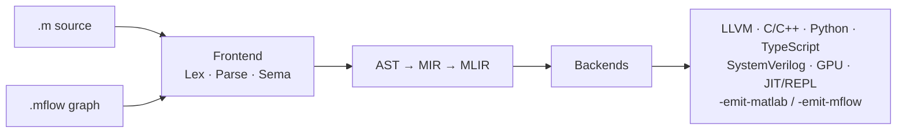
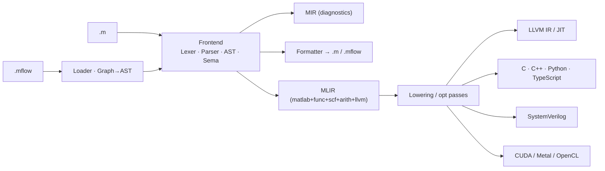

# matlab_llvm

[](https://en.cppreference.com/w/cpp/20)
[](https://mlir.llvm.org/)
[](#quick-start)
[](#quick-start)
&nbsp;
[](#code-generation)
[](#what-it-covers)
[](test/Run)
[](test/EmitSV)
&nbsp;
[](https://github.com/leonardoaraujosantos/matlab_llvm/stargazers)
[](https://github.com/leonardoaraujosantos/matlab_llvm/commits/main)

A self-contained **MATLAB compiler and tooling stack** for a practical,
tested subset of the language — one frontend feeding many backends, plus a
JIT-backed REPL, a debugger (DAP), a formatter, and a Language Server.

No MathWorks source, no Octave, no BLAS/LAPACK dependency for the compiled
backends. C++20 frontend, MLIR-based lowering, in-tree C / Python / TypeScript
runtimes.

## Pipeline


```mermaid
flowchart LR
  M[".m source"] --> FE
  F[".mflow graph"] --> FE["Frontend<br/>Lex · Parse · Sema"]
  FE --> IR["AST → MIR → MLIR"]
  IR --> B["Backends"]
  B --> O["LLVM · C/C++ · Python · TypeScript<br/>SystemVerilog · GPU · JIT/REPL<br/>-emit-matlab / -emit-mflow"]
```

Both frontends produce the same `TranslationUnit`; two reverse emitters round-trip
any input back to canonical `.m` (`-emit-matlab`) or an IDE `.mflow` diagram
(`-emit-mflow`). Architecture detail: [§ Architecture](#architecture).

## Code Generation

| Target | Flag | Notes |
|---|---|---|
| LLVM IR / native | `-emit-llvm` | primary path; JIT also drives the REPL/DAP |
| C / C++ | `-emit-c` / `-emit-cpp` | self-contained source + in-tree runtime |
| Python / TypeScript | `-emit-python` / `-emit-typescript` | NumPy- / NDArray-backed |
| SystemVerilog | `-emit-systemverilog` | synthesizable ASIC RTL, Verilator lint-clean |
| GPU bundle | `-emit-{cuda,metal,opencl} [-o dir]` | standalone kernel + host driver + Makefile from `coder.gpu.kernelfun`; CUDA/OpenCL validated on NVIDIA (RTX 5060), Metal on Apple silicon — [`docs/gpu_coder_roadmap.md`](docs/gpu_coder_roadmap.md) |
| MATLAB / flowchart | `-emit-matlab` / `-emit-mflow` | frontend round-trip from any input |

## What It Covers

Centered on numeric programs, linear algebra, control flow, OOP, and editor
tooling. The authoritative inventory is
[`docs/feature_status.md`](docs/feature_status.md); per-area roadmaps below.

| Area | Status | Docs |
|---|:--:|---|
| Core language (scripts, functions, recursion, multi-return + `varargout`, full control flow, OOP, `parfor`) | ✅ | [feature_status](docs/feature_status.md) |
| Numeric runtime (dense matrices, slicing, broadcasting, reductions, `eig`/`svd`/`qr`/`chol`/`fft`) | ✅ | [feature_status](docs/feature_status.md) |
| Data types (string/char, struct + struct arrays, 1-D/2-D cells, handles, dict, datetime/duration, categorical, table) | ✅ | [feature_status](docs/feature_status.md) |
| ODE / PDE solvers (`ode45`/`ode23`/`ode23s`, `pdepe`, event detection) | ✅ | [ode](docs/ode.md) |
| Signal Processing | ✅ | [roadmap](docs/signal_toolbox_roadmap.md) |
| Communications / RF / Antenna / Propagation | ✅ | [comm](docs/comm_toolbox_roadmap.md) · [rf](docs/rf_toolbox_plan.md) · [antenna](docs/antenna_toolbox_roadmap.md) · [prop](docs/propagation_toolbox_roadmap.md) |
| Control System (`tf`/`ss`/`zpk` objects, `c2d`, `ssdata`/`tfdata`, design + analysis) | ✅ | [roadmap](docs/control_toolbox_roadmap.md) |
| Model Predictive Control (linear + adaptive + explicit + NMPC) | ✅ | [roadmap](docs/mpc_toolbox_roadmap.md) |
| Optimization + Global Optimization | ✅ | [optim](docs/optim_toolbox_roadmap.md) · [global](docs/global_optim_toolbox_roadmap.md) |
| Statistics & ML · System Identification | ✅ | [stats](docs/stats_ml_toolbox_roadmap.md) · [ident](docs/ident_toolbox_roadmap.md) |
| Image Processing | ✅ | [roadmap](docs/image_toolbox_roadmap.md) |
| Deep Learning + DL HDL (autodiff, `dlnetwork`, `trainnet`/`trainingOptions`, RNN/attention, ONNX) | ✅ | [roadmap](docs/deep_learning_toolbox_roadmap.md) |
| Reinforcement Learning (DQN/PPO/DDPG/TD3/SAC/TRPO/GRPO) | ✅ | [roadmap](docs/reinforcement_learning_toolbox_roadmap.md) |
| Symbolic Math (opt-in via SymPP) | ✅ | [sym](docs/sym.md) · [roadmap](docs/symbolic_toolbox_roadmap.md) |
| Fixed-Point Designer (`fi`) | ✅ | [roadmap](docs/fixed_point_toolbox_roadmap.md) · [emit](docs/emit_fixed_point.md) |
| Stateflow (state-chart `.mflow` dialect + synthesizable FSM SV) | 🟡 | [roadmap](docs/mStateflow_roadmap.md) |
| Tooling (formatter, REPL, DAP, LSP, flowchart frontend) | ✅ | [repl](docs/repl.md) · [debug](docs/debug.md) · [lsp](docs/lsp.md) |

## Performance

Reproducible bench harness in [`bench/lapack/`](bench/lapack/) (Apple M-series,
single-thread BLAS, `clang++ -O3`):

- **Dense linalg** — every hot kernel dispatches to LAPACK/BLAS above a size
  threshold; matches NumPy within ±50% at N=1000, and beats it on `chol`/`inv`/`svd`
  (Apple Accelerate AMX). `svd` 266× over the naive baseline.
- **Scalar inner loops** (Mandelbrot, `max_iter=100`) — the LLVM JIT wins
  ~3.7–5.6× vs vectorized NumPy and ~11× vs pure Python.
- **GPU** — Metal MPS path swaps dense kernels onto the GPU when `MATLAB_GPU_TARGET=metal`.

Full data: [`bench/lapack/results/`](bench/lapack/results/).

## Quick Start

Prereqs: LLVM 22.x + MLIR, CMake 3.20+, Ninja, a C++20 compiler (Clang), and
Python 3 + NumPy for `-emit-python`.

```bash
# Generic (LLVM 22 already installed)
cmake -S . -B build -G Ninja
cmake --build build
ctest --test-dir build --output-on-failure

# Run
build/matlabc -emit-llvm foo.m       # or -emit-c / -emit-cpp / -repl / -dap …
```

- **Ubuntu 24.04** (install LLVM 22 from [apt.llvm.org](https://apt.llvm.org/)) and
  **Docker** builds: see [`docs/build.md`](docs/build.md).
- Frontend-only (no MLIR): `-DMATLAB_LLVM_WITH_MLIR=OFF`.
- Plots/video (`-DMATLAB_LLVM_WITH_PLOT=ON`): [`docs/plotting.md`](docs/plotting.md).
- Shortcuts via [`just`](justfile): `just build` · `just test` · `just repl` · `just examples`.

## Common Workflows

```bash
# Inspect each stage
build/matlabc -dump-ast foo.m
build/matlabc -emit-mlir foo.m

# Backends (each is self-contained source + the in-tree runtime)
build/matlabc -emit-c   foo.m > foo.c   && cc  foo.c   runtime/matlab_runtime.c -o foo -lm -lpthread
build/matlabc -emit-python foo.m > foo.py && PYTHONPATH=runtime python3 foo.py

# Flowchart frontend — same pipeline from a different source shape
build/matlabc -emit-matlab foo.mflow    # round-trip to canonical .m
build/matlabc -emit-c      foo.mflow    # any -emit-* works on .mflow too
```

The Python emitter reads as a natural translation (`for i = 1:N` → `for i in
range(1, N+1)`, `A*B` → `A @ B`, `classdef` → a real `class`). See
[`docs/emit_python.md`](docs/emit_python.md).

## Tools

`matlabc` modes: `-dump-{tokens,ast}`, `-emit-{sema,mir,mlir,llvm,c,cpp,python,typescript,systemverilog,matlab,mflow}`,
`-check-synthesizable`, `-emit-{hardware,fixed-point}-report`, `-format`, `-repl`, `-dap`.
Modifiers: `-O` (optimize), `-g` (debug hooks), `-line` (DWARF/`#line`), `-o <dir>` (GPU bundle output).
Full reference: [`docs/README.md`](docs/README.md). The repo also builds `matlab-lsp`
(Language Server; accepts `.m` and `.mflow`).

## Debugging

`matlabc -dap` is a Debug Adapter Protocol server over stdio — line + conditional
breakpoints, log points, step in/over/out, multi-frame stacks, per-frame variable
inspection, `evaluate`/`setVariable` against any frame, and `error()` backtraces.
The REPL adds multi-line block input, persistent history, and tab completion.
Details: [`docs/debug.md`](docs/debug.md) · [`docs/repl.md`](docs/repl.md).

## Architecture


```mermaid
flowchart LR
  M[".m"] --> FE["Frontend<br/>Lexer · Parser · AST · Sema"]
  F[".mflow"] --> FC["Loader · Graph→AST"] --> FE
  FE --> MIR["MIR (diagnostics)"]
  FE --> FMT["Formatter → .m / .mflow"]
  FE --> MLIR["MLIR (matlab+func+scf+arith+llvm)"]
  MLIR --> P["Lowering / opt passes"]
  P --> LLVM["LLVM IR / JIT"]
  P --> SRC["C · C++ · Python · TypeScript"]
  P --> SV["SystemVerilog"]
  P --> GPU["CUDA / Metal / OpenCL"]
```

- The frontend builds without MLIR; production lowering goes through MLIR.
- MIR is a readable internal IR + diagnostic target.
- Compiled backends share one semantics-oriented runtime model; `parfor` → pthreads.

## Documentation

[`docs/README.md`](docs/README.md) is the full index. Start points:

- **Status & plan** — [`docs/feature_status.md`](docs/feature_status.md) (what works) ·
  [`docs/roadmap.md`](docs/roadmap.md) (what's next)
- **Backends** — [`docs/emit_c_cpp.md`](docs/emit_c_cpp.md) ·
  [`docs/emit_python.md`](docs/emit_python.md) ·
  [`docs/emit_systemverilog.md`](docs/emit_systemverilog.md) ·
  [`docs/gpu_coder_roadmap.md`](docs/gpu_coder_roadmap.md)
- **Frontends & tooling** — [`docs/flowchart_frontend.md`](docs/flowchart_frontend.md) ·
  [`docs/repl.md`](docs/repl.md) · [`docs/debug.md`](docs/debug.md) · [`docs/lsp.md`](docs/lsp.md)
- **HDL flow** — [`docs/tutorial_hdl.md`](docs/tutorial_hdl.md) (write MATLAB → emit SV → verify with cocotb)
- **Examples** — [`examples/README.md`](examples/README.md)

## Repository Layout

| Path | Role |
|---|---|
| `include/matlab/` · `lib/` | frontend, MIR, MLIR lowering, Flowchart, emitters |
| `tools/matlabc/` · `tools/matlab-lsp/` | CLI driver + REPL + DAP · Language Server |
| `runtime/` | C / Python / TypeScript runtime shims |
| `examples/` · `test/` | runnable programs · parser/sema/MIR/MLIR/emission/execution tests |

## Status

Not a full MATLAB implementation — the target is the practical subset for numeric
programs and compiler experimentation, not graphics, GUIs, or `.mat` compatibility.

Maturity by output path (most → least mature): **LLVM/native** (full subset) →
**C/C++** (minus a few class-instance edge cases) → **SystemVerilog** (synthesizable
ASIC; 79 Verilator-clean goldens; HDL examples cocotb bit-exact) → **Python** →
**TypeScript** (least exercised in CI).
