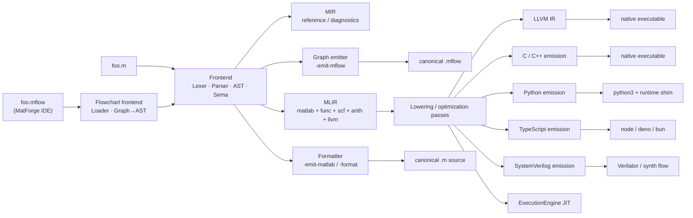

# matlab_llvm

[](https://en.cppreference.com/w/cpp/20)
[](https://mlir.llvm.org/)
[](https://cmake.org/)
[](#quick-start)
&nbsp;
[](#code-generation)
[](#shipped-toolboxes-in-the-runtime)
[](test/Run)
[](test/EmitSV)
&nbsp;
[](https://github.com/leonardoaraujosantos/matlab_llvm/stargazers)
[](https://github.com/leonardoaraujosantos/matlab_llvm/network/members)
[](https://github.com/leonardoaraujosantos/matlab_llvm/commits/main)
[](https://github.com/leonardoaraujosantos/matlab_llvm/issues)
[](https://github.com/leonardoaraujosantos/matlab_llvm)
[](https://github.com/leonardoaraujosantos/matlab_llvm)
[](https://github.com/leonardoaraujosantos/matlab_llvm)

`matlab_llvm` is a MATLAB compiler and tooling stack for a practical,
tested subset of the language. It ships a full frontend, multiple code
generation paths, a JIT-backed REPL, a formatter, and a Language Server,
all built on the same parser and semantic analysis.

The core pipeline is:

```
MATLAB source (.m)        ─► Lexer ─► Parser ────────┐
                                                     ├─► AST ─► Sema ─► MIR ─► MLIR ─► LLVM / C / C++ / Python / TypeScript / SystemVerilog
Flowchart graph (.mflow)  ─► Loader ─► Graph→AST ────┘             │
                                                                   ├─► .m source via formatter (`-emit-matlab`)
                                                                   └─► .mflow via AST→Graph emitter (`-emit-mflow`)
```

Both frontends produce the same `TranslationUnit`, and the AST has
two reverse-direction emitters: `-emit-matlab` (any input → canonical
`.m`) and `-emit-mflow` (any input → IDE-format `.mflow` diagram).

The project is self-contained by design:

- no MathWorks source
- no Octave dependency
- no BLAS/LAPACK dependency for the compiled backends
- C++20 frontend and MLIR-based lowering
- in-tree C and Python runtimes

## Code Generation

The project also allows emission from the MLIR:
- C/C++
- Python
- TypeScript
- SystemVerilog (ASIC, synthesizable; vendor-neutral RTL — Verilator lint-clean)

Plus a frontend-side round-trip: any `.m` or `.mflow` input can emit
canonical MATLAB source via `-emit-matlab` (pretty-prints from the AST,
with classdef-attribute aware formatting and idempotent re-parse).

## Shipped Toolboxes (in the runtime)

The compiler is the smaller half of the project. The larger half is a
~28 kLOC C++ runtime that implements toolbox surfaces alongside the
matrix kernel, exposed as builtins and classdefs the compiled MATLAB
calls into. Seventeen toolbox surfaces ship today:

| Toolbox | Runtime backing | Status |
|---|---|---|
| **Signal Processing** | core `matlab_runtime.cpp` | Tier-1 design / Tier-2 spectral+parametric / Tier-3 §4.1–§4.4 closed — ~95 entries. See [`docs/signal_toolbox_roadmap.md`](docs/signal_toolbox_roadmap.md). |
| **Control System** | core + [`runtime/cst_classdefs.m`](runtime/cst_classdefs.m) + 4 model-object classdefs (`tf` / `ss` / `zpk` / `pid` / `frd`) | Tier-1 numerics / Tier-2 SISO / Tier-3 state-space / Tier-4 reduction + interconnection + §3.1 model-object short-form surface closed — ~50 entries. See [`docs/control_toolbox_roadmap.md`](docs/control_toolbox_roadmap.md). |
| **Communications** | [`runtime/runtime_comm.cpp`](runtime/runtime_comm.cpp) (3.1 kLOC) | Tier-1 base (§2) / Tier-2 modulation (§4) / Tier-3 channel coding (§5) / Tier-4 equaliser+sync+RF impairments (§6) / Tier-5 OFDM+fading+MIMO (§7) / Tier-6 spreading+source-coding (§8) / Tier-7 modern codes — Polar/LDPC/Turbo (§5.4) all closed in function form. System-Object variants stay SO-gated. See [`docs/comm_toolbox_roadmap.md`](docs/comm_toolbox_roadmap.md). |
| **RF Toolbox** | [`runtime/runtime_rf.cpp`](runtime/runtime_rf.cpp) (6.1 kLOC) + 15 RF classdefs (`rf_class_sparameters.m` … `rf_class_amplifier.m`) | Tier-1 Touchstone v1/v2 / Tier-2 N-port conversions+cascade / Tier-3 Vector Fitting / Tier-4 transmission lines + matching networks + LC filters all closed; native complex N×N LU; Verilog-A export (Tier-1 → Tier-10). See [`docs/rf_toolbox_plan.md`](docs/rf_toolbox_plan.md) + [`docs/verilog_a_plan.md`](docs/verilog_a_plan.md). |
| **Antenna Toolbox (subset)** | `runtime_rf.cpp` + [`runtime/ant_class_dipole.m`](runtime/ant_class_dipole.m) / `ant_class_monopole.m` | ANT-Tier-2 closed-form thin-wire dipole (induced-EMF method) — `Zin`, `S11`, `VSWR`, directivity, pattern, swept S-parameters; ANT-Tier-2b multi-wire MoM (Yagi / monopole-over-ground / helix / loop / folded-dipole) is the next slice; ANT-Tier-3 triangular-mesh MoM (patches / planar) and ANT-Tier-4 arrays are open. See [`docs/antenna_toolbox_roadmap.md`](docs/antenna_toolbox_roadmap.md). |
| **Propagation Models** | [`runtime/runtime_prop.cpp`](runtime/runtime_prop.cpp) (1.7 kLOC) + 3 site classdefs (`rf_class_propagationmodel.m`, `rf_class_txsite.m`, `rf_class_rxsite.m`) | PROP-Tier-1a/2a/2b/3 + Tier-1b classdef wrappers all closed — closed-form path loss + empirical cellular + Fresnel + ITM (Longley-Rice) + link budget + multi-site coverage with directional patterns + `propagationModel` / `txsite` / `rxsite` MathWorks-API classdefs. See [`docs/propagation_toolbox_roadmap.md`](docs/propagation_toolbox_roadmap.md). |
| **Optimization** | [`runtime/runtime_optim.cpp`](runtime/runtime_optim.cpp) (2.5 kLOC) + [`runtime/optim_classdefs.m`](runtime/optim_classdefs.m) | **Tier-1 → Tier-5 all closed** — `fzero`/`fminbnd`/`fminsearch`/`fminunc`/`linprog`/`lsqnonneg`/`fsolve` (T1) · `fmincon`/`quadprog`/`lsqlin`/`lsqnonlin`/`lsqcurvefit` (T2) · `intlinprog`/`coneprog`/`fminimax`/`fgoalattain`/`fseminf` (T3) · problem-based `optimvar`/`optimproblem`/`solve` expression-DAG (T4) · `eqnproblem` (T5). Headline `examples/optim/blade_pitch_opt.m` couples `fmincon` to PDE elasticity. Carve-down: full `optimoptions` surface + `[x,fval,exitflag,output]` multi-return is the next slice. See [`docs/optim_toolbox_roadmap.md`](docs/optim_toolbox_roadmap.md). |
| **Model Predictive Control** | [`runtime/toolbox/mpc/runtime_mpc.cpp`](runtime/toolbox/mpc/runtime_mpc.cpp) + [`runtime/toolbox/mpc/mpc_classdefs.m`](runtime/toolbox/mpc/mpc_classdefs.m) | **Tiers 1 → 6 all closed.** Linear MPC (hand-coded KWIK active-set QP) · constraints + disturbances + run-time overrides via `mpcmoveopt` · adaptive / time-varying / gain-scheduled + mflow `MpcMove` block + cocotb SIL · explicit-MPC grid lookup + standalone `mpcActiveSetSolver` + finite-control-set · nonlinear MPC (`nlmpc` / `nlmpcmove` over `fmincon` with an RK4 prediction rollout) · Tier-6 carve-down sweep (continuous-plant auto-c2d, rate bounds, MV-tracking, `setEstimator`/`getEstimator`/`review`, `mpcsimopt`, reference previewing). 25 gating tests. Headlines `examples/mpc/{dc_servo_mpc,paper_machine,pendulum_nlmpc,twin_rotor_nlmpc}.m` (SISO/MIMO × linear/nonlinear) + the `examples/quadrotor/` symbolic-EOM cascade flight controller. See [`docs/mpc_toolbox_roadmap.md`](docs/mpc_toolbox_roadmap.md). |
| **System Identification** | [`runtime/toolbox/ident/runtime_ident.cpp`](runtime/toolbox/ident/runtime_ident.cpp) + [`runtime/toolbox/ident/ident_classdefs.m`](runtime/toolbox/ident/ident_classdefs.m) | **All 6 tiers closed.** T1 `iddata` + `idpoly` + `arx`/`ar` (QR-LS) + `sim`/`predict`/`compare`(NRMSE)/`goodnessOfFit`/`fpe`/`aic` + `ss`/`tf`(idpoly). T2 PEM core: `armax`/`oe`/`bj` via `lsqnonlin` with one general predictor `e=(D/C)(A·y−B/F·u)`, `iv4` instrumental-variables, `pe`/`resid` whiteness, `delayest`. T3 subspace state-space: `n4sid`/`ssest` via Ho-Kalman/ERA (block-Hankel SVD through symmetric Gram-eig), `tfest`, `idss`, state-space sim/compare, `ss(idss)`. T4 non-parametric: `etfe`/`spa` → `idfrd`, `impulseest`, `forecast`, **linear grey-box** `greyest`/`idgrey` (function-handle structure fn + ZOH `c2d` + `lsqnonlin`). T5 heavy: **EKF/UKF** `extendedKalmanFilter`/`unscentedKalmanFilter` (the project's first dynamic Kalman filtering loop), forgetting-factor RLS `recursiveARX`/`recursiveLS`, nonlinear grey-box `nlgreyest`. T6 polish: regularized `arx(data,orders,arxOptions)` ridge LS + `getcov`/`getpvec`/`setpvec` introspection. **20 gating tests; 435/435 full regression clean.** Headline `examples/ident/data_driven_mpc.m` (the cross-toolbox tracer-bullet: `ssest(z,2) → ss(idsys) → mpc(P,10,3)` end-to-end) + `arx_lab_process.m` / `armax_refine.m` / `greybox_msd.m` / `ukf_state_estimation.m` / `recursive_arx_tracking.m` / `arx_regularization.m`. **Next slice**: nonlinear black-box `nlarx`/`nlhw` + mapping objects (`idSigmoidNetwork` / `idWaveletNetwork` / `idTreePartition`), `particleFilter`, recursive-PEM, estimation `Report` struct, MIMO. **Carve-outs**: SI App + Time Series Modeler GUIs, Simulink blocks, Neural State-Space + LSTM (Deep Learning dep), ML-NLARX (Stats & ML dep), Reduced Order Modeling, C-MEX grey-box, Diagnostics & Prognostics. See [`docs/ident_toolbox_roadmap.md`](docs/ident_toolbox_roadmap.md). |
| **Global Optimization** *(all 6 tiers)* | [`runtime/toolbox/gads/runtime_gads.cpp`](runtime/toolbox/gads/runtime_gads.cpp) + [`runtime/toolbox/gads/gads_classdefs.m`](runtime/toolbox/gads/gads_classdefs.m) | **All 6 tiers shipped** — an *amplifier* of the shipped Optimization Toolbox: every solver runs over the shared seeded PRNG (`rng`-reproducible) and reuses the shipped `fmincon` / `mldivide` (no external dependency). T1 derivative-free solvers: `ga` (real-coded GA), `particleswarm` (Clerc-Kennedy PSO), `simulannealbnd` (geometric-cooling SA), each with a `fmincon` hybrid polish. T2 multi-start meta-solvers: `createOptimProblem` + `MultiStart` (k restarts) + `GlobalSearch` (scatter-search). T3 `patternsearch` (deterministic GPS direct search). T4 `surrogateopt` (cubic-RBF surrogate + adaptive sampling). T5 multiobjective: `gamultiobj` (NSGA-II) + `paretosearch` (Pareto fronts). T6 carve-down sweep: `optimoptions('ga', …)` options carrier + **integer-constrained `ga`** (`IntCon` — rounds the flagged variables each generation, auto-skips the continuous hybrid). Headlines: `rastrigin_ga.m` (global f=0) + `sixhump_multistart.m` (−1.0316) + `nonsmooth_patternsearch.m` (`fminunc` stalls at f=125 → `patternsearch` finds f=0) + `branin_surrogate.m` (Branin global f=0.3979) + `pareto_front.m` (full Pareto trade-off curve) + `gear_train_intga.m` (mixed-integer gear-train, ratio error ≈ 2.3e-11). 9 gating tests. Tier-6 follow-ons (other-solver options, `exitflag`/`output`, nonlinear constraints, problem-based routing) documented in [`docs/global_optim_toolbox_roadmap.md`](docs/global_optim_toolbox_roadmap.md). |
| **Statistics and Machine Learning** *(all 6 tier cores)* | [`runtime/toolbox/stats/runtime_stats.cpp`](runtime/toolbox/stats/runtime_stats.cpp) + [`runtime/toolbox/stats/stats_classdefs.m`](runtime/toolbox/stats/stats_classdefs.m) | **All 6 tier cores shipped — the `iris_classify` headline is closed.** The biggest single-toolbox roadmap (~2 kLOC), hand-coded over the shipped numeric base (no external dependency). **T1**: descriptive battery, `cov`/`corr`, Normal/Exponential/Uniform pdf/cdf/inverse (normal CDF via libc `erf`, inverse normal via Acklam), RNGs, `makedist`/`fitdist` → `ProbDistUnivParam`. **T2**: hypothesis tests + one-way ANOVA (`ttest*`/`vartest2`/`kstest`/`ranksum`/`signrank`/`anova1`) with the MATLAB `[h,p,ci,stats]` multi-output; p-values on hand-coded t/F/χ² CDFs (regularized incomplete gamma + beta). **T3**: regression — `regress`, `fitlm` (`LinearModel` + coefficient table + R²/RMSE + `predict`), `fitglm` (logistic IRLS), `ridge`. **T4**: `pca` (Jacobi eig), `kmeans` (Lloyd + k-means++), `pdist2`/`pdist`/`squareform`, `silhouette`. **T5**: classification — `fitcknn`, `fitcnb`, `fitcdiscr` (LDA), `fitctree` (CART), `fitcsvm` (linear), `fitcecoc` (multiclass) + `predict` + `confusionmat`. **T6**: ensembles (`fitcensemble` bagging, `TreeBagger` random forest), `bayesopt` (GP + expected-improvement), Markov models (`hmmgenerate`/`hmmviterbi`/`hmmdecode`/`hmmtrain`). Also fixed two general compiler gaps (multi-arity builtin overloads; bracket concat of column vectors `[x1 x2]`). Headline `examples/stats_ml/iris_classify.m` (descriptive → `pca` → `kmeans` → `fitcecoc` → `confusionmat`, ~95% on Fisher-iris-like data) + 8 more under `examples/stats_ml/`. 12 gating tests. Carve-downs (boosting, RBF-SVM, Wilkinson-formula `fitlm`, `crossval`, `gmdistribution`, …) documented in [`docs/stats_ml_toolbox_roadmap.md`](docs/stats_ml_toolbox_roadmap.md). |
| **Image Processing** *(all 6 tier cores)* | [`runtime/toolbox/images/runtime_images.cpp`](runtime/toolbox/images/runtime_images.cpp) + [`runtime/toolbox/images/image_classdefs.m`](runtime/toolbox/images/image_classdefs.m) | **All 6 tier cores shipped — the `rice_grains` headline is closed** — hand-coded over the shipped pixel substrate (no OpenCV/libpng/stb/libjpeg). Images are double matrices in [0,255] (grayscale M×N or slice-major M×N×3 RGB), reusing `conv2`/`imfilter`/`padarray`/`fft2`. **T1**: `imread` for **PGM/PPM/BMP + real PNG (hand-coded zlib inflate) + baseline JPEG (Huffman+IDCT+YCbCr)**, `imwrite` for PGM/PPM/BMP + lossless PNG, `checkerboard`; `im2double`/`im2uint8`/`rgb2gray`/`mat2gray`; saturating arithmetic `imadd`/`imsubtract`/`imcomplement`/`imlincomb`; `imhist`/`imadjust`/`stretchlim`/`mean2`/`std2`. **T2**: `fspecial`, `imgaussfilt`/`imboxfilt`/`medfilt2`/`ordfilt2`/`stdfilt`/`rangefilt`, and `histeq`/`adapthisteq`/`imsharpen`/`imhistmatch`/`imnoise`. **T3**: geometric — `imresize`/`imrotate`/`imcrop`/`imtranslate`/`imwarp` (affine + projective) with `affine2d`/`projective2d`/`imref2d` classdefs, and `fitgeotform2d`. **T4**: binarization + morphology — `graythresh`/`imbinarize`/`strel`, `imerode`/`imdilate`/`imopen`/`imclose`/`imtophat`/`imbothat`, `imfill`, `edge` (Sobel + Canny), `bwareaopen`. **T5**: segmentation — `bwlabel`, `regionprops` (area/centroid/bbox/perimeter/axes/…), `bweuler`, `label2rgb`, `imsegkmeans` (reuses Stats `kmeans`). **T6**: transforms (`dct2`/`idct2`/`radon`/`hough`/`houghpeaks`), quality (`immse`/`psnr`/`ssim`), ROI (`poly2mask`/`roifilt2`), colour (`rgb2hsv`/`hsv2rgb`/`rgb2ycbcr`/`ycbcr2rgb`/`rgb2lab`/`lab2rgb`), block (`im2col`/`col2im`), deblur (`deconvwnr` Wiener + `edgetaper`). Also landed four general compiler capabilities (string-literal args → `matlab_string*`; mat3-aware `size`/`numel`/`ndims`; 3-D array indexing `A(:,:,k)`/`A(i,j,k)`/`cat(3,…)`; real PNG+JPEG image codecs). Headlines `basic_image` + `filtering` + `geometric` + **`rice_grains`** (illumination correction → Otsu → label → measure: 40 grains) + `transforms` (DCT/colour/Hough/Wiener) + `channel_split` + `read_write_png`. 10 gating tests. See [`docs/image_toolbox_roadmap.md`](docs/image_toolbox_roadmap.md). |
| **Curve Fitting** *(all 6 tiers)* | [`runtime/toolbox/curvefit/runtime_curvefit.cpp`](runtime/toolbox/curvefit/runtime_curvefit.cpp) + [`runtime/toolbox/curvefit/curvefit_classdefs.m`](runtime/toolbox/curvefit/curvefit_classdefs.m) | **All 6 tiers shipped** — hand-coded over the shipped `polyfit`/`interp1`/`sgolayfilt` base (no external dependency). **T1** `fit(x,y,'polyN')` (Vandermonde LS + center-and-scale) → `cfit` object with `[f,gof]`/`[f,gof,output]` multi-return, `feval`/`f(x)` call-syntax, `coeffvalues`, `disp`. **T2** nonlinear library `exp1`/`exp2`/`power1`/`power2`/`gaussN`/`sinN`/`fourierN` via a hand-coded Levenberg-Marquardt with analytic Jacobians + auto start-points, the full `fitoptions` surface (`StartPoint`/`Lower`/`Upper`/`Weights`/`Robust`) + `fit(x,y,model,opts)`, box-constrained bounds + robust IRLS (bisquare/LAR). **T3** custom equations `fittype('a*exp(-b*x)+c')` (recursive-descent evaluator + multistart finite-diff LM) + postprocessing `confint`/`differentiate`/`integrate`/`formula`/`numcoeffs`. **T4** interpolant fits (`linear`/`nearest`/`pchip`/`spline`-interp) + `smooth` (moving/lowess/loess/rlowess/rloess/sgolay) + `csaps`/`smoothingspline` (Reinsch). **T5** polynomial surface fitting `fit([x y],z,'polyNM')` → `sfit` + `feval(sf,xq,yq)`. **T6** ppform spline layer `spline`/`pchip`/`ppmak` + `fnval`/`fnder`/`fnint`/`fnbrk`. Headlines `census_fit` (poly2 + forecast) · `exp_decay_fit` · `peaks_gauss` · `enso_fourier` (custom Fourier) · `robust_smooth` · `franke_surface` · `spline_interp`. 10 gating tests. Carve-downs: rational/logistic/Weibull library models, interpolant/lowess surfaces + `tpaps`, B-form/NURBS/Chebyshev splines, `predint`. See [`docs/curve_fitting_toolbox_roadmap.md`](docs/curve_fitting_toolbox_roadmap.md). |
| **DSP System** *(Tiers 1–6 + DSP HDL T7–T8 simulation)* | [`runtime/toolbox/dsp/runtime_dsp.cpp`](runtime/toolbox/dsp/runtime_dsp.cpp) + [`runtime/toolbox/dsp/dsp_classdefs.m`](runtime/toolbox/dsp/dsp_classdefs.m) + [`runtime/toolbox/dsp/dsphdl_classdefs.m`](runtime/toolbox/dsp/dsphdl_classdefs.m) | **Tiers 1 – 6 shipped + Tiers 7 – 8 simulation surface** — closes the documented **System-Object lowering blocker** that gated `comm.*`/`rf.*`/`dsp.*`/`phased.*` matrix-property objects (the parser folds `dsp.FIRFilter(...)` to the flat classdef `dsp_FIRFilter`; the `obj(frame)` call-syntax dispatches to `step`; matrix-typed `DiscreteState` writeback runs in the runtime, not the method body — sidesteps the field-type-inference gap). **T1**: System-Object lifecycle + `dsp.FIRFilter` / `dsp.IIRFilter` / `dsp.BiquadFilter` / `dsp.SOSFilter` / `dsp.Delay` over the shipped `filter`/`sosfilt` kernels — frame-streaming with a tapped-delay line that persists by reference (handle classes); `getDiscreteState` / `reset` / `isLocked`. **T2** filter design (function-form, no SO): `firpm` (Parks-McClellan Remez equiripple), `firls` (least-squares), `iirnotch` / `iirpeak` (`[b,a]` multi-return biquad designers). **T3** adaptive filters: `dsp.LMSFilter` (LMS + NLMS) and `dsp.RLSFilter` (forgetting-factor recursive LS) — `e = lmsFilt(x, d)` adapts the weights in place and returns the error signal (the ANC output); `getWeights` reads the converged tap vector. **T4** multirate: `dsp.FIRDecimator`/`FIRInterpolator` (polyphase) + `dsp.SampleRateConverter` (rational L/M) + `dsp.CICDecimator`/`CICInterpolator` (multiplier-free Hogenauer). **T5** sources + streaming stats + spectral: `dsp.SineWave`/`NCO`/`Chirp` (persisted phase), `dsp.MovingAverage`/`MovingRMS`/`MovingMaximum`/`MovingStandardDeviation` (sliding-window reductions), `dsp.PeakFinder`/`DCBlocker`/`ZeroCrossingDetector` (running detectors), `dsp.SpectrumEstimator` (Hann-windowed periodogram + exponential averaging), `dsp.AsyncBuffer` (FIFO), `buffer(x, n, p)` function. **T6** linalg + polish: `dsp.LevinsonSolver` (Levinson-Durbin AR), `dsp.NotchPeakFilter` (tunable second-order biquad), `dsp.LowpassFilter`/`HighpassFilter` (design-and-filter SOs with lazy windowed-sinc design). **T7–T8 DSP HDL simulation surface**: `dsphdl.FIRFilter`/`BiquadFilter`/`SineWave`/`NCO`/`FIRDecimator`/`CICDecimator` — bit-identical reference to their `dsp.*` siblings plus a `Latency` property and `getLatency` method matching the MathWorks `dsphdl.*` API; `cordic_atan2`/`cordic_sqrt` function-form CORDIC math. Headlines `streaming_fir` (5-frame loop, `frame-vs-whole maxdiff = 0`) · `firpm_design` (equiripple) · `lms_anc` (ANC 11× SNR improvement, learned echo-path matches truth) · `rate_convert` (3/2 streaming SRC) · `streaming_stats` (sliding-window pipeline over a multi-frame sine) · `spectrum_estimate` (two-tone Welch PSD) · `polish_filters` (design-and-filter convenience) · `dsphdl_fir_stream` (HW FIR matches sim, latencies reported) · `adaptive_eq` (channel equaliser composing T1+T3+T5) · `fpga_ddc` (digital downconverter NCO + CIC chain) · `fixedpoint_fir_hdl` (**emits 112 lines of synthesizable SystemVerilog today** via the shipped persistent-fi → SV regfile lane: a 7-tap fixed-point FIR with a saturating-MAC adder chain — verilator-lint clean, yosys-synthesizable, regression-gated as `test/EmitSV/dsp_fixedpoint_fir.m`; `matlabc -emit-cocotb` auto-generates a cocotb SIL harness from the same source). 14 gating tests. Compile / execute / debug (`-g` + DAP) / REPL all verified end-to-end on DSP System Objects; **`-emit-systemverilog`** + **`-emit-cocotb`** verified end-to-end on the flat fi-typed FIR. The full `dsp.FIRFilter('Numerator', b)` SO → SV bridge **v1 also shipped** via the source-level rewrite at `lib/Sema/RewriteDspSoForSv.cpp` (active in `-emit-systemverilog` / `-check-synthesizable` / `-emit-cocotb` / `-emit-hardware-report`): the canonical synthesizable SO pattern lowers to byte-identical SV vs the flat-fi golden. Regression-gated as `test/EmitSV/dsp_fir_so_bridged.m`. The v2 MLIR-pass form (generalises to other filter SOs, helper functions, computed constants) is in [`docs/dsp_so_to_sv_bridge.md`](docs/dsp_so_to_sv_bridge.md). Carve-downs / follow-ons: fixed-point `dsp.FIRFilter` → emit-SV + cocotb SIL bridge (needs new emit-SV lane patterns for clocked valid/ready datapaths + fixed-point coefficient lowering); the full `dsphdl.*` valid / backpressure-ready / reset HDL emit; `designfilt`/`fdesign.*` spec classdefs; `dsp.Channelizer`/`ChannelSynthesizer` polyphase-FFT bank; `dsp.LUFactor`/`LDLFactor` multi-return linalg SOs; the rest of the `dsphdl.*` block family (DDC/DUC, Channelizer, FFT, full SampleAligner/DelayMatcher). Documented in [`docs/dsp_toolbox_roadmap.md`](docs/dsp_toolbox_roadmap.md). |
| **Wavelet** *(all 6 tiers)* | [`runtime/toolbox/wavelet/runtime_wavelet.cpp`](runtime/toolbox/wavelet/runtime_wavelet.cpp) | **All 6 tiers shipped** — hand-coded over the shipped `conv`/`fft`/`ifft` base (no PyWavelets/WaveLab). The DWT is an orthonormal *circular* two-channel filter bank (synthesis = analysis transpose → exact perfect reconstruction for the whole `haar`/`db1`–`db9`/`sym4`–`sym8`/`coif1`–`coif5` catalogue, validated by a PR loop test). **T1** `wfilters`/`dwt`/`idwt`/`wavedec`/`waverec` (`[C,L]` matrix lane, no classdef) + `appcoef`/`detcoef`/`wrcoef`/`upcoef` + `wextend`/`wkeep`/`wmaxlev`/`qmf`/`centfrq` + `wentropy`/`wenergy`. **T2** denoising — `wthresh` (soft/hard), `thselect` (`sqtwolog`/`rigrsure`/`heursure`/`minimaxi`), `wnoisest` (MAD σ), `wnoise` test signals, `wden`/`wdenoise`, `wcompress`, `measerr`. **T3** continuous transform — FFT-domain `cwt` (analytic Morlet, complex coefficient matrix) + `icwt` + `scal2frq`/`freq2scal` + `wcoherence`. **T4** undecimated + 2-D — `modwt`/`imodwt`/`modwtmra`/`modwtvar` (à-trous MODWT) + `swt`/`iswt` + separable `dwt2`/`idwt2`/`wavedec2`/`waverec2` + `wcodemat`. **T5** wavelet packets — `wpdec`/`wprec`/`wpcoef`/`besttree`/`wenergy` (terminal-node matrix lane). **T6** special topics — `emd` (cubic-spline sifting), `vmd` (frequency-domain ADMM), `ewt`, `matchingPursuit` (OMP), and `waveletScattering` features → `fitcsvm` classification. Headlines `denoise_signal` (heavy-sine SNR +21 dB) · `mra_stack` · `scalogram_chirp` (swept ridge) · `wcoherence_pair` · `ecg_rwave_modwt` (MODWT R-wave detection) · `image_denoise2` · `packet_bestbasis` · `scattering_svm` (wavelet → SVM). 10 gating tests. Carve-downs: `cwtfilterbank`/`WPTREE`/`waveletScattering` classdef descriptors (shipped function-form in the matrix lane), true entropy best-basis pruning, `wsst`, dual-tree/shearlet/3-D DWT, `lwt` lifting. See [`docs/wavelet_toolbox_roadmap.md`](docs/wavelet_toolbox_roadmap.md). |
| **Partial Differential Equation** | [`runtime/runtime_pde.cpp`](runtime/runtime_pde.cpp) (7.0 kLOC) + [`runtime/runtime_sparse.cpp`](runtime/runtime_sparse.cpp) + [`runtime/pde_classdefs.m`](runtime/pde_classdefs.m) | Eleven shipped arcs close Tier-1 → Tier-4. Sparse CSR (PCG/MINRES/ILU(0)-GMRES); 3-D P1 + T10 quadratic tetrahedra with stress recovery; Lanczos shift-invert; modal superposition + Rayleigh damping; Bey red refinement; full Craig-Bampton ROM; complex-Krylov damped frequency response; N-component coupled PDE systems; `femodel` classdef façade + MATLAB-faithful aliases. STL + GLB importers. Headline `examples/pde/wind_stress_3d.m`. See [`docs/pde_toolbox_roadmap.md`](docs/pde_toolbox_roadmap.md). |
| **Symbolic Math** | [`runtime/runtime_sym.cpp`](runtime/runtime_sym.cpp) (~820 LOC, 92 entries — opt-in via `-DMATLAB_LLVM_WITH_SYM=ON`, backed by [SymPP](https://github.com/leonardoaraujosantos/SymPP)) | **Tiers 1 → 4 all closed.** Tier-1 core CAS: `syms` / `sym` / `str2sym` / arithmetic dispatch / `simplify` / `expand` / `factor` / `subs` / `solve` / `vpa` / `double` / `disp` / `latex` / `pretty` / `ccode`. Tier-2 calculus + transforms + ODE/PDE: `diff` / `int` (indef + def) / `taylor` / `limit` / `laplace` / `fourier` / `ztrans` (+ inverses) / `dsolve` (1st + 2nd-order auto-classify) / `pdsolve` / `pdsolve_heat` / `pdsolve_wave`. Tier-3 sym matrices (kind=8 opaque type with cross-input REPL persistence + DAP rendering): standard `[a 1; 2 b]` literal syntax + `sym_matrix` / `sym_eye` / `sym_zeros` / `sym_det` / `sym_inv` / `sym_transpose` / `sym_trace` / `sym_rank` / `sym_linsolve` / `eig` / `chol` / `sym_dsolve_system` + variadic `sym_solve_sys` / fixed `sym_solve_2x2` / `sym_solve_3x3`. Tier-4: assumption framework (10 properties — `simplify` auto-chains `refine()`) + `nsolve` / `vpasolve` (MPFR Newton) + multi-condition `apply_ivp` / `dsolve_ivp` + `checkodesol`. Next slice (Tier-5 §6 / §7 of the roadmap): `matlabFunction(f, vars)` returning a real function handle, AppliedFunction lifting pass (`diff(y(x), x)` → SymPP `(y, yp, x)` form), cell-array array-arg lowering (`rsolve` / `groebner` / `pythagorean_triples`), `subs` cell-form / `combine` / `rewrite` / `collect` / `horner` / `numden` / `partfrac`, extended assumption properties (`even` / `odd` / `prime` / `algebraic` / `complex`), `-emit-python` via SymPy. See [`docs/sym.md`](docs/sym.md) (user reference) + [`docs/symbolic_toolbox_roadmap.md`](docs/symbolic_toolbox_roadmap.md) (tiered plan). |
| **Stateflow (mStateflow)** | [`lib/StateChart/`](lib/StateChart/) + [`runtime/runtime_mstateflow.cpp`](runtime/runtime_mstateflow.cpp) + [`runtime/mstateflow_helpers.m`](runtime/mstateflow_helpers.m) + [`runtime/stateflow_classdefs.m`](runtime/stateflow_classdefs.m) | Hierarchical state charts as a third `.mflow` dialect — chart IR + lowering (JIT-friendly persistent-scalar OR synthesizable SV) + C++ chart interpreter + full DAP `stateChart/*` namespace + 6 §6.8 canonical fixtures + 4 extras (55/55 tests). Three Moore / Mealy / AND-parallel charts emit verilator-clean SV. UI/UX track is the next slice. See [`docs/mStateflow_roadmap.md`](docs/mStateflow_roadmap.md). |
| **Fixed-Point Designer (`fi`)** | core lowering ([`lib/MLIR/Passes/LowerFixedPoint.cpp`](lib/MLIR/Passes/LowerFixedPoint.cpp) / `LowerFiSaturate.cpp` / `LowerPersistentFiArrays.cpp`) | **Tiers 1 → 5 all shipped** — scalar Q-format arithmetic with quantize/saturate (5 rounding modes), `numerictype` / `fimath` first-class objects + `reinterpretcast`, fi-array indexing/slice/concat + `sum`/`mean` + implicit promotion + `persistent` storage, full emit-* parity (LLVM / C / C++ / Python / SV / cocotb, TS skip on one rough edge), persistent fi-array → SV shift register / runtime-indexed regfile + hierarchical multi-module SV emit. **Next slice (Tier-6)**: function-internal fi typing across user calls (biggest UX gap), 2-D fi matrices, reductions tail (`prod`/`min`/`max`/`cumsum`/`dot`), fi `parfor` reductions, TypeScript BigInt coercion. See [`docs/fixed_point_toolbox_roadmap.md`](docs/fixed_point_toolbox_roadmap.md) (tiered compatibility plan) and [`docs/emit_fixed_point.md`](docs/emit_fixed_point.md) (full implementation reference). |

Headless **plotting** (Cairo backend → PNG/SVG/PDF) is in-tree behind
`-DMATLAB_LLVM_WITH_PLOT=ON` ([`docs/plotting.md`](docs/plotting.md));
**ODE / PDE solvers** (`ode45` / `ode23` / `ode23s` stiff /
`ode_events` / `pdepe`) live in the core runtime
([`docs/ode.md`](docs/ode.md)); the **mflowLink Embedded Coder** lane
(per-subsystem + whole-diagram codegen + cocotb SIL across C / C++ /
TS / Python / SV, Tiers 1–7 shipped) is documented in
[`docs/embedded_coder_roadmap.md`](docs/embedded_coder_roadmap.md).

**Planned next toolboxes** — four more have full tiered compatibility
roadmaps drafted (not yet shipped), ordered by gain (demand × reuse of
the shipped substrate):
[Wavelet](docs/wavelet_toolbox_roadmap.md) (extends Signal —
`conv`/`fft`/`dct`/`upfirdn`),
[DSP System + DSP HDL](docs/dsp_toolbox_roadmap.md) (streaming filters +
fixed-point `dsphdl.*` → synthesizable SV + cocotb SIL; its Tier-1
System-Object model also unblocks the SO-gated Comm/RF tiers),
[Sensor Fusion and Tracking](docs/sensor_fusion_toolbox_roadmap.md)
(reuses the shipped EKF/UKF cores from System ID), and
[Robotics System](docs/robotics_toolbox_roadmap.md) (inverse kinematics
over the shipped `lsqnonlin`/`fminunc`; shares the `quaternion` +
coordinate-transform foundation with Sensor Fusion). See
[`docs/roadmap.md`](docs/roadmap.md) §16 for the sequencing rationale.

## Performance

Two stories, captured by the reproducible bench harness at
[`bench/lapack/`](bench/lapack/). Apple M-series, single-threaded BLAS
(`OPENBLAS_NUM_THREADS=1 VECLIB_MAXIMUM_THREADS=1`), `clang++ -O3`,
matlabc built with `MATLAB_LLVM_WITH_BLAS=ON` (default on macOS — links
Apple Accelerate; Linux uses CMake's `FindBLAS` / `FindLAPACK` to pick
OpenBLAS / MKL / generic LAPACK).

### Story 1 — dense linear algebra (LAPACK kernels)

After the LAPACK acceleration epic ([#45](https://github.com/leonardoaraujosantos/matlab_llvm/issues/45)),
every hot dense-linalg kernel dispatches to LAPACK / BLAS above a size
threshold. matlab_llvm now matches NumPy to within ±50% on N=1000 across
the board, and in several places (`chol`, `inv`, `svd`) is faster than
NumPy on Apple Silicon because Accelerate uses the AMX matrix
coprocessor.

| Kernel | Pre-LAPACK | After Phases 1-3 | Speedup | vs NumPy (after) |
|---|---|---|---|---|
| `matmul` | 1.137 s | 7.97 ms | **143×** | 0.97× |
| `solve` (`A \ b`) | 71.5 ms | 5.85 ms | 12× | 0.96× |
| `lu` | 150 ms | 13.0 ms | 12× | — |
| `qr` | 1.615 s | 58.0 ms | 28× | 0.62× |
| `chol` | 168 ms | 3.34 ms | 50× | **1.09×** |
| `inv` | 882 ms | 18.8 ms | 47× | **1.12×** |
| `eig` (symmetric) | 6.451 s | 96.8 ms | 67× | 0.72× |
| `svd` | 20.324 s | 76.5 ms | **266×** | **1.05×** |

All numbers at N=1000 (square matrix). Threshold for the dispatch is
`N ≥ 64` for LAPACK and `m·n·k ≥ 64³` for BLAS gemm; below those the
naive O(N³) path stays competitive (the LAPACK call overhead dominates).
Full per-(kernel × size × implementation) data: [`bench/lapack/results/`](bench/lapack/results/).

### Story 2 — scalar inner loops (Mandelbrot)

Where LAPACK matters for dense linalg, it can't help with the
opposite shape: scalar arithmetic per element with data-dependent
branches. matlab_llvm's LLVM JIT compiles those loops to tight native
code; NumPy has to either vectorize (overhead per masked element) or
fall back to Python-level iteration.

Mandelbrot escape-time at `max_iter=100`, square N×N image:

| N (image side) | matlab_llvm | NumPy (vectorized + masked) | Pure Python | matlab_llvm vs NumPy | vs pure Python |
|---|---|---|---|---|---|
| 100 | 1.25 ms | 4.88 ms | 14.32 ms | **3.92× faster** | **11.5× faster** |
| 300 | 11.72 ms | 43.62 ms | 130.02 ms | **3.72× faster** | **11.1× faster** |
| 1000 | 100.88 ms | 560.63 ms | — *(too slow)* | **5.56× faster** | — |

`bench/lapack/bench_mandelbrot.m` is the same scalar-loop algorithm
across all three implementations — no `parfor`, no broadcasting trick,
just `for py = 1:N; for px = 1:N; for k = 1:max_iter`. The LLVM
optimiser handles register allocation, loop unrolling, and the
data-dependent escape branch tightly enough that matlab_llvm wins
even against NumPy's vectorised mask-update approach.

### Story 3 — GPU library replacement (Phase 4, Metal MPS)

When the active backend is Metal — `MATLAB_GPU_TARGET=metal` — the
`gpucoder.gemm(A, B)` dispatcher routes through
`MPSMatrixMultiplication` instead of Accelerate. On an M2 Max the
Metal lane finishes a 1000×1000 gemm in **2.7 ms — 3× faster than
Accelerate (8.07 ms) and 3.3× faster than NumPy (8.9 ms)**:

| N | matlab_llvm (Accelerate) | matlab_llvm (Metal MPS) | NumPy | Metal vs Accelerate | Metal vs NumPy |
|---|---|---|---|---|---|
| 100 | 0.04 ms | 0.05 ms *(below threshold; CPU fallback)* | 0.01 ms | — | — |
| 300 | 0.87 ms | 0.49 ms | 0.16 ms | **1.78×** | 0.32× |
| 1000 | 8.07 ms | **2.73 ms** | 8.90 ms | **2.96×** | **3.26×** |

The dispatcher falls back to the host CPU lane below `N ≥ 128` (the
fp64 → fp32 host-side conversion + Metal command-buffer setup
dominates the kernel for small sizes). Above the threshold the GPU
wins decisively — and crucially, the call site is unchanged: same
fp64 matlab_mat \* matlab_mat surface, the fp64↔fp32 round-trip is
hidden in `runtime/gpu/metal/runtime_gpu_metal.mm`.

Full architectural argument and per-kernel coverage in
[`docs/lapack_roadmap.md`](docs/lapack_roadmap.md) §4. The CUDA /
cuBLAS analogue and AMD ROCm / clBLAS are documented follow-ons.

### Reproducing

```bash
# Pre-LAPACK baseline (naive C only; verifies the cross-emit-clean
# build still works):
WITH_BLAS=0 bash bench/lapack/driver.sh baseline_pre_lapack

# With LAPACK acceleration on (Tier 4 SIMD + Phase 4 Metal MPS):
bash bench/lapack/driver.sh tier4_phase4

# Render the before/after Markdown table:
python3 bench/lapack/report.py baseline_pre_lapack tier4_phase4
```

The bench harness pins single-threaded BLAS so per-implementation
comparisons are fair (NumPy on macOS uses Accelerate, on Linux uses
OpenBLAS; both spawn pools that would otherwise skew the matlab_llvm
comparison). The Metal lane is auto-on when the build is on macOS
and `MATLAB_GPU_TARGET=metal` is set at run time; otherwise
`gpucoder.gemm` is identical to `matlab_matmul_mm`.

### The cross-emit invariant

LAPACK acceleration is **opt-in at build time** and never leaks into
the user's emitted source. The matlabc binary on a dev machine can be
linked against Apple Accelerate for fast REPL while emitting C source
that cross-compiles to a Cortex-M7 against the naive-only runtime
build. Verified by `nm runtime/matlab_runtime.o | grep cblas_`
returning empty on a `WITH_BLAS=OFF` build. Full architectural
argument in [`docs/lapack_roadmap.md`](docs/lapack_roadmap.md) §0.

## What It Covers

The implemented subset is centered on numeric programs, linear algebra,
control flow, functions, basic OOP, and editor tooling.

| Area | Highlights |
|---|---|
| Core language | scripts, functions, recursion, multi-return, `if` / `switch` / `for` / `while` / `try` / `catch`, `break`, `continue`, `return` |
| Numeric runtime | dense matrices, slicing, broadcasting, reductions, `eig`, `svd` (values), `qr`, `chol`, `fft`, `ifft`, `fft2`, `ifft2` |
| Signal Processing Toolbox (subset) | **Tier-1 IIR/FIR design loop (LP + HP/BP/BS) + Tier-2 bulk + Tier-3 (§4.1, §4.2, §4.3, §4.4) closed.** Tier-1: 17 windows; polynomial helpers (`roots`/`poly`/`polyder`/`polyint`/`residue`); IIR design (`butter`/`cheby1`/`cheby2` LP+HP+BP+BS via `'high'`/`'stop'` + 2-elem-Wn dispatch, `besself` analog Bessel, `buttord`/`cheb1ord`/`cheb2ord`); standalone `bilinear`/`freqs`; form conversions (`tf2zp`/`zp2tf`/`tf2sos`/`sos2tf`); FIR (`fir1`/`sgolay`/`sgolayfilt`); filter impl (`filter`/`filtfilt` with steady-state ICs/`sosfilt`); response (`freqz`/`impz`/`stepz`/`grpdelay`). Tier-2: transforms (`dct`/`idct`/`fwht`/`hilbert`/`goertzel`); spectral (`periodogram`/`pwelch`/`cpsd`/`mscohere`/`tfestimate`); LP + parametric PSD (`levinson`/`lpc`/`aryule`/`arburg`/`pyulear`/`pburg`); time-frequency (`spectrogram`). Tier-3: real multirate (`upfirdn`/`decimate`/`interp`/`resample`), waveform generators (`chirp`/`sawtooth`/`square`/`gauspuls`/`rectpuls`/`tripuls`/`sinc`), alignment (`xcov`/`finddelay`/`dtw`), pulse measurements (`findpeaks`, `rms`/`peak2peak`/`peak2rms`/`rssq`, `medfilt1`/`hampel`/`envelope`, `midcross`/`risetime`/`falltime`/`dutycycle`, `statelevels`/`slewrate`/`pulseperiod`/`pulsewidth`/`overshoot`/`undershoot`/`settlingtime`). See [`docs/signal_toolbox_roadmap.md`](docs/signal_toolbox_roadmap.md). |
| Communications Toolbox — Tier-7 modern channel codes (function-form) | **§5.4 of the comm toolbox roadmap flipped from stretch carve-out to closed.** Polar codes (`polarEncode(u, N)` Arikan butterfly + `polarSCdecode(llr, frozen_mask, N)` recursive SC decoder); LDPC (`ldpcEncode(msg, P)` systematic from a parity-portion P + `ldpcDecodeMS(llr, H, max_iter)` flooding-schedule min-sum belief-propagation); Turbo PCCC (`turboEncode(msg, trellis, perm)` paired RSC + interleaver + `turboDecode(llr_sys, llr_p1, llr_p2, trellis, perm, max_iter)` canonical iterative max-log-MAP / BCJR with extrinsic LLR exchange). Verified at SNR = 5 dB on a 64-bit message: uncoded BPSK 2 errors / Polar (128, 64) SC 0 / Turbo PCCC 0 / LDPC (6, 3) 0. Frozen-mask / generator-polynomials / 5G NR base matrices / 3GPP polar reliability sequences are caller-supplied lookup tables — production-grade table sets are follow-on slices. System-Object variants (`comm.LDPCEncoder` / `LDPCDecoder` / `TurboEncoder` / `TurboDecoder` / `PolarEncoder` / `PolarDecoder`) stay gated on the SO lowering fix. See [`docs/comm_toolbox_roadmap.md`](docs/comm_toolbox_roadmap.md) §5.4. |
| Communications Toolbox — Tier-6 spreading + source coding (function-form) | **§8 of the comm toolbox roadmap closed** for the SO-free subset. Spreading sequences (`pnSequence(poly_int, init_int, length, output_mode)` LFSR; `goldSequence(...)` XOR of two PNs; `hadamard(n)` Sylvester-form matrix; `walshCode(n, k)` k-th row), uniform quantiser (`quantiz` / `quantizApply`), Lloyd-Max codebook optimisation (`lloydsQuant`), G.711 companding (`compandMu` / `compandA` with `dir` 0 compress / 1 expand), DPCM encode / decode (`dpcmEncode` / `dpcmDecode` first-order predictor). Two-user Walsh-coded CDMA round-trip (`examples/comm/cdma_walsh_demo.m`) recovers both users at 0 symbol errors at 15 dB SNR — confirms the Walsh-code orthogonality property. Kasami sequences (need m-sequence decimation) and `dpcmopt` codebook design stay deferred; the `comm.PNSequence` / `GoldSequence` / `KasamiSequence` System Objects + hybrid ARQ + ray-tracing-based propagation are explicit roadmap carve-outs. See [`docs/comm_toolbox_roadmap.md`](docs/comm_toolbox_roadmap.md) §8. |
| Communications Toolbox — Tier-5 OFDM / fading / MIMO (function-form) | **§7 of the comm toolbox roadmap closed** for the SO-free subset. OFDM modulation `ofdmmod(data, fft_len, cp_len)` / `ofdmdemod(...)` over `Nfft × Nsym` complex data with cyclic-prefix insertion via the shipped FFT kernels; multi-path fading channels `rayleighChannel(x, delays, gains_dB, max_doppler, fs)` (16-oscillator Jakes sum-of-sinusoids per path) and `ricianChannel(x, K_dB, ...)` (LOS + scatter decomposition); Alamouti 2-Tx space-time block code `ostbcEncode` + `ostbcCombine` (maximum-ratio combiner normalising by `\|h1\|² + \|h2\|²`); `mlDetect(y, alphabet)` per-symbol Euclidean ML decision. OFDM AWGN loopback at 15 dB SNR recovers all 64 QPSK subcarriers with 0 errors; Alamouti combine recovers the input symbols at 0 errors vs the single-Tx baseline 0.27% at 10 dB. System-Object variants (`comm.OFDMModulator`, `comm.RayleighChannel`, `comm.RicianChannel`, `comm.OSTBCEncoder`, `comm.OSTBCCombiner`, `comm.SphereDecoder`, `comm.MIMOChannel`) + complex ZF / MMSE MIMO detect + lattice-reduction sphere decode stay gated on the SO lowering fix and the future complex-LU runtime. See [`docs/comm_toolbox_roadmap.md`](docs/comm_toolbox_roadmap.md) §7. |
| Communications Toolbox — Tier-4 equalisation / sync / RF impairments (function-form) | **§6 of the comm toolbox roadmap closed** for the SO-free subset. Adaptive equalisers (`lms`, `rls`, `cma`, `dfe`); carrier / symbol / frame sync (`costasPll` for M-PSK with 2nd-order PLL, `symbolSyncMM` Mueller-Müller TED, `preambleDetect` cross-correlation peak); the four canonical RF impairments (`phaseFreqOffset` complex frequency / phase rotation, `iqimbal` amplitude + phase mis-mate, `memorylessNl(x, model_code, p1..p4)` with cubic-clipper / Saleh / Rapp / Ghorbani models, `phaseNoise` random-walk SSB density); soft-decision Viterbi (`vitdecSoft(llr, trellis, tblen, opmode)` — max-log-MAP path-metric branch). End-to-end soft-vs-hard Viterbi BER curve (`examples/comm/ber_soft_vs_hard.m`) shows ~3 dB soft-decision gain on (171,133)₈ K=7 over BPSK + AWGN (hard 0.120 / soft 0.0051 at 5 dB Eb/N0). System-Object variants (`comm.LinearEqualizer`, `comm.CarrierSynchronizer`, `comm.SymbolSynchronizer`, `comm.PreambleDetector`, `comm.PhaseNoise`, `comm.MemorylessNonlinearity`) stay gated on the SO lowering fix. See [`docs/comm_toolbox_roadmap.md`](docs/comm_toolbox_roadmap.md) §6. |
| Communications Toolbox — Tier-3 channel coding (function-form) | **§5 of the comm toolbox roadmap closed** for the SO-free subset. Function-form CRC (`crcGenerate` / `crcCheck` / `crcStrip` — sidesteps the System-Object surface); convolutional codes (`poly2trellis` builds the trellis struct, `convenc` runs the state-machine encoder, `vitdec` is hard-decision Viterbi with traceback over the trellis at user-supplied `tblen` / `opmode` / `dectype` tags, `oct2dec` bridge for octal generators); Hamming binary codes (`hammgenParity`, `hammingEncode`, `hammingDecode` — single-error correction); block interleavers (`intrlv` / `deintrlv`). End-to-end coded-vs-uncoded BER curve (`examples/comm/ber_coded_vs_uncoded.m`) shows (171,133)₈ K=7 convolutional beating uncoded BPSK by ~2× at Eb/N0 = 7 dB. Carve-outs: BCH / RS + `gf(2^m)` (needs a new typed descriptor — ~2 wk follow-on); CRC System-Object form (`comm.CRCGenerator` / `comm.CRCDetector`) and LDPC / Turbo / Polar (multi-week iterative decoders) stay deferred. See [`docs/comm_toolbox_roadmap.md`](docs/comm_toolbox_roadmap.md) §5. |
| Communications Toolbox — Tier-2 digital modulation MVP (function-form) | **§4 of the comm toolbox roadmap closed.** First user-visible Comm slice: source → modulate → AWGN → demodulate → BER, with a closed-form theory overlay. PAM (`pammod` / `pamdemod`), PSK (`pskmod` / `pskdemod` with configurable initial phase), square + rectangular cross-QAM (`qammod` / `qamdemod` for M ∈ {4, 8, 16, 32, 64, 256, …}), bit-output and max-log LLR demod (`qamdemodBit` / `qamdemodLlr`), generic user-alphabet (`genqammod` / `genqamdemod`), pulse shaping (`rcosdesign` RRC + full-RC, `gaussdesign` GMSK/GFSK), closed-form BER (`berawgn` for PAM/PSK/QAM/DPSK/FSK-coh/FSK-nc), `scatterplot`, `qfunc`, `erfc`. Mapping codes: order 0 natural / 1 Gray; output 0 hard / 1 bit / 2 LLR; mod 0 PAM / 1 PSK / 2 QAM / 3 DPSK / 4 FSK-coh / 5 FSK-nc; shape 0 RRC / 1 full RC. End-to-end 16-QAM Monte-Carlo (`examples/comm/ber_qam_montecarlo.m`) tracks `berawgn` theory within ~10% relative from 4 dB Eb/N0 onward at 20 k symbols/point. FSK function-form (`fskmod` / `fskdemod`, continuous-phase M-FSK with phase accumulator across symbol boundaries; mode 0 coherent / 1 noncoherent) is also shipped. See [`docs/comm_toolbox_roadmap.md`](docs/comm_toolbox_roadmap.md) §4. |
| Antenna Toolbox (subset) — ANT-Tier-2 MVP (closed-form dipole) | **§10.2 of the comm toolbox roadmap closed for the canonical thin-wire dipole.**  Closed-form induced-EMF method (Balanis Eq. 8-60a/b) for a center-fed thin dipole of arbitrary length / radius: `antennaWireSolve(L, a, n_segs, freq)` returns `Zin_re` / `Zin_im` / `S11_re` / `S11_im` / `VSWR` / `ReturnLoss_dB`.  `antennaWirePattern(L, a, n_segs, freq, n_theta)` returns the closed-form sinusoidal-current pattern `F(θ) = (cos(½kL·cosθ) − cos(½kL)) / sin θ` with directivity computed by direct integration.  `antennaWireSparameters(L, a, n_segs, freqs)` packages a swept S11(f) as an RFSparameters-shaped struct (S11 column / Frequencies / Z0 / NumPorts) that drops straight into `touchstoneWrite` — closes the Antenna → RF Toolbox bridge for the dipole use case.  Validated against textbook half-wave: Z_in = 73.08 + j42.52 Ω (reference 73.13 + j42.55), Directivity 2.15 dBi.  Si / Ci special-function implementations (Taylor < 8, asymptotic ≥ 8).  **Carve-out**: full thin-wire MoM (Pocklington / Hallen on arbitrary multi-wire geometries — Yagi / monopole-over-ground / helix / loop) is gated on resolving the matrix-element scaling and lands as ANT-Tier-2b. See [`docs/comm_toolbox_roadmap.md`](docs/comm_toolbox_roadmap.md) §10.2. |
| Communications Toolbox — Tier-1 base layer (function-form) | **§2 of the comm toolbox roadmap closed.** Bit / symbol sources (`randi` scalar / matrix, `randsrc`, `randsrcWeighted`, `randerr`), RNG seed control (`rng(seed)`, `rngDefault()`, `rngShuffle()`, `rngGet()` / `rngSet()` save-restore — shared PRNG state with `rand` / `randn`), MSB-first ↔ LSB-first bit/int conversion (`int2bit` / `bit2int`, legacy `de2bi` / `bi2de`), additive white Gaussian noise channel `awgn(x, snr_dB)` / `awgn(x, snr, sigpower_dBW)` polymorphic on real / complex input via the descriptor-magic dispatch, BER / SER measurement (`biterr`, `biterrCount`, `biterrK(x, y, k)` for k-bit symbols, `symerr`, `symerrCount`). End-to-end BPSK Monte-Carlo loop (`examples/comm/ber_awgn_uncoded.m`) tracks Q(√SNR_lin) within ~5% from 4 dB onward at 50 k bits per SNR point. See [`docs/comm_toolbox_roadmap.md`](docs/comm_toolbox_roadmap.md) §2. |
| Communications / RF / Antenna — Propagation Models (function-form) | **PROP-Tier-1a + 2a + 2b + 3 of the comm toolbox roadmap §3 closed.** Closed-form ITU-R / NIST path loss (`fspl`, `pathlossRain`, `pathlossGas`, `pathlossFog`, `pathlossCloseIn`); cellular empirical models (`pathlossHata`, `pathlossCost231`, `pathlossEgli`, `pathlossEcc33`, `pathlossSui`, `pathlossEricsson9999`); Fresnel-zone math (`fresnelZoneRadius`, `fresnelClearance`); single-edge + multi-edge knife-edge diffraction (`diffractionKnifeEdge`, `diffractionBullington`, `diffractionDeygout`); geographic helpers (`haversine`, `bearing`, `vincenty`, `greatCircleDestLat`, `greatCircleDestLon`); Longley-Rice / ITM (`itmPathloss(profile, freq, ht, hr, pol, climate, Ns, σ, εr, d_total, q_t, q_l, q_s)` — engineering port with reliability quantile correction); terrain + LOS + link budget + single-TX coverage (`terrainProfile`, `losObstruction`, `losClear`, `linkBudget` → struct, `coverageGrid` → matrix); directional antennas + mount + multi-site coverage (`sectorPattern`, `cosinePattern`, `gaussianPattern`, `isotropicPattern`, `applyMountAz`/`applyMountEl`/`applyMountOrientation`, `coverageGridMulti` with best-server / sum-power / SINR aggregation). Classdef wrappers `propagationModel` / `txsite` / `rxsite` / `pathloss(pm, rx, tx)` / `coverage(tx, pm)` / `los(tx, rx)` / `link(tx, rx)` / `sigstrength(rx, tx, pm)` all shipped with kwarg-sugar constructors. End-to-end demos under `examples/rf/`: `coverage_barbados.m` (PtP + ITM + coverage map on a synthetic Mount-Hillaby DEM with two 22 dBi cosine dishes), `pathloss_models.m`, `fresnel_diffraction.m`, `antenna_patterns.m`, `longley_rice_link.m`, `geo_helpers.m`, `coverage_three_sector.m`. See [`docs/comm_toolbox_roadmap.md`](docs/comm_toolbox_roadmap.md). |
| RF Toolbox (subset) — RF-Tier-1 / 2 / 3 / 4 + Tier-1/Tier-2 polish all closed | **Full RF Toolbox numerical surface ported** across two commit arcs (`44198e5` Tier-1, `56e324c` Tier-2). Touchstone v1 + v2 I/O (`touchstoneRead` auto-detects `.s1p` / `.s2p` / `.s3p` / `.s4p` / `.sNp` / `.ts`; `touchstoneWrite` emits any N-port v1 in MA format); 2-port + N-port S↔Y / S↔Z + 2-port S↔H / S↔G / S↔ABCD / S↔T and all inverses + N-port `sparamS2abcdN` / `sparamS2hN` (block-partitioned via Y); `newref(spar, z0_new)` re-references S to a new reference impedance; mixed-mode 4-port `sparamS2smm` (dd/dc/cd/cc); `snp2smp` matched + `snp2smpZ` arbitrary-termination port extraction; closed-form 2-port analyses `gammaIn`/`gammaOut`/`vswr`/`powerGain`/`stabilityK`/`stabilityMu`/`s2tf`/`s2tfPort` + `gammams` / `gammaml` conjugate-match Γ + `groupdelay` + `stabCircleLoad` / `stabCircleSource` Smith-chart circles + `smithGrid`; cascade `cascadeSparams2` (T-chain), `cascadeSparamsN` (diagonal), `cascadeSparamsNFull` / `cascadeSparamsNFullK` (full Redheffer star product with arbitrary inner k); `rfbudgetFriis` Friis cascade + `rfbudgetTable` per-stage cumulative columns; **rationalfit Gustavsen-Semlyen Vector Fitting with both real and complex-conjugate pole pairs** + `freqresp` / `passivity` / `timeresp` complex-pole-aware + `rfDelayEstimate` / `rfApplyDelay` pre-fit transport-delay extraction + `rfPassivityEnforce` iterative residue scaling + `rationalfitWeighted` per-frequency weighted VF; time-domain `s2tdr` / `s2tdt` via ZOH state-space; transmission-line geometries `rfckt_txline` / `coaxial` / `microstrip` (Hammerstad-Jensen) / `cpw` (Hilberg) / `parallelplate` / `twowire`; LC filter circuits `rfckt_lcfilter` (3-element Lowpass / Highpass Tee + Pi) + `rfckt_lcfilter4` (4-element Bandpass / Bandstop Tee + Pi); matching networks `matchingnetwork` (L) + `matchingnetworkT` + `matchingnetworkPi`; block analyze helpers `rfAnalyzeAmplifier` / `Passive` / `Series` / `Shunt`; classdef hierarchy `RFSparameters` + 6 sibling network-parameter classdefs (`RFYparameters` / `RFZparameters` / `RFHparameters` / `RFGparameters` / `RFAbcdparameters` / `RFTparameters`) + 7 rfckt blocks (`RFCktAmplifier` / `RFCktMixer` / `RFCktPassive` / `RFCktCascade` / `RFCktParallel` / `RFCktSeries` / `RFCktShunt`) with `analyze(block, freqs)` method dispatch + `RFRational` value classdef; MathWorks-faithful lowercase aliases (`s2y` / `s2z` / `s2h` / `s2g` / `s2abcd` / `s2t` and inverses, `rfbudget`, `rfwrite`, `sparameters`). **Verilog-A behavioral export** (Tiers 1–10 of [`docs/verilog_a_plan.md`](docs/verilog_a_plan.md); user reference at [`docs/emit_verilog_a.md`](docs/emit_verilog_a.md)): `writeVerilogA(mdl, filename)` emits a parameterized `.va` module from a `rfmodel.rational` (real-pole sections + complex-conjugate biquads + `absdelay` wrap); `writeVerilogATF(num, den, filename)` and `writeVerilogAZPK(zeros, poles, k, filename)` handle continuous tf/zpk filters (auto-folds complex pole pairs to real-coefficient quadratics); `writeVerilogASS(A, B, C, D, filename)` emits per-state `ddt(x[i])` contributions for continuous SISO state-space.  Tier-4 ships `writeVerilogASource` (sin / cos / square / exp-decay), `writeVerilogAComparator` and `writeVerilogASchmitt` via `@(cross())` events + `transition()` smoothing.  Tier-5 emits `writeVerilogAVCO` via `idtmod` phase accumulation.  Tier-6 ships a pure-Verilog-A `writeVerilogADAC`.  Tier-7 covers compact components: `writeVerilogADiode` (Shockley), `writeVerilogAOpAmp` (`tanh`-saturated), `writeVerilogARTD` and `writeVerilogAThermistor` with first-class `$temperature`.  Tier-8 ships `writeVerilogANoise` (PSD `white_noise` / `flicker_noise` for `.noise` analysis).  Tier-9 ships `writeVerilogATable` (`$table_model` 1-D lookup with auto-emitted `.tbl` sidecar).  Tier-10 polish: user-facing [`docs/emit_verilog_a.md`](docs/emit_verilog_a.md) reference and [`scripts/va_lint.sh`](scripts/va_lint.sh) OpenVAF wrapper.  19 runnable examples under [`examples/verilog_a/`](examples/verilog_a/).  Two matlab_llvm infra fixes shipped alongside: matrix-arg `complex(re, im)` builtin (`pp`/`fp`/`pf` variants) closing the `1i * real_col` ergonomics gap, and classdef matrix-property storage via `TypeName == "complex"` annotations. Internal numerics: **native complex N×N LU decomposition** with partial pivoting transparently powers every matrix-inverse call (~4× speedup vs the 2N×2N real-equivalent fallback that kicks in only on singular pivot). See [`docs/rf_toolbox_plan.md`](docs/rf_toolbox_plan.md). |
| Optimization Toolbox (subset) | **Tier-1 → Tier-5 all closed (2026-05-14).** Tier-1: scalar `fzero` + 1-D `fminbnd`; N-D unconstrained `fminsearch` (Nelder-Mead), `fminunc` (BFGS), `fsolve`; dense-simplex `linprog`; non-negative least squares `lsqnonneg`. Tier-2: constrained — `fmincon` (SQP / interior-point), `quadprog`, `lsqlin`, `lsqnonlin` (Levenberg-Marquardt), `lsqcurvefit`. Tier-3: integer + cone + multi-objective — `intlinprog` (branch-and-bound on `linprog` LP relaxations), `coneprog` (SOCP self-dual interior-point), `fminimax`, `fgoalattain`, `fseminf`. Tier-4 **problem-based API**: `optimvar` / `optimproblem` / `solve` with an expression-DAG that auto-derives objective + constraint Jacobians. Tier-5: `eqnproblem`. Headline coupling demo `examples/optim/blade_pitch_opt.m` runs `fmincon` against a PDE-evaluated von Mises stress constraint. **Carve-downs / next slice**: full `optimoptions` options surface + `[x, fval, exitflag, output]` multi-return (would unblock `OptimizationResult` / `optimwarmstart` / `UseParallel`); name+size `optimvar()`; show/write/prob2struct. **Carve-outs**: Live Editor optimtool / Coder UI / Global Optim / complex objectives. See [`docs/optim_toolbox_roadmap.md`](docs/optim_toolbox_roadmap.md). |
| Control System Toolbox (subset) | **Tier-1 numeric stack + Tier-2 SISO design loop + Tier-3 state-space design + Tier-4 model reduction + Tier-2/3.6 interconnection + §3.1 model objects (tf / ss / zpk / pid / frd classdefs) + model-object short-form surface all closed.** Numerics: `expm`, `logm`, `hess` (1- + 2-return), `schur` (1- + 2-return), non-symmetric `eig` (1- + 2-return, real-eig path), generalised `eig(A, B)` (via QZ + 2×2-block quadratic), `lyap`/`dlyap`/`lyapchol`/`sylvester`, `qz` (4-return), `care`/`dare`/`icare`/`idare` (1- + 3-return `[X, K, L]` + 5-arg cross-term). Design: `lqr`/`dlqr` (1- + 3-return `[K, S, e]` + 5-arg cross-term), `lqry(sys, Q, R)` output-weighted, SISO `place` + `acker` alias (Ackermann), `kalman_L`/`kalmd_L` + 2-return `[L, P] = kalman/kalmd`. Discretization: `c2d` (ZOH), `c2d_tustin` + `d2c_tustin` (matrix-arg, 2-return), **`c2d(sys, Ts)`** model-object form returning a fresh ss. Analysis: `bode_ss` (SISO) / `bode_tf` + 2-return `[mag, phase]`, `step_ss`, `impulse_ss`, `initial_ss`, `lsim_ss`, `gain_margin`/`phase_margin`/`allmargin_ss`, `bandwidth_ss`, `getPeakGain_ss` (rough H∞), `freqresp_ss`/`freqresp_tf` (complex H(jω)), `nyquist_ss`/`nyquist_tf` (`[re, im]` columns), `gram_c`/`gram_o`, `ctrb`/`obsv`, `isstable`/`isstable_d`, `damp`, `hsvd`, `norm_h2`/`norm_h2_d`, `dcgain_ss`, `pole`, `stepinfo`, `logspace`. Reduction: `balreal_T`, `balred` (1- and 3-return `[Ar, Br, Cr]`), `sminreal_{A,B,C}` (structural minimality via boolean-graph reach/observability), `modred_{A,B,C}` (modal residualisation, Truncate / MatchDC), `minreal(num, den, tol)` tf-form pole-zero cancellation. Time-delay: `pade(τ, n)` Padé approximation of `e^{-τs}`, `thiran(D, n)` fractional-delay all-pass FIR. Interconnection (matrix-arg, strictly proper): `feedback_ss`, `series_ss`, `parallel_ss`, `append_ss` — all 3-return splitters. **Model-object short forms** (Sema's `pinnedOfRhs` propagates the class pin through class-returning builtin names): `pole(sys)`, `step(sys)`, `impulse(sys)`, `initial(sys, x0)`, `lsim(sys, u, dt)`, `bode(sys, w)`, `freqresp(sys, w)`, `nyquist(sys, w)`, `allmargin(sys, w)`, `dcgain(sys)`, `bandwidth(sys)`, `damp(sys)`, `isstable(sys)`, `ctrb(sys)`, `obsv(sys)`, `gram(sys, 'c'\|'o')`, `norm(sys)` / `norm(sys, 2)`, `hsvd(sys)`, `balreal_T(sys)`, `lqry(sys, Q, R)`. Class-returning short forms: `c2d(sys, Ts)`, `feedback(sys1, sys2)`, `series(sys1, sys2)`, `parallel(sys1, sys2)`, `append(sys1, sys2)`, `blkdiag(sys1, sys2)`, `sminreal(sys)`, `modred(sys, elim, method)`. Plus `tf('s')` / `tf('z')` char-literal sugar and `disp(tf)` formatted s-domain rendering. See [`docs/control_toolbox_roadmap.md`](docs/control_toolbox_roadmap.md). |
| Model Predictive Control Toolbox (subset) | **Tiers 1 → 6 all closed (2026-05-20).** Linear MPC core on a hand-coded KWIK active-set QP (`mpc` / `mpcstate` classdefs, `mpcmove`, `sim`). Tier-2: output + mixed input/output constraints, ECR soft slack, output-disturbance integrator, run-time bound overrides via `mpcmoveopt`. Tier-3: `mpcmoveAdaptive`, time-varying `mpcmoveTV` (stacked per-step plants), gain-scheduled, LPV; plus the **mflow `MpcMove` block** deploying through emit-c / cpp / python / SV + cocotb SIL. Tier-4: explicit MPC via offline grid tessellation (`generateExplicitMPC` / `mpcmoveExplicit`, zero run-time QP), standalone `mpcActiveSetSolver`, finite-control-set `mpcmoveFinite`. Tier-5: nonlinear MPC (`nlmpc` / `nlmpcmove` over the shipped `fmincon` with an RK4 prediction rollout, anonymous-handle StateFcn). Tier-6 carve-down sweep: continuous-plant auto-c2d, rate bounds `dumin`/`dumax`, MV-tracking `Wu`/`u_target` (gradient + Hessian), `setEstimator`/`getEstimator`, `review`, `mpcsimopt`, reference previewing. Headlines `examples/mpc/{dc_servo_mpc,paper_machine,pendulum_nlmpc,twin_rotor_nlmpc}.m` (SISO/MIMO × linear/nonlinear) + `examples/quadrotor/` (symbolic 6-DOF EOM + cascade MPC/PID flight controller). **25 MPC tests green.** See [`docs/mpc_toolbox_roadmap.md`](docs/mpc_toolbox_roadmap.md). |
| MATLAB data types | strings, chars, structs, **struct arrays** (`s(i).x`), 1-D and 2-D cell arrays + bracket-concat, function handles, anonymous functions with captures, **dictionaries** (`containers.Map` / `dictionary`), **datetime** / **duration**, **categorical**, **table**, **symbolic** (`sym` / `syms` via SymPP) |
| Symbolic Math Toolbox | `syms`, `sym`, `str2sym`, `diff`, `int`, `simplify`, `expand`, `factor`, `subs`, `solve`, `vpa`, `taylor`, `limit`, `dsolve`, `pdsolve`, `pdsolve_heat`, `pdsolve_wave`, `laplace`, `ilaplace`, `fourier`, `ifourier`, `ztrans`, `iztrans`, `assume`, `assumeAlso`, `clearAssumptions`, `double`, `latex`, `pretty`, `ccode` — opt-in via `-DMATLAB_LLVM_WITH_SYM=ON`, backed by [SymPP](https://github.com/leonardoaraujosantos/SymPP) |
| ODE / IVP solvers | `ode45` (Dormand–Prince 5(4)) and `ode23` (Bogacki–Shampine 3(2)) non-stiff, plus `ode23s` (Rosenbrock 2(3) **stiff solver** — handles Robertson-style kinetics where `ode45` diverges). All three for **scalar and vector `y`**, with adaptive FSAL + cubic-Hermite dense output, full `odeset` surface (`RelTol`, `AbsTol`, `MaxStep`, `InitialStep`, `Refine`, `Stats`), 2- and 3-return forms, forward/backward integration, user-time-grid `tspan = [t0 t1 … tN]`. **Event detection** via the dedicated `[t, y, te, ye, ie] = ode_events(@f, tspan, y0, @evt)` builtin — bracket-then-bisect over each accepted step on a user `value` function with `isterminal` halt and `direction` filter. See [`docs/ode.md`](docs/ode.md). |
| Numerical PDE | `pdepe(m, @pdefun, @icfun, @bcfun, xmesh, tspan)` — MATLAB-compatible 1-D parabolic-elliptic solver via method-of-lines on top of `ode23s`. Cartesian / cylindrical / spherical (`m = 0, 1, 2`); Dirichlet, Neumann, Robin BCs; non-uniform mesh; scalar PDE. Heat equation `u_t = u_xx` on a 21-point mesh recovers `exp(-π²t)·sin(πx)` to ~1e-3; cylindrical Laplacian on an annulus recovers the log-profile steady state to ~2e-5. See [`docs/ode.md`](docs/ode.md). |
| Partial Differential Equation Toolbox | **11 shipped arcs cover the full Tier-1 → Tier-4 surface.** Sparse CSR infra (PCG / MINRES / ILU(0)-preconditioned GMRES). 3-D linear elasticity P1 + T10 quadratic tetrahedra with super-convergent Gauss-point stress recovery. Lanczos shift-invert with mode shapes; modal superposition + Rayleigh damping. STL + GLB importers (surface + voxelize-AABB volumetric). `femodel` classdef façade + legacy MATLAB-faithful aliases (`solvepde`, `solvepdeeig`, `specifyCoefficients`, `applyBoundaryCondition`, `pdegplot` / `pdemesh` / `pdeplot` / `pdeplot3D`). AnalysisType dispatch: structuralStatic / Transient / Modal / Frequency (real and complex-Krylov damped via 2N×2N real-bordered) / TransientModal / StaticNL / StaticTL / thermalSteadyState (+ Picard nonconstant `k(T)`) / thermalTransient / electrostatic / magnetostatic / dcConduction / harmonicElectromagnetic. Thermal-stress coupling (`cellLoad(Temperature=…)`). Modal-truncation **and** full Craig-Bampton ROMs (`reduce`, `reconstructSolution`, `pde_reduce_craig_bampton`). Geometry primitives (`multicuboid` / `multicylinder` / `multisphere`) + Bey red refinement (`refineMeshBey`) + `adaptmesh`. N-component coupled scalar PDE systems (`pde_solve_multi_n`). Headline `examples/pde/wind_stress_3d.m` (250 km/h aerodynamic wind on a 3-D sign panel with von Mises stress map) ships end-to-end. **33 PDE tests green** on the LLVM lane. See [`docs/pde_toolbox_roadmap.md`](docs/pde_toolbox_roadmap.md). |
| Numeric typed lanes | `int32` / `uint8` matrix descriptors with saturating arithmetic, comparisons, casts, REPL+DAP display; narrower / wider int lanes still f64-shadowed |
| State | `global`, `persistent`, REPL workspace variables, `who` / `whos` / `clear` |
| Parallelism | `parfor` with reduction support |
| OOP | `classdef`, inheritance, static methods, operator overloading, `Dependent` properties, enumerations, **value-class copy-on-assign** for non-handle classes |
| Multi-return | full `[a, b] = f(x)` plus `varargout` (pure and mixed `function [first, varargout] = f(...)`) |
| Stateflow Toolbox (mStateflow) — chart compiler + interpreter + DAP | **`settings.kind = "state_chart"` `.mflow` dialect shipped end-to-end on the compiler / debugger / DAP / REPL side.** Full hierarchical state-chart authoring + live-debug surface as a third `.mflow` dialect alongside `control_flow` and `signal_flow`. **Tiers 0 / 4 / 6 complete + Tier 8 / 9 / 10 partial; UI/UX (Tiers 1–3 / 5 / 7) is the next slice.** Compiler: `lib/StateChart/StateChartIR.{h,cpp}` (Chart / ChartState / ChartJunction / Transition / ChartFunction; build-time lint warns on undefined symbol refs), `lib/StateChart/Lowering.cpp` (chart IR → JIT-friendly persistent-scalar MATLAB OR synthesizable SV form; super-step fixed-point loop with kMaxIterations + saturation warning; identifier-aware action rewriter swaps `state.locals.X` / `state.events.X` for flat persistent vars; `in(stateId)` / `emit('X')` / `after`/`before`/`at`/`every` rewriting; history junctions, inner + super-transitions via LCA-relative exit/enter chains, junction chains; auto-snapshot per super-step gated by `state.auto_snapshot`; active-state output port). C++ chart interpreter (`lib/StateChart/Interpreter.{h,cpp}`) — in-process super-step simulator with backtracking junction resolver, history, super-transitions, temporal counters, symbol-change watchpoints, snapshot/restore. Runtime: `runtime/runtime_mstateflow.cpp` (bounded FIFO event queue, snapshot ring with name introspection, DAP event sinks) + `runtime/mstateflow_helpers.m` (emit / save_op / restore_op / active / push_history / pop_history / auto_snap) + `runtime/stateflow_classdefs.m` (`stateChart` REPL classdef wrapper). CLI: `matlabc -dump-chart` (chart IR dump), `matlabc -emit-matlab` (compilable MATLAB), `matlabc -simulate` (deterministic interpreter trace), `matlabc -simulate --sim-dap` (live DAP server). DAP namespace `stateChart/*`: events (stateEnter/stateExit/transitionFired/eventBroadcast/superStepBegin/End/maxIterations + `stopped` on BP hits), requests (emit/setLocal/getActive/getLocals/stepSuperStep/stepTransition/set{State,Transition,Symbol}Breakpoints/save+restoreOperatingPoint), introspection (list{States,Transitions,Junctions,Events,Symbols,Snapshots}). All six MathWorks §6.8 canonical fixtures (air_temp_controller / hotel_check_in / traffic_light_moore / vending_machine_mealy / bang_bang_temp / automatic_transmission) shipped plus five tutorial-aligned examples under `examples/stateflow/`. **Charts also lower to verilator-clean synthesizable SystemVerilog**: traffic_light (Moore) emits a 122-line FSM module, vending_machine (Mealy) emits a 106-line module with cond-action outputs, air_temp_controller (AND-parallel regions) emits 208 lines — `(clk, rst_n, inputs..., outputs...)` surface with `always_comb` next-state + `always_ff @(posedge clk or negedge rst_n)` state registers. See [`docs/mStateflow_roadmap.md`](docs/mStateflow_roadmap.md). |
| Tooling | formatter, REPL, DAP server, LSP server, `.mflow` flowchart frontend (graph → AST → every backend) |
| Outputs | LLVM IR, C, C++, experimental Python, native executables via helper scripts. Symbolic programs route through `-emit-cpp` / `-emit-llvm`; `-emit-python`, `-emit-typescript`, and `-emit-systemverilog` diagnose unsupported sym usage at emit time. |

Current corpus size in-tree:

- `31` runnable programs in [`examples/`](examples/) (plus `6` PDE Toolbox demos in [`examples/pde/`](examples/pde/))
- `39` synthesizable HDL example modules in [`examples/hdl/`](examples/hdl/) (plus driver scripts)
- `10` flowchart programs in [`examples/mflow/`](examples/mflow/)
- `357` execution tests in `test/Run/` plus `4` opt-in symbolic tests in `test/RunSym/`
- `77` SystemVerilog golden fixtures (Verilator lint-clean) in `test/EmitSV/`
- `7` fi-spec port-declaration regression tests in `test/EmitSVPorts/`
- `2` boolean-port lint-hint tests in `test/EmitSVHint/`
- `10` synthesizability-gate diagnostic tests in `test/EmitSVFail/`
- `40` flowchart fixtures across 6 lanes in `test/Flowchart/` (loader / emit-matlab / cross-backend / lsp / dap / emit-mflow)
- `5` Stateflow examples in [`examples/stateflow/`](examples/stateflow/) (battery basic / hierarchy, air-temp AND-parallel, Moore traffic light, Mealy vending machine — all five compile through every matlabc lane; three produce verilator-clean SV)
- `10` state-chart fixtures × 4 modes (flow / chart-IR / lowered-MATLAB / interpreter-trace) in `test/Flowchart/StateChart/` + 4 schema-error fixtures (55/55 tests green across all `.mflow` dialects)

For the authoritative compatibility inventory, see
[`docs/feature_status.md`](docs/feature_status.md).

## Quick Start

Prerequisites:

- LLVM 22.x and MLIR
- CMake 3.20+
- Ninja
- a C++20 compiler
- Python 3 with NumPy if you want `-emit-python`

Build and test:

```bash
cmake -S . -B build -G Ninja
cmake --build build
ctest --test-dir build --output-on-failure
```

Or via [`just`](https://github.com/casey/just):

```bash
just build
just test
just repl
just examples
```

Frontend-only build, without MLIR/LLVM:

```bash
cmake -S . -B build -G Ninja -DMATLAB_LLVM_WITH_MLIR=OFF
cmake --build build
```

Sanitized runtime tests (`AddressSanitizer` + `UndefinedBehaviorSanitizer`):

```bash
cmake -S . -B build-asan -G Ninja \
    -DMATLAB_LLVM_RUNTIME_ASAN=ON -DMATLAB_LLVM_WITH_MLIR=OFF
cmake --build build-asan
ctest --test-dir build-asan -R '^runtime-tests-'
```

All 25 runtime tests run cleanly under ASan + UBSan; the flags
are wired per-test via `ENVIRONMENT` so a single fault doesn't
abort the rest of the lane.

## Common Workflows

Inspect each compiler stage:

```bash
build/matlabc -dump-tokens foo.m
build/matlabc -dump-ast foo.m
build/matlabc -emit-sema foo.m
build/matlabc -emit-mir foo.m
build/matlabc -emit-mlir foo.m
build/matlabc -emit-llvm foo.m

# Flowchart frontend: same pipeline from a different source shape.
build/matlabc -dump-flow   foo.mflow      # parsed FlowDoc / validation
build/matlabc -emit-matlab foo.mflow      # round-trip to canonical .m
build/matlabc -emit-c      foo.mflow      # any -emit-* works here too
```

Compile through the different backends:

```bash
# LLVM path
runtime/build_and_run.sh foo.m

# C path
build/matlabc -emit-c foo.m > foo.c
cc foo.c runtime/matlab_runtime.c -o foo -lm -lpthread

# C++ path
build/matlabc -emit-cpp foo.m > foo.cpp
c++ -x c++ foo.cpp -x c runtime/matlab_runtime.c -o foo -lm -lpthread

# Python path (experimental)
build/matlabc -emit-python foo.m > foo.py
PYTHONPATH=runtime python3 foo.py
```

The Python emitter aims to read as the natural translation of the
source. MATLAB `for i = 1:N` becomes `for i in range(1, N+1):`; matrix
arithmetic uses inline numpy operators (`A @ B`, `A.T`,
`np.linalg.inv(A)`); MATLAB `classdef` becomes a real Python `class`
with `__init__`, `@property`, `@staticmethod`, and dunder operator
overloads; `disp` of a string literal collapses to bare `print(...)`;
and the `matlab_runtime` import only appears when the body actually
references the shim. See [`docs/emit_python.md`](docs/emit_python.md)
for the full op-to-Python mapping.

Use the development shortcuts in [`justfile`](justfile):

```bash
just compile examples/hello.m
just compile-c examples/hello.m
just compile-cpp examples/hello.m
just compile-python examples/hello.m
just format examples/factorial.m
just mlir examples/matrix_mult.m
just llvm examples/matrix_mult.m
```

## Tools

`matlabc` is the main driver:

| Mode | Purpose |
|---|---|
| `-dump-tokens` | token stream |
| `-dump-ast` | parsed AST |
| `-emit-sema` | AST with bindings and inferred types |
| `-emit-mir` | internal SSA-style MIR |
| `-emit-mlir` | MLIR module |
| `-emit-llvm` | LLVM IR |
| `-emit-c` | self-contained C source |
| `-emit-cpp` | self-contained C++ source |
| `-emit-python` | self-contained Python source using `runtime/matlab_runtime.py` |
| `-emit-typescript` | self-contained TypeScript source using `runtime/matlab_runtime.ts` |
| `-emit-systemverilog` | synthesizable SystemVerilog (ASIC, vendor-neutral RTL) |
| `-check-synthesizable` | gate-only mode for `-emit-systemverilog` (no output, only diagnostics) |
| `-emit-hardware-report` | per-module synthesis budget summary (registers / FSMs / pipeline) |
| `-emit-fixed-point-report` | per-`fi` summary of WL/FL/saturate sites |
| `-emit-matlab` (alias `-emit-m`) | canonical MATLAB source from any input — `.m` formats in place; `.mflow` round-trips through the flowchart frontend |
| `-emit-mflow` (alias `-emit-flow`) | reverse direction: emit a `.mflow` JSON diagram from any input. IDE-canonical formatting; idempotent on repeat emission |
| `-dump-flow` | parsed `FlowDoc` for a `.mflow` input (loader + validation only; no AST build) |
| `-format` | canonical source formatting (synonym of `-emit-matlab` for `.m` inputs) |
| `-repl` | JIT-backed interactive interpreter |
| `-dap` | Debug Adapter Protocol server over stdio |

Useful modifiers:

| Flag | Effect |
|---|---|
| `-opt` / `-O` | run optimization passes before emission |
| `-line` | emit `#line` markers in generated C / C++ (off by default — opt in when you need `lldb` / `gdb` to step into the original `.m`) |
| `-no-line` | redundant for C / C++ (matches the default); accepted for backwards compat |
| `-doxygen` | preserve function-leading comments as Doxygen blocks in `-emit-c` / `-emit-cpp` |
| `-cpp-auto` | prefer `auto` in generated C++ locals |
| `-g` / `--debug-hooks` | inject `matlab_dbg_hook(file_id, line)` at every statement (the same instrumentation `-dap` runs against; visible in `-emit-mlir` / `-emit-c` / `-emit-cpp` output) |
| `--block-path DIR` | search path for `.mflow` `custom` block `library_id` resolution; repeatable. Pairs with the `MATFORGE_BLOCK_PATH` env var (colon-separated). |

The repo also builds `matlab-lsp`, a lightweight Language Server that
reuses the same frontend. It accepts both `.m` and `.mflow` URIs —
`.mflow` files surface loader / builder diagnostics inline on the
offending block.

## Debugging

`matlabc -dap` starts a Debug Adapter Protocol server on stdio so any
DAP-aware editor (VS Code via a generic DAP extension, `nvim-dap`,
JetBrains, Emacs `dap-mode`, …) can drive a live debugging session
against your `.m` script. What works today:

| Capability | Notes |
|---|---|
| Plain line breakpoints | `setBreakpoints`; verified against the loaded source |
| Conditional breakpoints | `condition` evaluated against the workspace via the REPL JIT — pause iff non-zero |
| Log points | `logMessage` with `{name}` placeholders, emitted as DAP `output` events; never pauses |
| Step into / over / out | Full step into user-function bodies — frame stack pushed on entry, popped on return; pauses surface as DAP `reason="step"` |
| Continue / pause / stop on entry | All standard resume actions plus `stopOnEntry` on launch |
| Multi-frame stack trace | `stackTrace` walks back through nested calls (e.g. recursive `fact(5)` shows 5 `fact` frames + `<script>`) |
| Per-frame variable inspection | `scopes(frameId)` + `variables(ref)` render Locals for any frame — function bodies show their own locals (`a`, `b`, `total`), the script frame merges `matlab_ws` + loop-induction vars |
| `evaluate` against any frame | `evaluate(expr, frameId=…)` bridges the chosen frame's mini-ws into the REPL JIT and reverses afterward — watch / hover / debug-console expressions resolve function-frame locals |
| `setVariable` (any RHS) | Watch-box mutation routes through the REPL JIT — scalars, matrix literals, strings, struct accessors all work |
| `error()` backtrace | When `-dap` is on, `error()` prints `error: <msg>` plus one `at <fn> (<file>:<line>)` frame per call site to stderr |
| Multi-file breakpoints | Function-only / classdef-only sibling `.m` files in the entry-point's directory get auto-loaded; bps on their lines resolve and fire correctly |
| Hook line normalization | Stepping never lands on a blank or comment-only row — the lowering anchors each statement's hook to its first executable line |
| `lldb` / `gdb` stepping into `.m` | `matlabc -emit-llvm -g foo.m` attaches DWARF line tables (`!DICompileUnit` / `!DISubprogram` / `!DILocation`) so clang-compiled binaries map back to `.m` source — line breakpoints set by file:line resolve correctly |

Minimal nvim-dap config:

```lua
require('dap').adapters.matlab = {
  type = 'executable',
  command = '/path/to/matlab_llvm/build/matlabc',
  args = { '-dap' },
}
require('dap').configurations.matlab = {{
  type = 'matlab', request = 'launch',
  name = 'Run current .m', program = '${file}', stopOnEntry = false,
}}
```

For the full protocol surface, threading model, and the limits of the
current condition / log-point evaluator (script-level workspace only —
locals inside user functions aren't reachable yet), see
[`docs/debug.md`](docs/debug.md). Lower-level aids — `dbg(x)` source-
located prints, `who` / `whos` / `clear` in the REPL, `#line`-annotated
C/C++ output for stepping in `lldb`/`gdb` — live there too.

The debugging surface is regression-tested by two ctest suites,
`debug-hook-tests` (per-statement hook injection in the lowering) and
`debug-dap-tests` (end-to-end DAP scenarios driven by a small Python
client over `matlabc -dap`'s stdio). Run with
`ctest --test-dir build -R "debug-"`.

## Main Features

Examples of shipped functionality:

```matlab
% Parallel reduction
x = 0;
parfor i = 1:10
    x = x + i;
end
disp(x);   % 55
```

```matlab
% Linear algebra
A = [4 3; 6 3];
b = [7; 9];
disp(A \ b);
disp(det(A));
disp(inv(A));
```

```matlab
% Handles and anonymous functions
k = 5;
f = @(x) x + k;
g = @sq;
disp(f(3));
disp(g(6));
function y = sq(x), y = x * x; end
```

```matlab
% Basic OOP
classdef Vec2
    properties
        x
        y
    end
    methods
        function obj = Vec2(xv, yv), obj.x = xv; obj.y = yv; end
        function r = plus(a, b), r = Vec2(a.x + b.x, a.y + b.y); end
    end
end
```

```matlab
% Complex arithmetic and FFT
x = [1 2 3 4];
y = fft(x);
disp(real(y));
disp(imag(y));
```

```matlab
% Fixed-Point Designer (`fi`) — emits idiomatic int + shift code in C
gain = fi(1.5, 1, 16, 8);    % Q8.8 signed
x    = fi(0.75, 1, 16, 8);
y    = fi(0, 1, 16, 8);
y(:) = x * gain;             % real-world 1.125
disp(y);
```

## Architecture


```mermaid
flowchart LR
  src1["foo.m"] --> FE["Frontend<br/>Lexer · Parser · AST · Sema"]
  src2["foo.mflow<br/>(MatForge IDE)"] --> FC["Flowchart frontend<br/>Loader · Graph→AST"]
  FC --> FE
  FE --> MIR["MIR<br/>reference / diagnostics"]
  FE --> MLIR["MLIR<br/>matlab + func + scf + arith + llvm"]
  FE --> FMT["Formatter<br/>-emit-matlab / -format"]
  FE --> MFL["Graph emitter<br/>-emit-mflow"]
  MFL --> MOUT2["canonical .mflow"]
  MLIR --> Passes["Lowering / optimization passes"]
  Passes --> LLVM["LLVM IR"]
  Passes --> C["C / C++ emission"]
  Passes --> PY["Python emission"]
  Passes --> TS["TypeScript emission"]
  Passes --> SV["SystemVerilog emission"]
  Passes --> JIT["ExecutionEngine JIT"]
  LLVM --> EXE1["native executable"]
  C --> EXE2["native executable"]
  PY --> EXE3["python3 + runtime shim"]
  TS --> EXE4["node / deno / bun"]
  SV --> EXE5["Verilator / synth flow"]
  FMT --> MOUT["canonical .m source"]
```

Notes:

- The frontend can build without MLIR.
- MIR is maintained as a readable internal IR and diagnostic target.
- Production lowering goes through MLIR.
- The compiled backends share the same semantics-oriented runtime model.
- `parfor` lowers to pthread-backed execution in the compiled runtime.

## Documentation Map

Start here for the high-level index:

- [`docs/README.md`](docs/README.md)

Core docs:

- [`docs/roadmap.md`](docs/roadmap.md): forward-looking work — CocoTB verification, SV→MATLAB, runtime/REPL/HDL improvements, and (§16) the next-toolbox queue with sequencing rationale
- [`docs/feature_status.md`](docs/feature_status.md): feature inventory and known gaps
- [`docs/flowchart_frontend.md`](docs/flowchart_frontend.md): graphical block-language frontend (`.mflow` JSON → AST → every backend)
- [`docs/flowchart_schema.md`](docs/flowchart_schema.md): `.mflow` JSON schema reference — every block kind's required fields, port conventions, validation rules. Read this when implementing the IDE save/load.
- [`docs/repl.md`](docs/repl.md): REPL behavior and limits
- [`docs/lsp.md`](docs/lsp.md): editor integration and LSP surface
- [`docs/debug.md`](docs/debug.md): DAP mode and built-in debugging aids
- [`docs/emit_c_cpp.md`](docs/emit_c_cpp.md): C and C++ backends
- [`docs/emit_cpp_classdef.md`](docs/emit_cpp_classdef.md): MATLAB classdef → C++ class lowering
- [`docs/emit_python.md`](docs/emit_python.md): Python backend status and behavior
- [`docs/tutorial_hdl.md`](docs/tutorial_hdl.md): **end-to-end HDL tutorial** — write MATLAB, emit SV, verify with cocotb (start here for HDL flow)
- [`docs/emit_systemverilog.md`](docs/emit_systemverilog.md): SystemVerilog (ASIC, synthesizable) backend
- [`docs/sv_supported_subset.md`](docs/sv_supported_subset.md): SV supported subset — every pragma + every limitation
- [`docs/emit_cocotb.md`](docs/emit_cocotb.md): `-emit-cocotb` cycle-by-cycle co-simulation harness
- [`docs/fixed_point_toolbox_roadmap.md`](docs/fixed_point_toolbox_roadmap.md): Fixed-Point Designer (`fi`) tiered compatibility plan — Tiers 1 → 5 closed (scalar arithmetic + `numerictype` / `fimath` objects + fi arrays + emit-* parity + persistent-fi → SV regfile); Tier-6 open follow-ons (function-internal typing, 2-D fi matrices, reductions tail, parfor, TS BigInt)
- [`docs/emit_fixed_point.md`](docs/emit_fixed_point.md): Fixed-Point Designer (`fi`) full implementation reference — type-system extension, MIR layout, MLIR ops, per-backend code-gen rules, 16-section implementation map
- [`docs/complex.md`](docs/complex.md): complex numbers and FFT
- [`docs/sym.md`](docs/sym.md): Symbolic Math Toolbox via SymPP — `syms`/diff/int/simplify/solve/dsolve/pdsolve/transforms/assume/vpa/taylor/limit + symbolic matrices and `[a 1; 2 b]` literal syntax
- [`docs/symbolic_toolbox_roadmap.md`](docs/symbolic_toolbox_roadmap.md): Symbolic Math Toolbox tiered compatibility plan — Tiers 1 → 4 closed (core CAS + calculus + transforms + ODE/PDE + sym matrices + assumptions + numeric solvers); Tier-5 (`matlabFunction` handle / AppliedFunction lifting / cell-array array-arg / extended assumptions) is the next slice; Tier-6 is `-emit-python` via SymPy
- [`docs/ode.md`](docs/ode.md): ODE / PDE numerical solvers — `ode45`, `ode23`, `ode23s` (stiff), `ode_events`, `pdepe`
- [`docs/pde_toolbox_roadmap.md`](docs/pde_toolbox_roadmap.md): **Partial Differential Equation Toolbox compatibility plan and shipped-arc log.** Eleven arcs close Tier-1 → Tier-4 (linear elasticity / thermal / EM / nonlinear / modal / frequency-response / ROM) plus the sparse CSR + Krylov stack, T10 quadratic tetrahedra with stress recovery, Lanczos shift-invert with mode shapes, modal superposition + Rayleigh damping, Bey red refinement, full Craig-Bampton, complex-Krylov damped frequency response, and N-component coupled PDEs. Headline `examples/pde/wind_stress_3d.m` ships end-to-end.
- [`docs/signal_toolbox_roadmap.md`](docs/signal_toolbox_roadmap.md): Signal Processing Toolbox compatibility plan — Tier-1 IIR/FIR design loop (lowpass + band variants HP/BP/BS for `butter`/`cheby1`/`cheby2`, plus `besself` analog Bessel, standalone `bilinear`/`freqs`, `cheb2ord`, `tf2zp`/`zp2tf`/`tf2sos`/`sos2tf` form conversions, `filtfilt` with steady-state ICs), Tier-2 (nonparametric + parametric spectral, transforms tail, single-output spectrogram), and Tier-3 (§4.1 real multirate, §4.2 waveform generators, §4.3 pulse measurements **full surface** — including `statelevels`/`slewrate`/`pulseperiod`/`pulsewidth`/`overshoot`/`undershoot`/`settlingtime`, §4.4 alignment) are all closed (~95 functions across the C/C++/Python/TS lanes); still open are `ellip`/`ellipord` (Jacobi elliptic), the analog prototype builtins as standalone 3-return entries, the state-space / zp→sos conversions (`tf2ss`/`ss2tf`/`zp2sos`), richer FIR (`fir2`/`firls`/`firpm`/`firrcos`/`kaiserord`), strict 1996 Gustafsson `filtfilt` (scipy's method='gust') + `phasez`/`zerophase`, multitaper (`dpss`/`pmtm`), STFT/`pspectrum`/`instfreq`/`instbw`, `czt`/`dst`/cepstrum, subspace AR methods, `findpeaks` name-value options, and the `digitalFilter` system object; explicit GUI / deep-learning / Simulink carve-outs documented
- [`docs/control_toolbox_roadmap.md`](docs/control_toolbox_roadmap.md): Control System Toolbox compatibility plan — Tier-1 numeric stack + Tier-2 SISO design + Tier-3 state-space + Tier-4 reduction + §3.1 model objects (`tf`/`ss`/`zpk`/`pid`/`frd`) + short-form surface all closed (~50 entries)
- [`docs/comm_toolbox_roadmap.md`](docs/comm_toolbox_roadmap.md): Communications Toolbox umbrella compatibility plan — Tiers 1–7 (function-form) closed; System-Object variants gated on SO-lowering fix. The Antenna / Propagation chapters were promoted to their own roadmaps (below); the comm doc keeps brief pointer stubs.
- [`docs/antenna_toolbox_roadmap.md`](docs/antenna_toolbox_roadmap.md): Antenna Toolbox tiered compatibility plan — ANT-Tier-2 MVP (closed-form thin-wire dipole via Balanis induced-EMF method) shipped; ANT-Tier-1 catalog partial (Dipole + Monopole); ANT-Tier-2b multi-wire MoM, Tier-3 triangular-mesh / patch MoM, Tier-4 arrays, Tier-5 advanced (dielectric / hybrid MoM-PO / FMM / mutual coupling) all open
- [`docs/propagation_toolbox_roadmap.md`](docs/propagation_toolbox_roadmap.md): Propagation Models tiered compatibility plan — PROP-Tier-1a / 2a / 2b / 3 + 1b classdef wrappers all closed (closed-form ITU-R + cellular empirical + Fresnel + knife-edge + Haversine + Vincenty + ITM Longley-Rice engineering port + terrain profile + LOS + link budget + multi-site directional coverage + `propagationModel` / `txsite` / `rxsite` classdefs); byte-identical NTIA v7.0 ITM port + ANT-Tier-2b pattern bridge remain open
- [`docs/rf_toolbox_plan.md`](docs/rf_toolbox_plan.md): RF Toolbox closure + forward plan — Tier-1 → Tier-4 shipped; Verilog-A export shipped across Tier-1 → Tier-10
- [`docs/verilog_a_plan.md`](docs/verilog_a_plan.md): Verilog-A emission plan — Tiers 1–10 shipped (`writeVerilogA` + 12 sibling entries; OpenVAF lint + cocosim)
- [`docs/emit_verilog_a.md`](docs/emit_verilog_a.md): Verilog-A user reference — runtime entries, examples table, lint + cosim workflow
- [`docs/optim_toolbox_roadmap.md`](docs/optim_toolbox_roadmap.md): Optimization Toolbox compatibility plan — Tier-1 → Tier-5 all shipped (2026-05-14); headline `examples/optim/blade_pitch_opt.m` couples `fmincon` to PDE elasticity
- [`docs/global_optim_toolbox_roadmap.md`](docs/global_optim_toolbox_roadmap.md): Global Optimization Toolbox — all 6 tiers shipped (`ga`/`particleswarm`/`simulannealbnd` + `MultiStart`/`GlobalSearch` + `patternsearch` + `surrogateopt` + `gamultiobj`/`paretosearch` + `optimoptions`/`IntCon`); amplifier of the shipped Optimization base
- [`docs/stats_ml_toolbox_roadmap.md`](docs/stats_ml_toolbox_roadmap.md): Statistics and Machine Learning Toolbox — all 6 tier cores shipped (descriptive + distributions; hypothesis tests + ANOVA; regression; PCA + clustering; classifiers + ensembles; `bayesopt` + Markov); `iris_classify` headline closed
- [`docs/ident_toolbox_roadmap.md`](docs/ident_toolbox_roadmap.md): System Identification Toolbox — all 6 tiers shipped (`iddata`/`arx`/`armax`/`oe`/`bj`; `n4sid`/`ssest`/`tfest`; grey-box; EKF/UKF + recursive RLS); headline `examples/ident/data_driven_mpc.m`
- [`docs/mpc_toolbox_roadmap.md`](docs/mpc_toolbox_roadmap.md): Model Predictive Control Toolbox — all 6 tiers shipped (linear MPC + KWIK QP; constraints/disturbances; adaptive/TV/LPV + mflow SIL; explicit MPC; NMPC via `fmincon`); headlines `dc_servo_mpc` … `pendulum_nlmpc`
- [`docs/image_toolbox_roadmap.md`](docs/image_toolbox_roadmap.md): Image Processing Toolbox — all 6 tier cores shipped (I/O incl. real PNG + baseline-JPEG `imread`; filtering; geometric; morphology; segmentation + `regionprops`; transforms/quality/colour/deblur); `rice_grains` headline closed
- [`docs/any_shape_roadmap.md`](docs/any_shape_roadmap.md): **core-compiler** roadmap for arbitrary-shape (N-D) arrays — 2-D + arbitrary-depth 3-D ship today (`300×200×4` works); plans full MATLAB-faithful N-D (Tier A 3-D polish → Tier B reshape/permute → Tier C rank-N descriptor) plus the diff-against-`main` "nothing broke" test strategy
- [`docs/mflow_link_roadmap.md`](docs/mflow_link_roadmap.md): mflowLink (signal-flow `.mflow` dialect) — Simulink-like time-domain block-diagram simulation; compiler-side scheduler + DAP + IDE roadmap
- [`docs/mflowlink_blocks.md`](docs/mflowlink_blocks.md): mflowLink per-block parameter catalogue — schema fields, units, default values, lowering hooks
- [`docs/embedded_coder_roadmap.md`](docs/embedded_coder_roadmap.md): mflowLink Embedded Coder — AOT codegen for `.mflow` models across C / C++ / Python / TS / SV; Tiers 1–7 shipped (per-subsystem + whole-diagram + cocotb SIL)
- [`docs/mStateflow_roadmap.md`](docs/mStateflow_roadmap.md): mStateflow (state-chart `.mflow` dialect) — chart IR + lowering + interpreter + DAP `stateChart/*` + Moore/Mealy/AND synthesizable SV emission all shipped
- [`docs/plotting.md`](docs/plotting.md): headless plot runtime — Cairo backend, PNG/SVG/PDF, 2-D + 3-D + decoration + layout + axes options + style; `-DMATLAB_LLVM_WITH_PLOT=ON`
- [`docs/sema.md`](docs/sema.md): semantic analysis and type inference
- [`docs/save_load_compat.md`](docs/save_load_compat.md): `save` / `load` `.mat` compatibility

Planned toolbox roadmaps (drafted; not yet shipped — see [`docs/roadmap.md`](docs/roadmap.md) §16):

- [`docs/curve_fitting_toolbox_roadmap.md`](docs/curve_fitting_toolbox_roadmap.md): Curve Fitting Toolbox — 6 tiers (~9.5 wk); `fit`/`fittype`/`cfit`/`sfit` + library + custom models + interpolation/smoothing + splines, over the shipped `polyfit`/`interp1` + Optim solvers; headline `census_fit.m`
- [`docs/wavelet_toolbox_roadmap.md`](docs/wavelet_toolbox_roadmap.md): Wavelet Toolbox — 6 tiers (~10.5 wk); DWT/`wavedec` + denoising + CWT/scalogram + MODWT + packets + scattering, extending Signal's `conv`/`fft`/`dct`/`upfirdn`; headline `denoise_signal.m`
- [`docs/dsp_toolbox_roadmap.md`](docs/dsp_toolbox_roadmap.md): DSP System + **DSP HDL** Toolboxes — 8 tiers (~18 wk); `dsp.*` streaming filters/design/adaptive/multirate/stats + `dsphdl.*` cycle-accurate valid/ready hardware → synthesizable SV + cocotb SIL. **Tier-1 System-Object model is the shared SO-lowering fix that also unblocks Comm/RF/Antenna/Fusion**; headline `dsphdl_fir_stream.m`
- [`docs/sensor_fusion_toolbox_roadmap.md`](docs/sensor_fusion_toolbox_roadmap.md): Sensor Fusion and Tracking Toolbox — 6 tiers (~12.5 wk); `quaternion` + tracking filters + IMU/GPS fusion (`ahrsfilter`/`insfilterMARG`) + trajectories + GNN/JPDA trackers + GOSPA metrics, reusing the **shipped EKF/UKF cores** (Ident T5); headline `imu_gps_fusion.m`
- [`docs/robotics_toolbox_roadmap.md`](docs/robotics_toolbox_roadmap.md): Robotics System Toolbox — 6 tiers (~13 wk); `se3`/`so3` transforms + `rigidBodyTree` FK/Jacobian + `inverseKinematics` (over shipped Optim) + trajectories/dynamics + occupancy-map PRM + `manipulatorRRT`/collision; shares the `quaternion`/transform foundation with Sensor Fusion; headline `ik_path_trace.m`

Implementation deep-dives (mostly for contributors):

- [`docs/repl_jit_cross_unit_gap.md`](docs/repl_jit_cross_unit_gap.md): REPL JIT cross-unit linkage gap and resolution
- [`docs/debug_improve_plan.md`](docs/debug_improve_plan.md): DAP capability improvement plan (frames, locals, conditional bps)
- [`docs/port_runtime_2_cpp.md`](docs/port_runtime_2_cpp.md): C → C++ runtime port notes
- [`docs/siteviewer.md`](docs/siteviewer.md): site-viewer roadmap (carved out of Propagation track)

Program examples:

- [`examples/README.md`](examples/README.md)

## Repository Layout

| Path | Role |
|---|---|
| `include/matlab/` | public headers for frontend, MIR, MLIR, Flowchart, and tooling |
| `lib/` | implementation of lexer, parser, Sema, Flowchart loader+builder, MIR, MLIR lowering, and emitters |
| `tools/matlabc/` | CLI driver, REPL, DAP entry point |
| `tools/matlab-lsp/` | Language Server (accepts both `.m` and `.mflow`) |
| `runtime/` | C runtime shim and Python runtime shim |
| `examples/` | runnable sample programs |
| `test/` | parser, sema, MIR, MLIR, emission, and execution tests |

## Status

This is not a full MATLAB implementation. The target is the practical
subset needed for numeric programs and compiler experimentation, not
toolboxes, graphics, GUIs, or `.mat` compatibility.

Maturity by output path (most → least mature):

1. **LLVM IR / native executable** — primary path. Full coverage of the
   shipped MATLAB subset.
2. **C / C++** — same coverage minus a few class-instance edge cases.
   Multi-return functions emit as out-pointer params (C) / `std::tuple`
   return (C++). Persistent variables with the canonical `if isempty(x);
   x = init; end` pattern lower to `static T x = <init>;`.
3. **Python** — multi-return uses native tuple unpacking; class /
   anon-handle path still has rough edges on a few edge fixtures.
4. **SystemVerilog** (ASIC, synthesizable) — Tier-1 closure shipped:
   FSMs, persistent registers (scalar + fi-array shift registers), full
   fixed-point lowering with quantize/saturate, `% hdl: port(...)`
   pragmas, bit-slicing `x(hi:lo)` syntax (any width 1..64), runtime-
   indexed persistent fi-arrays (auto-decoded regfile pattern), and
   hierarchical multi-module emission (`func.call` → SV instance with
   auto-wired clk/rst_n). Now also covers **mStateflow `.mflow`
   state-chart inputs**: chart lowering picks the HDL form when the
   target is `-emit-systemverilog` / `-check-synthesizable` /
   `-emit-hardware-report` / `-emit-cocotb`, producing Moore + Mealy
   FSM modules + AND-parallel charts that verilator-lint clean (see
   `examples/stateflow/` for traffic-light / vending-machine / air-
   temp). 77 fixtures lint clean under Verilator, all 39 standalone
   HDL examples verify bit-exact under cocotb, and three of five
   chart examples produce verilator-clean modules end-to-end. See
   `docs/sv_supported_subset.md` for the supported-subset reference,
   `docs/emit_systemverilog.md` for backend architecture,
   `examples/hdl/` for the canonical ASIC examples, and
   `docs/mStateflow_roadmap.md` for the state-chart lane.
5. **TypeScript** — same scope as Python; least exercised in CI.

The frontend itself has a second source surface alongside `.m` text:

- **Flowchart (`.mflow`) frontend** — graphical block-language input
  saved by the MatForge IDE. Supports linear chains, structured
  control flow (`if`/`else`, `for`, `while`, `break`, `continue`,
  `return`, arbitrary nesting), sub-flows lifted to top-level
  `Function`s, and `custom` blocks (inline `source` / sibling
  `path` / `library_id` from `--block-path` + `MATFORGE_BLOCK_PATH`)
  with function-insertion dedup. Every `-emit-*` backend works on
  `.mflow` inputs unchanged. A cross-backend round-trip CI lane
  asserts `.mflow` ≡ round-tripped `.m` across C / C++ / Python /
  TS. See [`docs/flowchart_frontend.md`](docs/flowchart_frontend.md)
  and [`docs/flowchart_schema.md`](docs/flowchart_schema.md).
- **State-chart (`settings.kind = "state_chart"`) dialect** of the
  same `.mflow` container — hierarchical Stateflow-style charts as a
  third dialect alongside `control_flow` and `signal_flow`. Chart
  IR + lowering + interpreter + DAP namespace + Moore / Mealy /
  AND-parallel synthesizable SystemVerilog emission all shipped on
  the compiler side; the IDE-side UI is the next slice. See
  [`docs/mStateflow_roadmap.md`](docs/mStateflow_roadmap.md) and
  the [`examples/stateflow/`](examples/stateflow/) examples.
