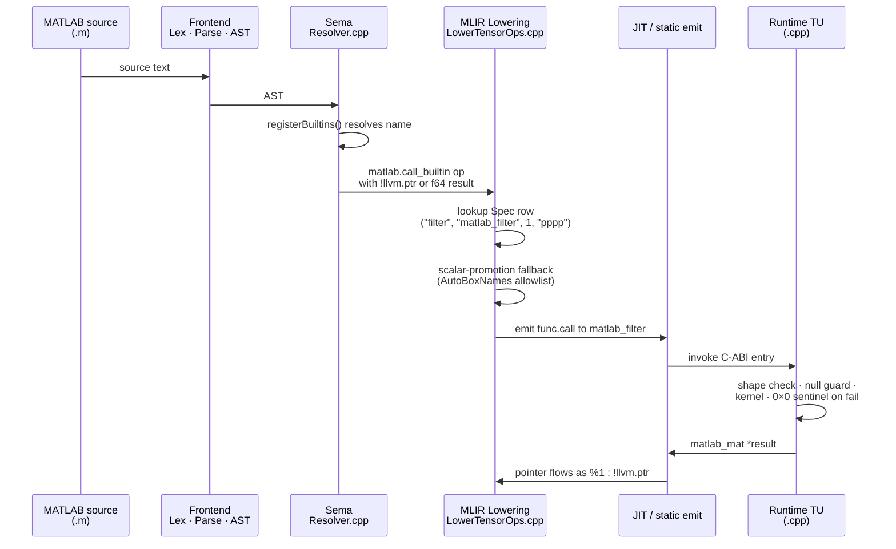
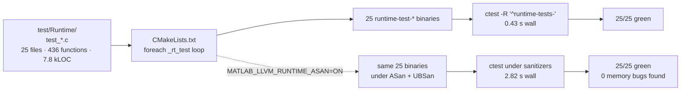
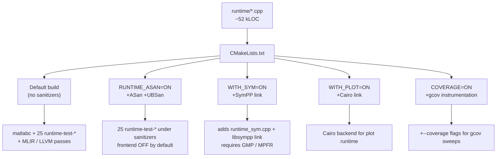

# Runtime — Architecture & ABI Reference

The `matlab_llvm` runtime is the half of the project the JIT, the
compiled-emit lanes, and the REPL/DAP all hand off to. It implements
~1,100 MATLAB-visible builtins across 12 C++ translation units, with
no BLAS/LAPACK dependency and no external maths library beyond
`libm` (plus optional `libsympp` + GMP/MPFR for the Symbolic lane and
optional Cairo for headless plotting).

Authoritative numbers (2026-05-17):

- **~52,000 LOC** of C++ across 12 TUs
- **~1,100 exported `matlab_*` / `mstateflow_*` C-ABI entries**
- **25 direct C-ABI test executables, 436 unit tests** in `test/Runtime/`
- **0 errors / 0 warnings** under default flags; **0 findings** under
  `-fsanitize=address,undefined`

> **Authoritative compatibility surface**: the per-feature *is-it-shipped*
> table is at [`feature_status.md`](feature_status.md). This document
> describes runtime **architecture** — how it's organised, what each TU
> implements, how to extend it.

---

## 1. Translation-unit map

The runtime is laid out as **core at the top level**, **per-toolbox TUs
under `runtime/toolbox/<name>/`**, **shims under `runtime/shim/`**,
and **build helpers under `runtime/scripts/`**:

```
runtime/
  matlab_runtime.{cpp,h,hpp}    # core kernel
  runtime_internal.h            # private layouts shared across TUs
  runtime_complex.cpp           # core complex math + FFT
  runtime_debug.cpp             # DAP/REPL infra
  runtime_sparse.cpp            # CSR + Krylov (PDE prereq, general infra)
  matlab_plot.h                 # plot header
  toolbox/
    comm/        runtime_comm.cpp + comm_class_*.m
    rf/          runtime_rf.cpp + 14 rf_class_*.m
    optim/       runtime_optim.cpp + optim_classdefs.m
    pde/         runtime_pde.cpp + pde_classdefs.m
    prop/        runtime_prop.cpp + 3 site classdefs
    sym/         runtime_sym.cpp + runtime_sym.h
    stateflow/   runtime_mstateflow.cpp + 2 classdef helpers
    antenna/     2 ant_class_*.m   (runtime entries live in toolbox/prop/runtime_prop.cpp)
    control/     cst_classdefs.m + 4 cst_class_*.m
  mflowlink/     runtime_mflowlink_call.cpp
  shim/          matlab_runtime.{py,ts} + numpy_ts.ts + cocotb_fi.py
  scripts/       build_and_run.sh + build_mflowlink.sh
  plot/          Cairo backend (c_api.cpp / cairo_render.cpp / etc.)
```

```mermaid
flowchart LR
  subgraph Core["Core numerical kernel (runtime/)"]
    direction TB
    MR[matlab_runtime.cpp<br/>~15.7 kLOC · 385 entries<br/>matrix kernels · linalg · FFT<br/>signal · stats · image · int<br/>fi · strings · structs · cells]
    CX[runtime_complex.cpp<br/>~2.6 kLOC · 57 entries<br/>complex arith · FFT · LU]
    DB[runtime_debug.cpp<br/>~3.1 kLOC · 75 entries<br/>DAP hooks · workspace mirror<br/>per-kind variable rendering]
    SP[runtime_sparse.cpp<br/>~0.8 kLOC · 17 entries<br/>CSR · PCG · MINRES · GMRES]
  end

  subgraph Toolboxes["Per-toolbox runtimes (runtime/toolbox/<name>/)"]
    direction TB
    PDE[pde/runtime_pde.cpp<br/>~7.0 kLOC · 111 entries<br/>FEM · STL/GLB]
    RF[rf/runtime_rf.cpp<br/>~6.1 kLOC · 85 entries<br/>S-params · cascade · VF · TL]
    CM[comm/runtime_comm.cpp<br/>~3.1 kLOC · 85 entries<br/>mod/demod · CRC · Viterbi<br/>LDPC · Polar · Turbo]
    OP[optim/runtime_optim.cpp<br/>~2.5 kLOC · 33 entries<br/>fzero · fmincon · linprog<br/>quadprog · intlinprog]
    PR[prop/runtime_prop.cpp<br/>~1.7 kLOC · 33 entries<br/>path loss · ITM · coverage<br/>antenna patterns + dipole]
    SY[sym/runtime_sym.cpp<br/>~0.8 kLOC · 95 entries<br/>SymPP bridge · sym + symmat]
    SF[stateflow/runtime_mstateflow.cpp<br/>~0.4 kLOC · 23 entries<br/>chart event queue · snapshot ring]
  end

  subgraph Other["Other runtime"]
    ML[mflowlink/runtime_mflowlink_call.cpp<br/>~0.1 kLOC · 2 entries]
    SH[shim/matlab_runtime.{py,ts}<br/>numpy_ts.ts + cocotb_fi.py]
    SC[scripts/build_and_run.sh<br/>scripts/build_mflowlink.sh]
  end

  Core --> Toolboxes
  PDE -.uses.-> SP
  RF -.uses.-> CX
  Toolboxes -.uses.-> CX
```

**Header surface** (`runtime/*.h*`, ~2.8 kLOC):

| Header | Purpose |
|---|---|
| `matlab_runtime.h` (1522 LOC) | Public C ABI — every entry callable from JIT/static emit lanes |
| `matlab_runtime.hpp` (240 LOC) | C++-side helpers (`MatPtr`, scoped-deleter wrappers) |
| `runtime_internal.h` (262 LOC) | Private struct layouts (`matlab_mat`, `matlab_mat_c`, magic words) shared between TUs |
| `runtime_sym.h` (414 LOC) | Symbolic-toolbox public surface (opt-in) |
| `matlab_plot.h` (366 LOC) | Cairo plotting backend (opt-in) |

---

## 2. ABI conventions

### 2.1 Type system

```mermaid
flowchart TD
  any[matlab_any] -.discriminated by.-> magic[4-byte magic word]
  magic --> mat[matlab_mat<br/>real row-major]
  magic --> mat_c["matlab_mat_c<br/>(0xC0FFEE01)<br/>complex, sep re/im"]
  magic --> mat3["matlab_mat3<br/>(0xC0FFEE03)<br/>3-D dense (sparse)"]
  magic --> mat_i8[matlab_mat_i8/i16/i32/i64<br/>typed signed int matrix]
  magic --> mat_u8[matlab_mat_u8/u16/u32/u64<br/>typed unsigned int matrix]
  magic --> fi_i64["matlab_mat_i64<br/>(also fi-typed)"]
  magic --> fi_u64["matlab_mat_u64<br/>(also fi-typed)"]
  magic --> mstruct[matlab_struct<br/>named-field record]
  magic --> mcell[matlab_cell<br/>1-D / 2-D heterogeneous]
  magic --> mstring[matlab_string<br/>UTF-8 heap-owned]
  magic --> mdict[matlab_dict<br/>containers.Map / dictionary]
  magic --> mdt[matlab_datetime / duration / categorical / table]
  magic --> mobj[matlab_obj<br/>classdef instance]
  magic --> msym["matlab_sym<br/>(kind=7, SymPP-backed)"]
  magic --> msymmat["matlab_symmat<br/>(kind=8)"]
```



- **Row-major** throughout. `data[i*cols + j]` for real, `re[]` / `im[]`
  parallel arrays for complex.
- **Reference-typed**: the compiler passes `T *`, never copies the
  payload unless an op semantically requires it (e.g. shape change).
- **Polymorphic builtins** dispatch on the magic word. `fft` /
  `fftshift` / `conj` / `real` / `imag` / `angle` / `abs` accept
  either `matlab_mat *` or `matlab_mat_c *`.
- **0×0 sentinel** for empty / invalid input — generated code can
  `isempty()`-check the result. Out-of-band errors set a flag via
  `matlab_set_error` and return a sentinel.

### 2.2 Ownership model

Every constructor returns a heap allocation owned by the **workspace**.
The workspace lives for the duration of the JIT session (REPL: until
`clear` or process exit; static-emit: until `main` returns). There's no
reference counting — the workspace is the lifetime root.

```
matlab_mat *A = mat_alloc(3, 3);   // workspace owns A
A->data[0] = 1.0;                  // direct write OK
                                   // no manual free needed
```

This is why direct test code (`test/Runtime/test_*.c`) calls
`rt_free()` explicitly — it isn't operating in a JIT session so it
must clean up its own allocations to keep ASan happy.

### 2.3 Magic words

```c
#define MATLAB_MAT_C_MAGIC  0xC0FFEE01    // complex matrix
#define MATLAB_MAT3_MAGIC   0xC0FFEE03    // 3-D dense
// real matlab_mat has no magic — first 4 bytes overlap data[] / rows
```

`mat_is_complex(void *p)` and `mat_is_3d(void *p)` are inline header
predicates in `runtime_internal.h` — every polymorphic builtin uses
them at entry.

---

## 3. Per-TU contents

### 3.1 Core numerical kernel

#### `matlab_runtime.cpp` (15.7 kLOC, 385 entries)
The historical foundation. Every "core" MATLAB operation lives here:

| Group | Entries |
|---|---|
| Constructors | `zeros`, `ones`, `eye`, `magic`, `rand`, `randn`, `linspace`, `repmat`, `meshgrid`, `ndgrid`, `range` |
| Elementwise | `+ - .* ./ .^`, comparisons, `exp`/`log`/`sqrt`/`abs`, trig + arc + hyperbolic, `floor`/`ceil`/`round`/`fix`, `mod`/`rem`/`atan2` |
| Linalg | `*` (matmul), `\` / `/`, `inv`, `det`, `transpose`/`ctranspose`, `diag`, `reshape`, `kron`, `tril`/`triu`, `svd`, `eig` (sym + non-sym), `qr`, `lu`, `chol`, `pinv`, `norm`, `trace`, `rank`, `cond`, `null`, `orth`, `matpow` |
| Reductions | `sum`/`prod`/`mean`/`min`/`max`/`std`/`var`/`median`/`any`/`all`/`cumsum`/`cumprod`/`diff` (vector → 1×1, matrix → 1×N row) |
| Sort + set | `sort`, `sortrows`, `unique`, `ismember`, `setdiff`, `intersect`, `union` |
| Shape | `size`, `length`, `numel`, `ndims`, `isempty`, `isequal`, `permute`, `squeeze`, `flip*`, `rot90`, `find`, `sub2ind`, `ind2sub` |
| Signal | `fft`/`ifft`/`fft2`/`ifft2`, `fftshift`/`ifftshift`, `conv`/`conv2`, `xcorr`, `filter`/`filtfilt`/`sosfilt`, all 17 windows, IIR/FIR design (`butter`/`cheby1`/`cheby2`/`fir1`/`besself`), `freqz`/`impz`/`stepz`/`grpdelay`, periodogram/pwelch/cpsd/mscohere/tfestimate, multirate, waveform gens, pulse measurements |
| Numerical calculus | `interp1`/`interp2`, `trapz`/`cumtrapz`, `gradient`, `polyval`/`polyfit`/`roots`/`poly`/`polyder`/`polyint`/`residue` |
| ODE / PDE solvers | `ode45` / `ode23` (scalar + vector), `ode23s` (stiff Rosenbrock), `ode_events`, `pdepe` (1-D parabolic-elliptic) |
| Image | `imfilter`, `padarray` |
| Heterogeneous data | `struct(...)` + field accessors, `cell(...)` + `{i}`/`(i)`, `containers.Map`/`dictionary`, `datetime`, `duration`, `categorical`, `table` |
| Typed integers | `int8`/`int16`/`int32`/`int64`/`uint8`/`uint16`/`uint32`/`uint64` matrix runtimes with saturating arith |
| Fixed-Point Designer (`fi`) | scalar Q-format arithmetic, 5 rounding modes, `numerictype` + `fimath` first-class objects, 1-D fi arrays, persistent fi storage |
| Strings | `sprintf`/`num2str`/`str2double`, `upper`/`lower`/`strtrim`/`strrep`/`strcat`, `startsWith`/`endsWith`/`contains` |
| I/O | `disp`/`fprintf`, `input`, `fopen`/`fclose`/`fgetl`/`feof`/`fread`/`fwrite`, custom `save`/`load` |
| Globals | `global` + `persistent` declarations (f64 + ptr) |
| Try/catch | error flag set/get/clear |
| Parallel | `parfor` fan-out + reduction |
| Bitwise | `bitand`/`bitor`/`bitxor`/`bitcmp`/`bitshift` |
| Function handles | `@name` / `@(x) ...` with captures |

See [`feature_status.md`](feature_status.md) for the per-entry
shipped / partial / missing matrix.

#### `runtime_complex.cpp` (2.6 kLOC, 57 entries)
- Native complex N×N LU decomposition (Doolittle, partial pivoting) —
  ~4× faster than the 2N×2N real-equivalent path.
- Complex elementwise `+ - .* ./`, transpose, conjugate transpose.
- FFT / IFFT / FFT2 / IFFT2 on complex inputs.
- Polymorphic complex dispatch helpers consumed by every toolbox.

#### `runtime_debug.cpp` (3.1 kLOC, 75 entries)
- DAP variable inspector — per-kind renderer for every workspace value
  (matrices, structs, cells, dicts, datetime, categorical, table, sym,
  classdef instances).
- Workspace mirror (`matlab_ws_*`) — JIT-side persistence across REPL
  inputs.
- Source-line hook (`matlab_dbg_hook(file_id, line)`) — the
  per-statement instrumentation injected by `-g`/`--debug-hooks`.
- Per-frame locals snapshot for `stackTrace` + `scopes` + `variables`.

### 3.2 Per-toolbox runtimes

Each of the eight toolboxes maps to one runtime TU plus its companion
roadmap doc:

| TU | LOC | Roadmap | Highlights |
|---|---:|---|---|
| `toolbox/pde/runtime_pde.cpp` | 7.0k | [`pde_toolbox_roadmap.md`](pde_toolbox_roadmap.md) | 11 shipped arcs · Tier-1 → 4 · sparse CSR + Krylov · T10 quadratic tets · Lanczos shift-invert · Craig-Bampton ROM · complex-Krylov frequency response · N-component coupled PDEs · `femodel` classdef façade · STL/GLB import |
| `runtime_sparse.cpp` | 0.8k | (PDE prereq) | CSR descriptor, PCG, MINRES, ILU(0)-preconditioned GMRES |
| `toolbox/rf/runtime_rf.cpp` | 6.1k | [`rf_toolbox_plan.md`](rf_toolbox_plan.md) + [`verilog_a_plan.md`](verilog_a_plan.md) | Tier-1 Touchstone v1/v2 · Tier-2 N-port S↔Y/Z/H/G/ABCD/T conversions + Redheffer cascade · Tier-3 Vector Fitting (real + complex pole pairs) + `rationalfit`/`freqresp`/`passivity`/`timeresp` · Tier-4 transmission-line geometries (microstrip / CPW / coax / two-wire / parallel-plate) + matching networks (L/T/Pi) + LC filter circuits · 15 RF classdefs · Verilog-A export Tier-1 → Tier-10 |
| `toolbox/comm/runtime_comm.cpp` | 3.1k | [`comm_toolbox_roadmap.md`](comm_toolbox_roadmap.md) | Tier-1 base (`randi`/`rng`/`int2bit`/`awgn`/`biterr`/`symerr`) · Tier-2 modulation (PAM/PSK/QAM/FSK + `berawgn`) · Tier-3 channel coding (CRC/Hamming/convolutional + Viterbi/interleavers) · Tier-4 equalisers + sync + RF impairments · Tier-5 OFDM + Rayleigh/Rician fading + Alamouti OSTBC · Tier-6 spreading + source coding · Tier-7 modern codes (Polar SC, LDPC min-sum, Turbo PCCC max-log-MAP) |
| `toolbox/optim/runtime_optim.cpp` | 2.5k | [`optim_toolbox_roadmap.md`](optim_toolbox_roadmap.md) | T1 `fzero`/`fminbnd`/`fminsearch`/`fminunc`/`linprog`/`lsqnonneg`/`fsolve` · T2 `fmincon` SQP/IP/`quadprog`/`lsqlin`/`lsqnonlin` LM · T3 `intlinprog`/`coneprog`/`fminimax`/`fgoalattain`/`fseminf` · T4 problem-based `optimvar`/`optimproblem`/`solve` expression-DAG · T5 `eqnproblem` |
| `toolbox/prop/runtime_prop.cpp` | 1.7k | [`propagation_toolbox_roadmap.md`](propagation_toolbox_roadmap.md) + [`antenna_toolbox_roadmap.md`](antenna_toolbox_roadmap.md) | PROP-Tier-1a (ITU-R + cellular empirical + Fresnel + knife-edge + Haversine/Vincenty) · 2a (ITM Longley-Rice) · 2b (terrain profile + LOS + `linkBudget` + `coverageGrid`) · 3 (directional patterns + mount orientation + multi-site `coverageGridMulti`) · 1b (classdef wrappers) · ANT-Tier-2 closed-form thin-wire dipole |
| `toolbox/sym/runtime_sym.cpp` | 0.8k | [`symbolic_toolbox_roadmap.md`](symbolic_toolbox_roadmap.md) | SymPP bridge · Tier-1 core CAS (`syms`/`simplify`/`solve`/`subs`) · Tier-2 calculus + transforms + ODE/PDE · Tier-3 sym matrices + multi-eq solvers · Tier-4 assumptions + numeric solvers + IVP. Opt-in via `-DMATLAB_LLVM_WITH_SYM=ON`. |
| `toolbox/stateflow/runtime_mstateflow.cpp` | 0.4k | [`mStateflow_roadmap.md`](mStateflow_roadmap.md) | DAP event queue (state-enter/exit/transition-fired/super-step boundaries/event broadcast) · bounded FIFO event queue with drop-oldest · snapshot ring (save_blob/copy/count/reset) |
| `mflowlink/runtime_mflowlink_call.cpp` | 0.1k | [`mflow_link_roadmap.md`](mflow_link_roadmap.md) | mflowLink-runner ABI bridge (compiler/runtime split point) |

---

## 4. How a builtin call reaches the runtime



### 4.1 Adding a new builtin — four touch-points

1. **`lib/Sema/Resolver.cpp`** — add the spelling to `registerBuiltins()`
   so the name resolves at binding time.
2. **`lib/MLIR/Lowering.cpp`** — if the call returns a matrix
   descriptor, add the spelling to the `PtrRet` set so the
   `matlab.call_builtin` op carries `!llvm.ptr` instead of f64.
3. **`lib/MLIR/Passes/LowerTensorOps.cpp`** — add a `Spec` row:
   `{"my_builtin", "matlab_my_builtin", 1, "pp"}` (1 = ptr return,
   `"pp"` = two ptr args). For overloaded forms add one row per
   arity/type combo — first match wins.
4. **Multi-return**: extend the splitter blocks in
   `rewriteBuiltinCalls()` (the eig/qr/lu/size/meshgrid/ndgrid
   pattern) and provide one runtime entry per output column.

For multi-backend parity, mirror the entry into
`runtime/matlab_runtime.py` and `runtime/matlab_runtime.ts` — these
are best-effort C-runtime mirrors used by `-emit-python` /
`-emit-typescript`.

### 4.2 Scalar-promotion fallback

A MATLAB call like `polyval(p, 5)` passes a 1×1 scalar where the
runtime expects `matlab_mat *`. The lowerer scans the dispatch table
twice — strict match first, then a scalar-promotion pass that boxes
f64 args via `matlab_mat_from_scalar`. The fallback is gated by an
**allowlist** in `LowerTensorOps.cpp` (`AutoBoxNames`) so calls like
`mean(5.0)` still route through `matlab_mean_s` instead of becoming
a 1×1 reduction:

```
AutoBoxNames = { conv, conv2, filter, xcorr, polyval, polyfit,
                 interp1, interp2, trapz, cumtrapz, imfilter,
                 padarray, ... }
```

Adding a ptr-only builtin? Either add it to that list or rely on
callers writing `[v]` to make the argument a 1×1 literal vector.

---

## 5. Backend matrix

Which runtime TUs each `-emit-*` lane needs to link against:

| Backend | Core (`matlab_runtime` + `complex` + `debug`) | Per-toolbox TUs | Notes |
|---|---|---|---|
| `-emit-llvm` / JIT (REPL/DAP) | ✓ | ✓ all | Single-process ExecutionEngine; the JIT resolves symbols via `LLJIT`'s `DynamicLibrarySearchGenerator` |
| `-emit-c` | ✓ | ✓ all | Caller compiles emitted source against the runtime; `-x c` works for the runtime, `-x c++` for the test harnesses |
| `-emit-cpp` | ✓ | ✓ all | Same shape; the runtime is internally C++20 |
| `-emit-python` | mirror in `runtime/matlab_runtime.py` | mirror in same | Best-effort numpy-backed shim; some builtins are stubs |
| `-emit-typescript` | mirror in `runtime/matlab_runtime.ts` | mirror in same | Same shape as Python; least exercised |
| `-emit-systemverilog` | doesn't link the runtime (synthesizable RTL has no runtime) | n/a | The `% hdl: port(...)` pragmas drive synthesis directly |
| `-emit-matlab` / `-emit-mflow` | doesn't link the runtime (source-to-source) | n/a | |

---

## 6. Test infrastructure



Each `test_*.c` (plain C, links the runtime TUs directly) covers one
module:

| Test exe | Functions | Module |
|---|---:|---|
| `runtime-tests-linalg` | 105 | matmul / inv / det / eig / SVD / expm / hess / schur / lyap / care / lqr / etc. (covers the full CST Tier-1 numeric stack) |
| `runtime-tests-signal` | 44 | windows · polynomials · IIR/FIR design · `filter`/`filtfilt`/`sosfilt` · spectral analysis |
| `runtime-tests-int_arrays` | 29 | int8 / i16 / i32 / i64 / u8 / u16 / u32 / u64 matrix arith with saturation |
| `runtime-tests-stats` | 26 | mean / median / std / var / min / max / reductions |
| `runtime-tests-prop` | 24 | path loss / Fresnel / knife-edge / Haversine / Vincenty / patterns / dipole |
| `runtime-tests-more` | 19 | categorical / datetime / duration / table |
| `runtime-tests-comm` | 16 | RNG / int2bit / biterr / PAM/PSK/QAM / berawgn / CRC / Hamming / interleaver / PN / Hadamard / Polar |
| `runtime-tests-optim` | 14 | fzero / fminbnd / fminsearch / fminunc / linprog / lsqnonneg / fsolve / quadprog / lsqlin / fmincon / lsqnonlin / intlinprog |
| `runtime-tests-fi` | 14 | Q-format arithmetic / rounding modes / saturate / wrap |
| `runtime-tests-strings` | 14 | string + char-array + sprintf |
| `runtime-tests-ode` | 13 | ode45 / ode23 / ode23s / ode_events / dense output |
| `runtime-tests-mstateflow` | 13 | listener flag / drain queue / FIFO push-pop-order-capacity / snapshot ring |
| `runtime-tests-struct_cell` | 12 | struct arrays · 2-D cells · dict |
| `runtime-tests-unary` | 12 | sin / cos / tan / asin / acos / atan / abs / sign / exp / log |
| `runtime-tests-fi_arrays` | 11 | 1-D fi vectors · indexing · slice · concat · persistent |
| `runtime-tests-image` | 10 | imfilter / kernels |
| `runtime-tests-rf` | 10 | gammaIn / VSWR / stability K / S→Y / cascade / microstrip / matchnet / rationalfit / rfbudget |
| `runtime-tests-fft` | 9 | FFT / IFFT / FFT2 / IFFT2 |
| `runtime-tests-complex` | 9 | complex arithmetic + dispatch |
| `runtime-tests-reduce` | 8 | sum / mean / prod / cumsum / min / max |
| `runtime-tests-shape` | 7 | reshape / size / numel / squeeze |
| `runtime-tests-elementwise` | 7 | broadcasting · .* · ./ · .^ |
| `runtime-tests-pde_io` | 4 | STL / GLB import · CSR I/O |
| `runtime-tests-rng` | 4 | seed control / rand / randn |
| `runtime-tests-pde` | 2 | FEM kernels (assembly · solve) |

**Wall-clock** (build/ dir, serial):
- Regular build: **0.43 s** for all 25 tests
- ASan + UBSan build: **2.82 s** for all 25 tests

Indirect coverage layers stacked on top:

- `run-tests` (387 `.m` programs through the LLVM JIT lane) — exercises
  every entry transitively
- `run-tests-emit-c` / `-cpp` / `-c-strict` / `-cpp-strict` / `-emit-python`
  / `-emit-typescript` — same source through 6 more emit lanes
- `run-tests-sym` (4 tests) — SymPP-gated symbolic surface
- `cocotb-tests` (39 HDL examples) — bit-exact SV vs Python reference

### 6.1 Sanitizer lane (opt-in)

```bash
cmake -S . -B build-asan -G Ninja \
    -DMATLAB_LLVM_RUNTIME_ASAN=ON -DMATLAB_LLVM_WITH_MLIR=OFF
cmake --build build-asan
ctest --test-dir build-asan -R '^runtime-tests-'
```

The `MATLAB_LLVM_RUNTIME_ASAN` CMake option adds
`-fsanitize=address,undefined -fno-sanitize-recover=undefined` to
every `runtime-test-*` binary and sets per-test
`ASAN_OPTIONS=abort_on_error=0:check_initialization_order=1` +
`UBSAN_OPTIONS=halt_on_error=0:print_stacktrace=1` so a single fault
doesn't abort the whole lane.

Current status: **25/25 tests pass under ASan+UBSan with zero
findings** — no use-after-free, heap-buffer-overflow, signed-shift UB,
or null deref across the full numerical surface.

### 6.2 Code-quality enforcements

- **`-Wold-style-cast` + `-Werror=old-style-cast`** enforced on the
  five new toolbox TUs (`toolbox/comm/runtime_comm.cpp` / `toolbox/optim/runtime_optim.cpp` /
  `toolbox/rf/runtime_rf.cpp` / `toolbox/prop/runtime_prop.cpp` / `toolbox/stateflow/runtime_mstateflow.cpp`).
  All casts use `static_cast<>` / `reinterpret_cast<>` / `const_cast<>`
  on those modules. Legacy `matlab_runtime.cpp` predates the
  convention and is exempt.
- **Default build**: `-Wall -Wextra -Wpedantic` — **zero warnings**.

---

## 7. Build matrix



| CMake option | Default | What it does |
|---|---|---|
| `MATLAB_LLVM_WITH_MLIR` | ON | Builds matlabc + the MLIR/LLVM lowering passes (off → frontend-only build, runtime unit tests still work) |
| `MATLAB_LLVM_WITH_SYM` | OFF | Links `runtime_sym.cpp` and pulls SymPP / GMP / MPFR — enables Symbolic Math Toolbox |
| `MATLAB_LLVM_WITH_PLOT` | ON | Links `runtime/plot/*.cpp` and pulls Cairo / FreeType — enables headless plotting (and VideoWriter via FFmpeg; see `MATLAB_LLVM_WITH_PLOT_FFMPEG`) |
| `MATLAB_LLVM_RUNTIME_ASAN` | OFF | Adds ASan+UBSan to runtime-test-* targets |
| `MATLAB_LLVM_COVERAGE` | OFF | Adds gcov instrumentation |

---

## 8. Known gaps

- **3-D tensor surface is sparse**. `matlab_mat3` exists with `zeros3` /
  `ones3` / 3-D subscripting, but most elementwise / reduction ops
  reject 3-D inputs. Expanding 3-D is a structural change rather than
  per-op work.
- **No SO classdef surface for `comm.*`**. Function-form ships for
  every Tier-3+ Comm primitive (CRC, LDPC, Turbo, etc.) — the
  `comm.CRCGenerator` / `comm.LDPCEncoder` / etc. System-Object
  classdef variants are gated on the SO-lowering fix tracked in
  [`comm_toolbox_roadmap.md`](comm_toolbox_roadmap.md) §11.1.
- **`fi` typing across user function boundaries**. Sema doesn't
  propagate the `numerictype` spec through user-function calls — a
  callee sees `f64` for what the caller declared as `fi`. The
  workaround is to re-wrap inside the helper. Tracked as Tier-6 §7.1
  in [`fixed_point_toolbox_roadmap.md`](fixed_point_toolbox_roadmap.md).
- **2-D fi matrices**. 1-D fi vectors ship; 2-D matrices have a
  runtime path but no concrete tests for slice2 / matmul. Tracked as
  Tier-6 §7.2 in the same doc.
- **`roots` numerical noise**. Durand-Kerner leaves ~1e-40 imaginary
  parts on real roots — filter with `abs(imag(r)) < tol` or take
  `real(r)`.
- **`polyfit` conditioning**. Uses normal equations rather than QR;
  degrades for high-degree fits. For `n > 8` prefer a QR-based fit
  (not yet wired).
- **No SymPy / mathjs bridge** for `-emit-python` / `-emit-typescript`
  on symbolic programs. Tier-6 of
  [`symbolic_toolbox_roadmap.md`](symbolic_toolbox_roadmap.md).
- **No `interp1`/`interp2` 'spline' method** — only linear / bilinear.
- **`save`/`load`** support only a subset of the `.mat` v5 format —
  see [`save_load_compat.md`](save_load_compat.md).

---

## 9. See also

| Doc | Purpose |
|---|---|
| [`feature_status.md`](feature_status.md) | Authoritative per-entry shipped / partial / missing matrix |
| [`roadmap.md`](roadmap.md) | Project-wide forward tracker |
| Per-toolbox roadmaps: [`signal`](signal_toolbox_roadmap.md), [`control`](control_toolbox_roadmap.md), [`comm`](comm_toolbox_roadmap.md), [`rf`](rf_toolbox_plan.md), [`antenna`](antenna_toolbox_roadmap.md), [`propagation`](propagation_toolbox_roadmap.md), [`optim`](optim_toolbox_roadmap.md), [`pde`](pde_toolbox_roadmap.md), [`symbolic`](symbolic_toolbox_roadmap.md), [`fixed-point`](fixed_point_toolbox_roadmap.md), [`stateflow`](mStateflow_roadmap.md), [`verilog-A`](verilog_a_plan.md) | Tiered compatibility plans + shipped logs for each toolbox |
| [`port_runtime_2_cpp.md`](port_runtime_2_cpp.md) | History of the C → C++ port that produced the current multi-TU split |
| [`emit_c_cpp.md`](emit_c_cpp.md) / [`emit_python.md`](emit_python.md) / [`emit_systemverilog.md`](emit_systemverilog.md) | Per-backend emission docs |
| [`emit_fixed_point.md`](emit_fixed_point.md) | Fixed-Point Designer implementation reference |
| [`sym.md`](sym.md) | Symbolic Math user reference |
| [`ode.md`](ode.md) | ODE/PDE solver user reference |
| [`complex.md`](complex.md) | Complex numbers + FFT user reference |
| [`debug.md`](debug.md) / [`repl.md`](repl.md) / [`lsp.md`](lsp.md) | Interactive tooling |
